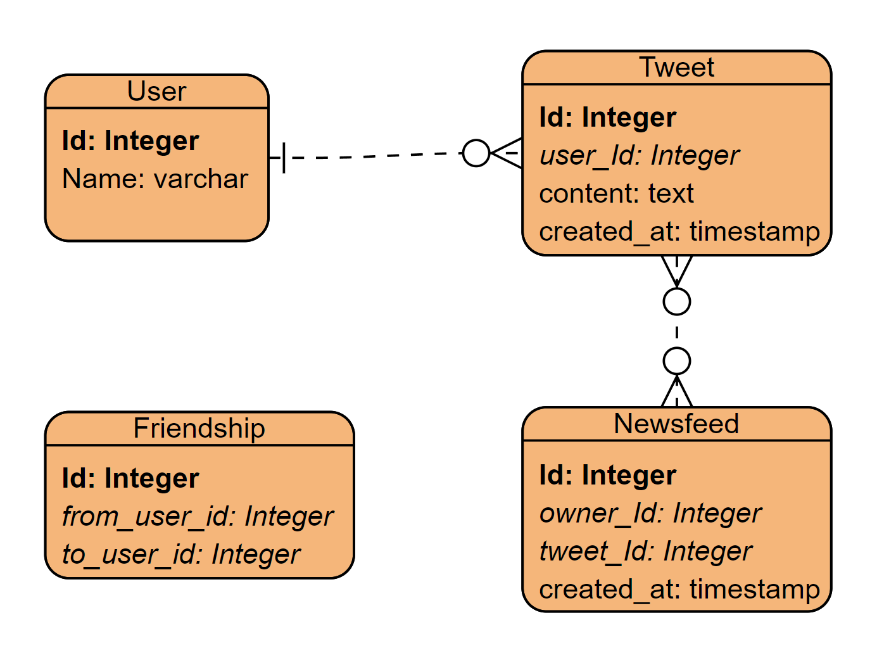

- [SQL database](#sql-database)
  - [Partition key](#partition-key)
- [NoSQL database](#nosql-database)
- [Object storage](#object-storage)

# SQL database



```sql
--friendship
Select \* from friendship\_table where from\_user\_id = user\_id

-- newsfeed 
Select * from newsFeed Table where owner_id = XX orderBy createdAt desc limit 20;
```

## Partition key
* Partition is needed because the write throughput for tweet table is 4600 per second in peak hours. 

* User ID: 
  * Cons: Some users could create lots of tweets. And sharding by user id could create hot entries. This could be relieved by setting upper limit for tweet per day (Each user publish at most 50 tweets per day.)

# NoSQL database

* Tweets \(Tweet service\) 

# Object storage

* Images
* Videos
