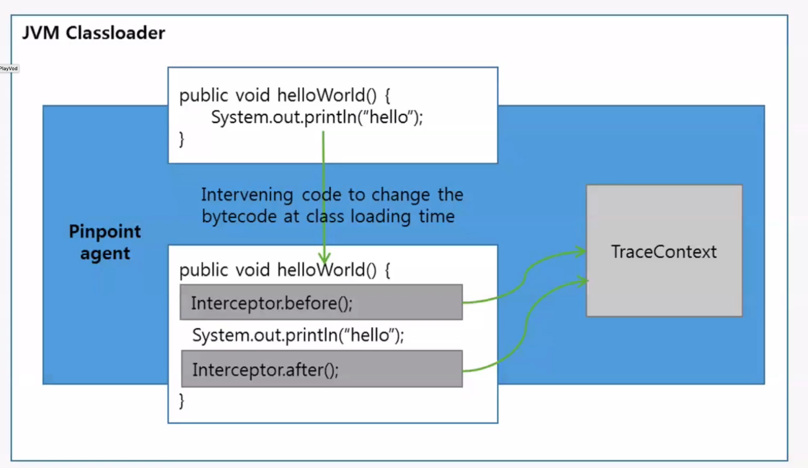

- [Trace concepts](#trace-concepts)
  - [Properties](#properties)
  - [Usecase](#usecase)
  - [Data model](#data-model)
    - [TraceID](#traceid)
      - [Generation rule](#generation-rule)
    - [Sample rate](#sample-rate)
    - [SpanID](#spanid)
      - [Parent spanId](#parent-spanid)
      - [Dot spanId](#dot-spanid)
      - [Annotation](#annotation)
    - [Context propogation](#context-propogation)
      - [Across threads](#across-threads)
      - [Across Restful style service APIs](#across-restful-style-service-apis)
      - [Across components such as message queues / cache / DB](#across-components-such-as-message-queues--cache--db)
    - [OpenTracing API standards**](#opentracing-api-standards)
- [Architecture](#architecture)
  - [Data collection](#data-collection)
    - [Asynchronous processing with bounded buffer queue](#asynchronous-processing-with-bounded-buffer-queue)
  - [Approaches](#approaches)
    - [Manual tracing](#manual-tracing)
    - [AOP](#aop)
      - [Bytecode Instrumentation](#bytecode-instrumentation)
      - [Append to log files](#append-to-log-files)
    - [Data storage](#data-storage)
      - [Requirement analysis](#requirement-analysis)
      - [Column-family data storage](#column-family-data-storage)
        - [Data model for a normal trace](#data-model-for-a-normal-trace)
        - [Data model for a buiness trace](#data-model-for-a-buiness-trace)
        - [Distributed file system](#distributed-file-system)
  - [Distributed tracing solutions](#distributed-tracing-solutions)
    - [OpenTracing](#opentracing)
    - [Solution inventory](#solution-inventory)
    - [OpenZipkin](#openzipkin)
    - [Pinpoint](#pinpoint)
    - [Compare Pinpoint and OpenZipkin](#compare-pinpoint-and-openzipkin)
  - [美团](#美团)
  - [Ali](#ali)


# Trace concepts

## Properties

* Definitions:
  * Traces—or more precisely, “distributed traces”—are samples of causal chains of events (or transactions) between different components in a microservices ecosystem. And like events and logs, traces are discrete and irregular in occurrence.
* Properties:
  * Traces that are stitched together form special events called “spans”; spans help you track a causal chain through a microservices ecosystem for a single transaction. To accomplish this, each service passes correlation identifiers, known as “trace context,” to each other; this trace context is used to add attributes on the span.

## Usecase

* Trace data is needed when you care about the relationships between services/entities. If you only had raw events for each service in isolation, you’d have no way of reconstructing a single chain between services for a particular transaction.
* Additionally, applications often call multiple other applications depending on the task they’re trying to accomplish; they also often process data in parallel, so the call-chain can be inconsistent and timing can be unreliable for correlation. The only way to ensure a consistent call-chain is to pass trace context between each service to uniquely identify a single transaction through the entire chain.
* Optimize the calling chain. For example, if a service calls the other one repeatedly, could these requests being batched? Or could such requests be parallelized?


* Locate the bottleneck service. 


* Optimize the network calls. e.g. Identify whether there are cross region calls


## Data model


### TraceID

* TraceId could be used to concatenate the call logs of a request on each server.

#### Generation rule

* Sample generation rule: 
  * The TraceId is typically generated by the first server that receives the request. The generation rule is: server IP + generated time + incremental sequence + current process ID, such as: 
* Example: 0ad1348f1403169275002100356696
  * The first 8 digits 0ad1348f is the IP of the machine that generates TraceId. This is a hexadecimal number, in which every two digits represents a part of IP. Based on the number, we can get a common IP address like 10.209.52.143 by converting every two digits into a decimal number. According to this rule, you can also figure out the first server that the request goes through.
  * The next 13 digits 1403169275002 is the time to generate the TraceId.
  * The next 4 digits 1003 is an auto-incrementing sequence that increases from 1000 to 9000. After reaching 9000, it returns to 1000 and then restarts to increase.
  * The last 5 digits 56696 is the current process ID. Its role in tracerId is to prevent the TraceId conflicts caused by multiple processes in a single machine.

### Sample rate

* Sampling states applied to the trace ID, not the span ID. 
* There are four possible values for sample rate: 
  * Accept: Decide to include
  * Debug: Within certain testing environments, always enable the sample.
  * Defer: Could not make the decision on whether to trace or not. For example, wait for certain proxy to make the decision. 
  * Deny: Decide to exclude
* The most common use of sampling is probablistic: eg, accept 0.01% of traces and deny the rest. Debug is the least common use case.
* Reference: [https://github.com/openzipkin/b3-propagation](https://github.com/openzipkin/b3-propagation)
* On demand sampling: [https://github.com/openzipkin-contrib/zipkin-secondary-sampling/blob/master/docs/design.md](https://github.com/openzipkin-contrib/zipkin-secondary-sampling/blob/master/docs/design.md)

```
   Client Tracer                                                  Server Tracer     
┌───────────────────────┐                                       ┌───────────────────────┐
│                       │                                       │                       │
│   TraceContext        │          Http Request Headers         │   TraceContext        │
│ ┌───────────────────┐ │         ┌───────────────────┐         │ ┌───────────────────┐ │
│ │ TraceId           │ │         │ X-B3-TraceId      │         │ │ TraceId           │ │
│ │                   │ │         │                   │         │ │                   │ │
│ │ ParentSpanId      │ │ Inject  │ X-B3-ParentSpanId │ Extract │ │ ParentSpanId      │ │
│ │                   ├─┼────────>│                   ├─────────┼>│                   │ │
│ │ SpanId            │ │         │ X-B3-SpanId       │         │ │ SpanId            │ │
│ │                   │ │         │                   │         │ │                   │ │
│ │ Sampling decision │ │         │ X-B3-Sampled      │         │ │ Sampling decision │ │
│ └───────────────────┘ │         └───────────────────┘         │ └───────────────────┘ │
│                       │                                       │                       │
└───────────────────────┘                                       └───────────────────────┘
```

### SpanID

* Span ID could be used to determine the order of execution for all calls happened within the same Trace ID.

```
// Temporal relationships between Spans in a single Trace

––|–––––––|–––––––|–––––––|–––––––|–––––––|–––––––|–––––––|–> time

 [Span A···················································]
   [Span B··············································]
      [Span D··········································]
    [Span C········································]
         [Span E·······]        [Span F··] [Span G··] [Span H··]


// Causal relationships between Spans in a single Trace


        [Span A]  ←←←(the root span)
            |
     +------+------+
     |             |
 [Span B]      [Span C] ←←←(Span C is a `ChildOf` Span A)
     |             |
 [Span D]      +---+-------+
               |           |
           [Span E]    [Span F] >>> [Span G] >>> [Span H]
                                       ↑
                                       ↑
                                       ↑
                         (Span G `FollowsFrom` Span F)
```

#### Parent spanId

* This is one way of defining parent span Id. More commonly adopted. 
* Ref: [https://www.sofastack.tech/en/projects/sofa-tracer/traceid-generated-rule/](https://www.sofastack.tech/en/projects/sofa-tracer/traceid-generated-rule/)


#### Dot spanId

* This is another way of defining parent span Id. 
* Cons: When a trace has too many calling layers, the dot spanId will carry too much redundant information. 


#### Annotation

* Basic description info related to the trace


### Context propogation

* A context will often have information identifying the current span and trace (e.g. SpanId / TraceId), and can contain arbitrary correlations as key-value pairs.
* Propagation is the means by which context is bundled and transferred across.
* The ability to correlate events across service boundaries is one of the principle concepts behind distributed tracing. To find these correlations, components in a distributed system need to be able to collect, store, and transfer metadata referred to as context.

#### Across threads

* References: [https://www.programmersought.com/article/65184544752/](https://www.programmersought.com/article/65184544752/)
* Use threadlocal to pass TraceID / SpanID

#### Across Restful style service APIs

* There are several protocols for context propagation that OpenTelemetry recognizes.
  * W3C Trace-Context HTTP Propagator
  * W3C Correlation-Context HTTP Propagator
  * B3 Zipkin HTTP Propagator


#### Across components such as message queues / cache / DB

1. Add the context variables inside message 
   * Cons: temper with message
2. Change message queue protocol 
   * Cons: challenging

### OpenTracing API standards**

* Reference: 
  * [OpenTracing specification](https://github.com/opentracing/specification/blob/master/specification.md)
  * [Doc](https://opentracing.io/docs/overview/spans/)

# Architecture
## Data collection

### Asynchronous processing with bounded buffer queue

* No matter what approach the data collector adopts, the threads for sending out telemetry data must be separated from business threads. Call it using a background threads pool. 
* There should be a queue between business threads and background threads. And this queue should have bounded size to avoid out of memory issue. 

```
┌─────────────────────────────────────────────────────────────────────────────────┐                                            
│                                   Application                                   │                                            
│                                                                                 │                                            
│                                                                                 │                                            
│   ┌───────────────────┐       ┌───────────────┐       ┌─────────────────────┐   │                                            
│   │                   │       │               │       │                     │   │                                            
│   │                   │       │               │       │                     │   │     ┌────────────┐      ┌─────────────────┐
│   │                   │       │               │       │                     │   │     │            │      │                 │
│   │                   │       │               │       │                     │   │     │            │      │                 │
│   │                   │       │               │       │                     │   │     │            │      │                 │
│   │                   │       │               │       │                     │   │     │            │      │                 │
│   │                   │       │               │       │                     │   │     │            │      │                 │
│   │  Business logic   │       │ Bounded size  │       │                     │   │     │            │      │Log/Trace/Metrics│
│   │      threads      │──────▶│queue to avoid │──────▶│ Background threads  │   │────▶│Kafka / UDP │─────▶│    Processor    │
│   │                   │       │ Out of Memory │       │                     │   │     │            │      │                 │
│   │                   │       │               │       │                     │   │     │            │      │                 │
│   │                   │       │               │       │                     │   │     │            │      │                 │
│   │                   │       │               │       │                     │   │     │            │      │                 │
│   │                   │       │               │       │                     │   │     │            │      │                 │
│   │                   │       │               │       │                     │   │     │            │      │                 │
│   │                   │       │               │       │                     │   │     └────────────┘      └─────────────────┘
│   │                   │       │               │       │                     │   │                                            
│   └───────────────────┘       └───────────────┘       └─────────────────────┘   │                                            
│                                                                                 │                                            
│                                                                                 │                                            
│                                                                                 │                                            
└─────────────────────────────────────────────────────────────────────────────────┘
```


## Approaches

### Manual tracing

* Manually add tracing logs

### AOP

#### Bytecode Instrumentation

* Please see more in [In Chinese](https://tech.meituan.com/2019/09/05/java-bytecode-enhancement.html)



#### Append to log files

* Appender is responsible for outputing formatted logs to destinations such as disk files, console, etc. Then trace files could be processed in the similar way as log files. 
  * When multiple threads use the same appender, there is a chance for resource contention. The append operation needs to be asynchronous. And to fit with asynchornous operation, there must be a buffer queue. Please 


### Data storage
#### Requirement analysis
* No fixed data model but calling chain has a tree-structure. 
* Large amounts of data, would better be compressed. 
  * Sample size figures: meituan 100TB per day

#### Column-family data storage

##### Data model for a normal trace

* Use TraceID as rowKey
* Has two columns
  * Basic info column: Basic info about trace 
  * Calling info column: (Each remote service call has four phases)
    * P1: Client send
    * P2: Server receive
    * P3: Server send
    * P4: Client receive
* Using HBase as an example for an ecommerce website

| TraceId             | 0001                          | 0002                             |
| ------------------- | ----------------------------- | -------------------------------- |
| Basic Info Column   | Type: buy                     | Type: refund                     |
| Basic Info Column   | Status: finished              | Status: processing               |
| Calling Info Column | SpanId 1 with P1 calling info | SpanId 1 with P1 calling info    |
| Calling Info Column | SpanId 1 with P2 calling info | SpanId 1 with P2 calling info    |
| Calling Info Column | SpanId 1 with P3 calling info | SpanId 1 with P3 calling info    |
| Calling Info Column | SpanId 1 with P4 calling info | SpanId 1 with P4 calling info    |
| Calling Info Column | SpanId 2 with P1 calling info | SpanId 2 with P1 calling info    |
| Calling Info Column | SpanId 2 with P2 calling info | empty to be filled when finished |
| Calling Info Column | SpanId 2 with P3 calling info | ... ...                          |

##### Data model for a buiness trace

* Motivation:
  * The above trace data model covers the case where all spans could be concatenated together with a trace ID. There are cases where multiple trace id needed to be concatenated to form a business chain. 
  * For example, in ecommerce system, a customer could create an order, the revise an exsiting order, and later on cancel the order. 
* Also needs a column-family storage from traceID -> json blob and the reverse mapping from system transaction id -> trace ID

| TraceID | Order system transaction ID | Payment system transaction ID | User system transaction ID |
| ------- | --------------------------- | ----------------------------- | -------------------------- |
| 0001    | 1                           | 2                             | 3                          |
| 0002    | 4                           | 5                             | 6                          |
| 0003    | 7                           | 8                             | 9                          |

##### Distributed file system

* Each block needs corresponding 48 bits index data. Based on the trace Id, the index position could be decided. 
* The trace Id format could be defined in a way to make locating index and block data easier. For example, ShopWeb-0a010680-375030-2 traceId has four segments. The index file name could be defined as the "ShopWeb" + "0a010680" + "375030". And the block position could be inferred from the 4th segment. 
  * ShopWeb: Application name
  * 0a010680: Current machine's IP address
  * 375030: Current time / hour 
  * 2: Mono-increasing sequence number in the current unit


## Distributed tracing solutions
### OpenTracing
* Datadog and Opentracing: [https://www.datadoghq.com/blog/opentracing-datadog-cncf/](https://www.datadoghq.com/blog/opentracing-datadog-cncf/)

### Solution inventory

* 2014 Google Dapper
* Twitter Zipkin: [https://zipkin.io/pages/architecture.html](https://zipkin.io/pages/architecture.html)
* Pinpoint: [https://pinpoint-apm.github.io/pinpoint/](https://pinpoint-apm.github.io/pinpoint/)
* DaZhongDianPing CAT (Chinese): [https://github.com/dianping/cat](https://github.com/dianping/cat)
* Alibaba EagleEye
* Jingdong Hydra
* Apache SkyWalking:[https://github.com/apache/skywalking](https://github.com/apache/skywalking)
* Pinpoint (APM)

### OpenZipkin

* [https://zipkin.io/pages/architecture.html](https://zipkin.io/pages/architecture.html)


```
// Here’s an example sequence of http tracing where user code calls the resource /foo. This results in a single span, sent asynchronously to Zipkin after user code receives the http response.

// Trace instrumentation report spans asynchronously to prevent delays or failures relating to the tracing system from delaying or breaking user code.

┌─────────────┐ ┌───────────────────────┐  ┌─────────────┐  ┌──────────────────┐
│ User Code   │ │ Trace Instrumentation │  │ Http Client │  │ Zipkin Collector │
└─────────────┘ └───────────────────────┘  └─────────────┘  └──────────────────┘
       │                 │                         │                 │
           ┌─────────┐
       │ ──┤GET /foo ├─▶ │ ────┐                   │                 │
           └─────────┘         │ record tags
       │                 │ ◀───┘                   │                 │
                           ────┐
       │                 │     │ add trace headers │                 │
                           ◀───┘
       │                 │ ────┐                   │                 │
                               │ record timestamp
       │                 │ ◀───┘                   │                 │
                             ┌─────────────────┐
       │                 │ ──┤GET /foo         ├─▶ │                 │
                             │X-B3-TraceId: aa │     ────┐
       │                 │   │X-B3-SpanId: 6b  │   │     │           │
                             └─────────────────┘         │ invoke
       │                 │                         │     │ request   │
                                                         │
       │                 │                         │     │           │
                                 ┌────────┐          ◀───┘
       │                 │ ◀─────┤200 OK  ├─────── │                 │
                           ────┐ └────────┘
       │                 │     │ record duration   │                 │
            ┌────────┐     ◀───┘
       │ ◀──┤200 OK  ├── │                         │                 │
            └────────┘       ┌────────────────────────────────┐
       │                 │ ──┤ asynchronously report span     ├────▶ │
                             │                                │
                             │{                               │
                             │  "traceId": "aa",              │
                             │  "id": "6b",                   │
                             │  "name": "get",                │
                             │  "timestamp": 1483945573944000,│
                             │  "duration": 386000,           │
                             │  "annotations": [              │
                             │--snip--                        │
                             └────────────────────────────────┘
```

### Pinpoint

* [https://pinpoint-apm.github.io/pinpoint/techdetail.html#bytecode-instrumentation-not-requiring-code-modifications](https://pinpoint-apm.github.io/pinpoint/techdetail.html#bytecode-instrumentation-not-requiring-code-modifications)


### Compare Pinpoint and OpenZipkin

* Language support:
  * OpenZipkin has a broad language support, including C#、Go、Java、JavaScript、Ruby、Scala、PHP
  * PinPoint only support Java
* Integration effort:
  * OpenZipkin's braven trace instrument api needs to be embedded inside business logic
  * Pinpoint uses Bytecode Instrumentation, Not Requiring Code Modifications. 
* Trace granularity: 
  * OpenZipkin: Code level
  * Pinpoint: Granular at bytecode level

## 美团
* 技术博客字节码：[https://tech.meituan.com/2019/09/05/java-bytecode-enhancement.html](https://tech.meituan.com/2019/09/05/java-bytecode-enhancement.html)
* 美团技术深入分析开源框架CAT: [https://tech.meituan.com/2018/11/01/cat-in-depth-java-application-monitoring.html](https://tech.meituan.com/2018/11/01/cat-in-depth-java-application-monitoring.html)
* 美团分布式追踪MTrace：[https://zhuanlan.zhihu.com/p/23038157](https://zhuanlan.zhihu.com/p/23038157)

## Ali
* 阿里云分布式链路文档：[https://help.aliyun.com/document_detail/133635.html](https://help.aliyun.com/document_detail/133635.html)
* 阿里eagle eye:
* Java instruments API: [https://tech.meituan.com/2019/02/28/java-dynamic-trace.html](https://tech.meituan.com/2019/02/28/java-dynamic-trace.html)
* 移动端的监控：[https://time.geekbang.org/dailylesson/topic/135](https://time.geekbang.org/dailylesson/topic/135)
* 即时消息系统端到端：[https://time.geekbang.org/column/article/146995?utm_source=related_read\&utm_medium=article\&utm_term=related_read](https://time.geekbang.org/column/article/146995)
