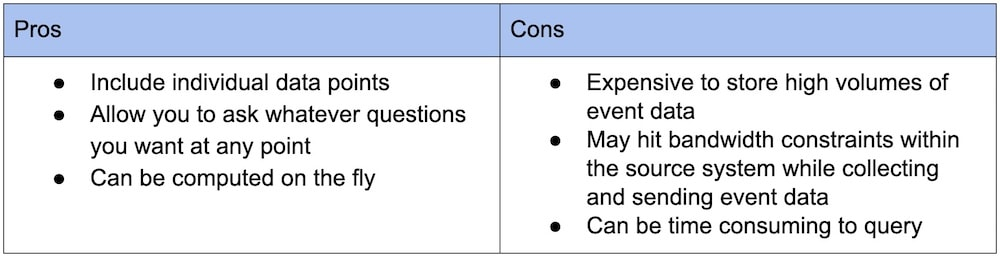

- [Logs](#logs)
  - [Properties](#properties)
  - [Usecase](#usecase)
- [Events](#events)
  - [Properties](#properties-1)
  - [use cases](#use-cases)
  - [Java logging frameworks](#java-logging-frameworks)

# Logs
* Use case: Troubleshooting
* Storage by ElasticSearch and display by Kibana

## Properties

* Definitions:
  * logs are essentially just lines of text a system produces when certain code blocks get executed. 
* Structure: 
  * Similar to events, log data is discrete—it’s not aggregated—and can occur at irregular time intervals. Logs are also usually much more granular than events. In fact, one event can correlate to many log lines.
  * Log data is sometimes unstructured, and therefore hard to parse in a systematic way; however, these days you’re more likely to encounter “structured log data” that is formatted specifically to be parsed by a machine. Structured log data makes it easier and faster to search the data and derive events or metrics from the data. 

## Usecase

* Developers rely on them heavily in order to troubleshoot their code and to retroactively verify and interrogate the code’s execution. Logs are incredibly versatile and have many use cases, and most software systems can emit log data. The most common use case for logs is for getting a detailed, play-by-play record of what happened at a particular time.

# Events

## Properties

* Conceptually, an event can be defined as a discrete action happening at a moment in time. 
* Events become more powerful when you add more metadata to them.

## use cases

* Events are useful when the data is relatively small or sporadic in nature, or when you don’t know the specific aggregates you want to see ahead of time. And each individual event is stored until it’s deleted.

## Java logging frameworks
* JDK logger: Shipped together with Java 1.4
* Frameworks define logging APIs: Apache Commons Logging / Slf4j
  * Logger: includes methods such as trace/debug/info/warn/error
  * LogFactory: LogFactoryImpl
* Log4j / log4j 2/ Logback
