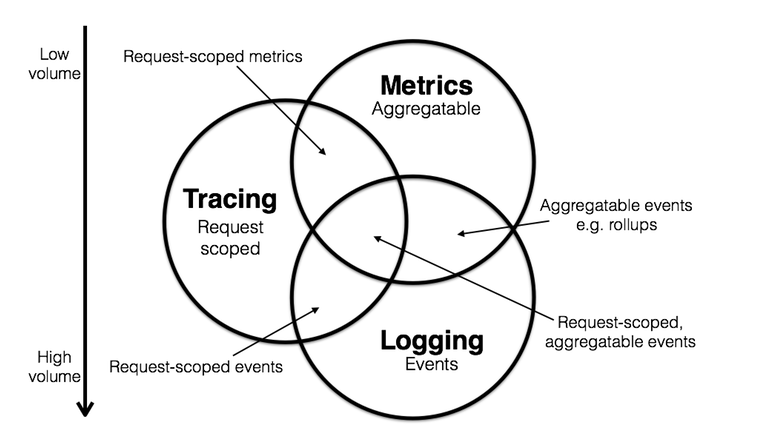
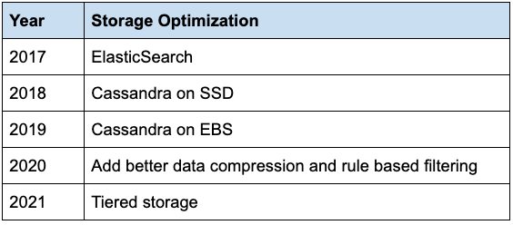

- [Telemetry types](#telemetry-types)
- [Real world](#real-world)
  - [Netflix](#netflix)
    - [Case study: Netflix's ElasticSearch -> Cassandra (SSD->EBS)](#case-study-netflixs-elasticsearch---cassandra-ssd-ebs)
  - [Healthchecks.io](#healthchecksio)
  - [Coinbase](#coinbase)
  - [Telemetry](#telemetry)
  - [Todo - Observability vs telemetry](#todo---observability-vs-telemetry)
  - [AppDynamics vs Dynatrace](#appdynamics-vs-dynatrace)

# Telemetry types

* [telemetry-data-101](https://newrelic.com/platform/telemetry-data-101)

# Real world

## Netflix

* Application monitoring: [https://netflixtechblog.com/telltale-netflix-application-monitoring-simplified-5c08bfa780ba](https://netflixtechblog.com/telltale-netflix-application-monitoring-simplified-5c08bfa780ba)
* Distributed tracing: [https://netflixtechblog.com/building-netflixs-distributed-tracing-infrastructure-bb856c319304](https://netflixtechblog.com/building-netflixs-distributed-tracing-infrastructure-bb856c319304)
* Edgar solving mysterious: [https://netflixtechblog.com/edgar-solving-mysteries-faster-with-observability-e1a76302c71f](https://netflixtechblog.com/edgar-solving-mysteries-faster-with-observability-e1a76302c71f)
* Self-serve dashboard: [https://netflixtechblog.com/lumen-custom-self-service-dashboarding-for-netflix-8c56b541548c](https://netflixtechblog.com/lumen-custom-self-service-dashboarding-for-netflix-8c56b541548c)
* Build observability tools: [https://netflixtechblog.com/lessons-from-building-observability-tools-at-netflix-7cfafed6ab17](https://netflixtechblog.com/lessons-from-building-observability-tools-at-netflix-7cfafed6ab17)
* Netflix On instance trace: [https://netflixtechblog.com/introducing-bolt-on-instance-diagnostic-and-remediation-platform-176651b55505](https://netflixtechblog.com/introducing-bolt-on-instance-diagnostic-and-remediation-platform-176651b55505)
* Netflix system intuition: [https://netflixtechblog.com/flux-a-new-approach-to-system-intuition-cf428b7316ec](https://netflixtechblog.com/flux-a-new-approach-to-system-intuition-cf428b7316ec)
* Time series data at Netflix: [https://netflixtechblog.com/scaling-time-series-data-storage-part-i-ec2b6d44ba39](https://netflixtechblog.com/scaling-time-series-data-storage-part-i-ec2b6d44ba39)

### Case study: Netflix's ElasticSearch -> Cassandra (SSD->EBS)

* [https://netflixtechblog.com/building-netflixs-distributed-tracing-infrastructure-bb856c319304](https://netflixtechblog.com/building-netflixs-distributed-tracing-infrastructure-bb856c319304)
* [https://netflixtechblog.com/lessons-from-building-observability-tools-at-netflix-7cfafed6ab17](https://netflixtechblog.com/lessons-from-building-observability-tools-at-netflix-7cfafed6ab17)

## Healthchecks.io

* 120 paying customer
* 1600 monthly recurring revenue
* 10M pings per day
* Industrial implementation:
  * Sentry

## Coinbase
* https://blog.coinbase.com/logs-metrics-and-the-evolution-of-observability-at-coinbase-13196b15edb7

## Telemetry
* OpenTelemetry; [https://opentelemetry.lightstep.com/](https://opentelemetry.lightstep.com)
* Metrics, logging and tracing: [https://peter.bourgon.org/blog/2017/02/21/metrics-tracing-and-logging.html](https://peter.bourgon.org/blog/2017/02/21/metrics-tracing-and-logging.html)
* Which trace to collect: 
  * [https://news.ycombinator.com/item?id=15326272](https://news.ycombinator.com/item?id=15326272)
  * Tail-based sampling: [https://github.com/jaegertracing/jaeger/issues/425](https://github.com/jaegertracing/jaeger/issues/425)

## Todo - Observability vs telemetry
* https://www.dynatrace.com/news/blog/what-is-observability-2/

## AppDynamics vs Dynatrace
* AppDynamics, Dynatrace, OpenTelemetry的介绍与比较: https://donggeitnote.com/2021/10/30/observability/
* https://www.overops.com/blog/appdynamics-vs-dynatrace-battle-of-the-enterprise-monitoring-giants/