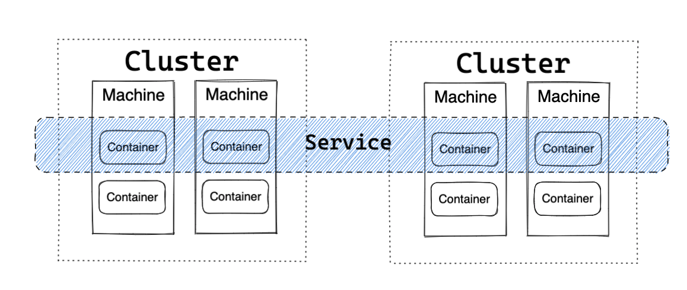
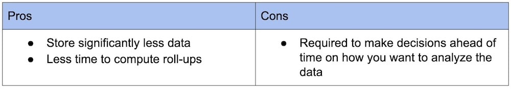

- [Time series](#time-series)
  - [Components](#components)
    - [Object](#object)
    - [Metric](#metric)
    - [Tag](#tag)
  - [Access patterns](#access-patterns)
  - [NonFunc requirements](#nonfunc-requirements)

# Time series

## Components
* Time series = Object + Tag + Metrics + actual data

### Object
* Monitoring object could be in three categories:
  * Machine level: Physical machine, virtual machine, operation system
  * Instance level: Container, process
  * Service level (logical object): Service, service group, cluster

### Metric
* Metrics are numeric measurements. Metrics can include:
  * A numeric status at a moment in time (like CPU % used)
  * Aggregated measurements (like a count of events over a one-minute time, or a rate of events-per-minute)
* The types of metric aggregation are diverse (for example, average, total, minimum, maximum, sum-of-squares), but all metrics generally share the following traits:
  * A name
  * A timestamp
  * One or more numeric values

### Tag
* Annotated key value pairs

## Access patterns
* Sequential read: Read by time range
* Random write: Different time series data 
* Much more write than read 
* Lots of aggregating dimensions

## NonFunc requirements
* High availability under high throughput
  * Usually each object has a write sampling frequency is per 5s/10s.