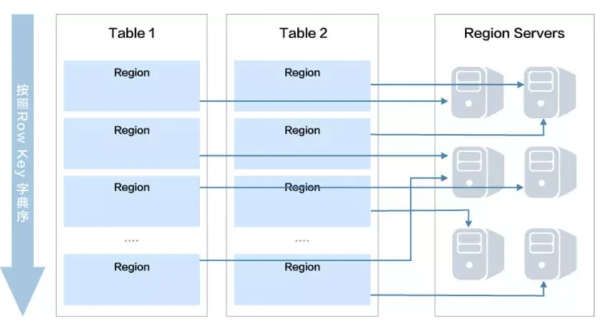
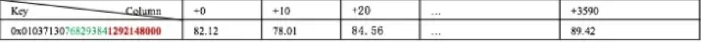
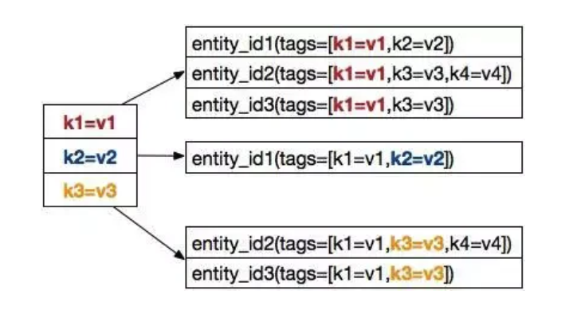
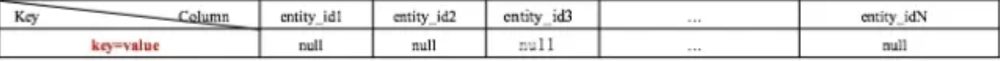
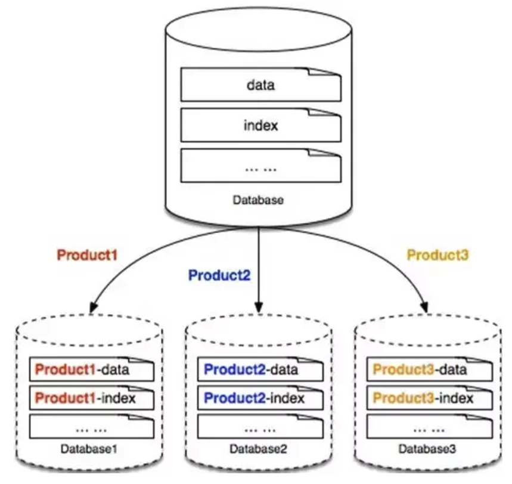
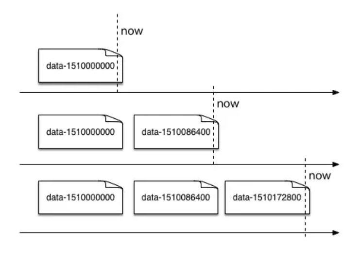
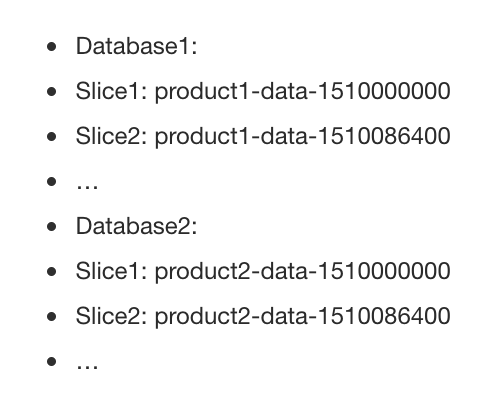
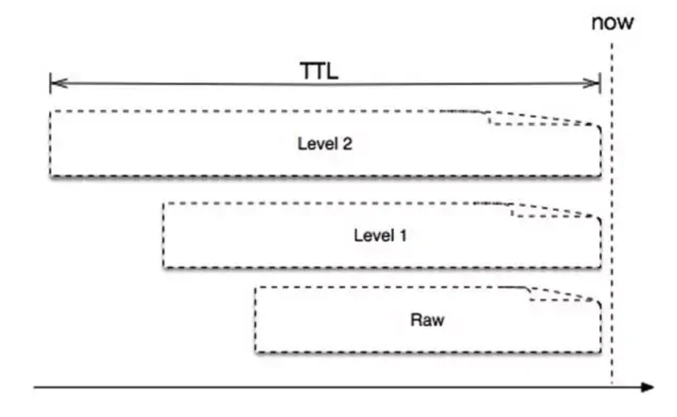

- [Components](#components)
  - [Object](#object)
  - [Metric](#metric)
  - [Tag](#tag)
- [Access patterns](#access-patterns)
- [Storage in HBase](#storage-in-hbase)
  - [Rowkey](#rowkey)
    - [Why rowkey is important](#why-rowkey-is-important)
    - [Row key design](#row-key-design)
      - [Benefits](#benefits)
      - [Support tag aggregation](#support-tag-aggregation)
    - [Scaling](#scaling)
      - [Vertical sharding](#vertical-sharding)
      - [Horizontal partitioning](#horizontal-partitioning)
      - [Downsampling](#downsampling)
        - [Pre-downsampling](#pre-downsampling)
        - [Post-downsampling](#post-downsampling)
- [References](#references)
  - [百度](#百度)
  - [Write time series DB from scratch](#write-time-series-db-from-scratch)
  - [ELK](#elk)
  - [Uber M3](#uber-m3)
  - [Datadog](#datadog)
  - [Aggregation](#aggregation)

# Components
* Time series = Object + Tag + Metrics + actual data

## Object
* Monitoring object could be in three categories:
  * Machine level: Physical machine, virtual machine, operation system
  * Instance level: Container, process
  * Service level (logical object): Service, service group, cluster


## Metric
* Metrics are numeric measurements. Metrics can include:
  * A numeric status at a moment in time (like CPU % used)
  * Aggregated measurements (like a count of events over a one-minute time, or a rate of events-per-minute)
* The types of metric aggregation are diverse (for example, average, total, minimum, maximum, sum-of-squares), but all metrics generally share the following traits:
  * A name
  * A timestamp
  * One or more numeric values


## Tag
* Annotated key value pairs

# Access patterns
* Sequential read: Read by time range
* Random write: Different time series data 
  * Usually each object has a write sampling frequency is per 5s/10s.
* Much more write than read 
* Lots of aggregating dimensions

# Storage in HBase
## Rowkey
### Why rowkey is important
* If rowkey could be designed properly, then data could be distributed evenly into HRegions. And different HRegions could be located in different server nodes. 



### Row key design

```
ts = (object, tags) + metric + [(timestamp, value), (timestamp, value), …]

// entity_id is hashed result of combination (object, tags)
// metric_id is hashed result of metric
// timebase is the result of Unix timestamp % 3600, 
//             4 byte length, Rowkey represents 1 hour data. 
RowKey = entity_id + metric_id + timebase
```



#### Benefits
* entity_id and metric_id makes data evenly distributed. 
* timebase makes continous data next to each other. 

#### Support tag aggregation
* HBase does not have native support for index. This makes it impossible to find all entity_ids given a tag. 
* In the example below:
  * Give a tag: K1=V1, it could find all entities containing the tag: entity_id1, entity_id2, entity_id3





### Scaling
#### Vertical sharding
* Each product has a different database



#### Horizontal partitioning
* Slice name is Product - data - {starttime}
  * startime is the data starting time in table.
  * It will help remove data in batch. 





#### Downsampling
##### Pre-downsampling
* The longer the retention period is, the less data could be stored. 



##### Post-downsampling
* At query time, dynamically downsample data based on user assigned query range. 

# References
## 百度
* [百度大规模时序数据存储（一）| 监控场景的时序数据](https://www.infoq.cn/article/UaVA1y2bsxOkHdpRbzAL)
* [百度大规模时序数据存储（二）| 存储选型及数据模型设计](https://www.infoq.cn/article/eELNhTBprAPEABiRfrzw)
* [百度大规模时序数据存储（三）| 核心功能设计](https://www.infoq.cn/article/4OmD0KKQ8z0pN3LmcXQD)

## Write time series DB from scratch
* https://fabxc.org/tsdb/

## ELK
* https://www.twosigma.com/articles/building-a-high-throughput-metrics-system-using-open-source-software/

## Uber M3
* https://eng.uber.com/m3/

## Datadog
* https://www.infoq.com/presentations/datadog-metrics-db/

## Aggregation
* https://www.youtube.com/watch?v=UEJ6xq4frEw&ab_channel=HasgeekTV