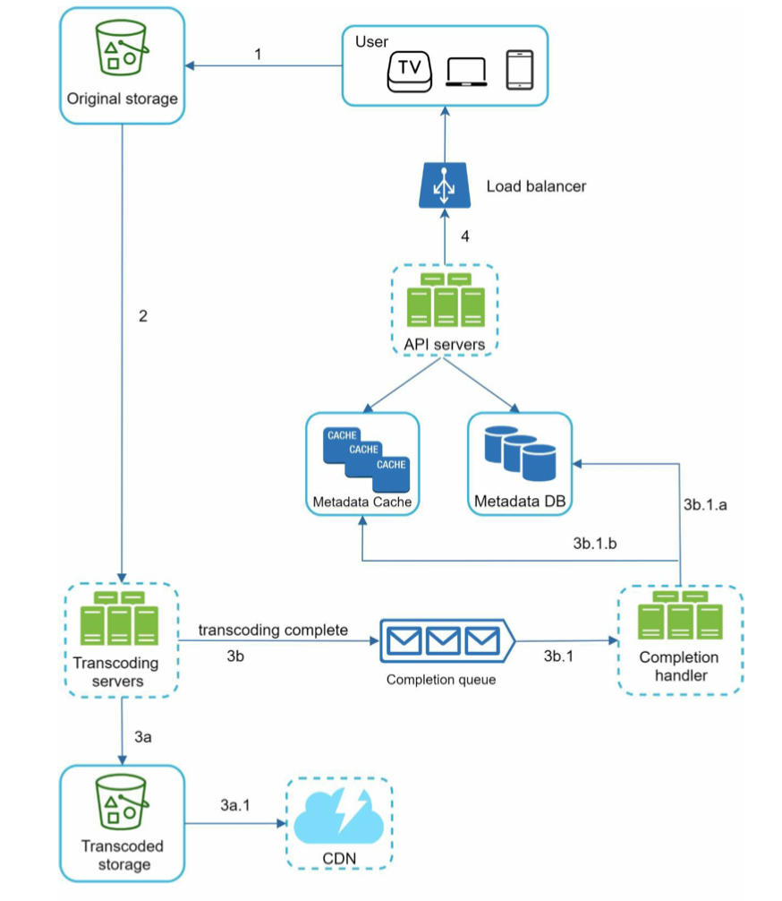
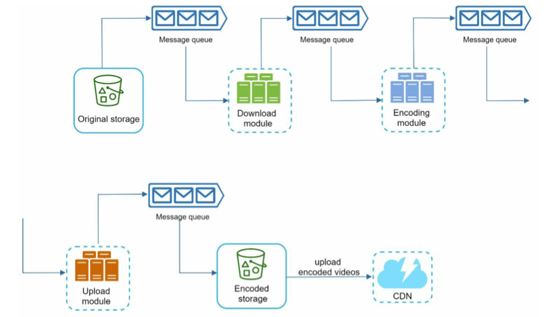

# Scenario_OnlineVideo

* [Online video](scenario_onlinevideo.md#online-video)
  * [High level architecture](scenario_onlinevideo.md#high-level-architecture)
    * [Video uploading flow](scenario_onlinevideo.md#video-uploading-flow)
    * [Video streaming flow](scenario_onlinevideo.md#video-streaming-flow)
  * [Detailed component design](scenario_onlinevideo.md#detailed-component-design)
    * [Upload](scenario_onlinevideo.md#upload)
      * [Preprocessing](scenario_onlinevideo.md#preprocessing)
      * [Async upload](scenario_onlinevideo.md#async-upload)
      * [Resumable upload](scenario_onlinevideo.md#resumable-upload)
    * [Video streaming](scenario_onlinevideo.md#video-streaming)
      * [Adaptive bitrate segmentation](scenario_onlinevideo.md#adaptive-bitrate-segmentation)
  * [Storage](scenario_onlinevideo.md#storage)
    * [Video chunks](scenario_onlinevideo.md#video-chunks)
    * [Thumbnails](scenario_onlinevideo.md#thumbnails)
  * [Real world practices](scenario_onlinevideo.md#real-world-practices)
    * [Netflix](scenario_onlinevideo.md#netflix)
      * [Popularity prediction](scenario_onlinevideo.md#popularity-prediction)
      * [Content distribution algorithm - HCA](scenario_onlinevideo.md#content-distribution-algorithm---hca)
      * [Proactive caching](scenario_onlinevideo.md#proactive-caching)
        * [Fill window](scenario_onlinevideo.md#fill-window)
        * [High level flow](scenario_onlinevideo.md#high-level-flow)
        * [Cache hit ratio](scenario_onlinevideo.md#cache-hit-ratio)
      * [Open Connect Appliances](scenario_onlinevideo.md#open-connect-appliances)
        * [Def](scenario_onlinevideo.md#def)
        * [Performance](scenario_onlinevideo.md#performance)
        * [Deployment](scenario_onlinevideo.md#deployment)
          * [At internet exchange locations](scenario_onlinevideo.md#at-internet-exchange-locations)
          * [Inside ISP site](scenario_onlinevideo.md#inside-isp-site)
        * [Clustering](scenario_onlinevideo.md#clustering)
        * [Flowchart](scenario_onlinevideo.md#flowchart)
          * [Identify the delta content](scenario_onlinevideo.md#identify-the-delta-content)
          * [Calculate the best route](scenario_onlinevideo.md#calculate-the-best-route)
          * [Tiered fetching approach](scenario_onlinevideo.md#tiered-fetching-approach)
      * [Media database](scenario_onlinevideo.md#media-database)
      * [S3 storage](scenario_onlinevideo.md#s3-storage)
      * [Encoding](scenario_onlinevideo.md#encoding)
    * [Facebook](scenario_onlinevideo.md#facebook)
      * [Facebook live](scenario_onlinevideo.md#facebook-live)
      * [Youtube](scenario_onlinevideo.md#youtube)
  * [Appendix](scenario_onlinevideo.md#appendix)
    * [Video formats](scenario_onlinevideo.md#video-formats)
    * [Container](scenario_onlinevideo.md#container)
    * [Codecs](scenario_onlinevideo.md#codecs)
    * [Streaming protocls](scenario_onlinevideo.md#streaming-protocls)

## Online video

### High level architecture

#### Video uploading flow

* Upload video
  * Video is uploaded to storage directly, not passing web server to save bandwidth. 



* Update metadata


#### Video streaming flow


### Detailed component design

#### Upload

**Preprocessing**

* Components:
  * Inspection: Make sure videos have good quality and not malformed.
  * Video transcoding: Videos are converted to support different container/codec. 
  * Thumbnail: Can be manually uploaded by the user or automatically generated by the system.
  * Watermark: An image overlay on top of your video contains identifying information about your video. 


* Video transcoding is to 
  * Raw video consumes large amount of storage space. 
  * Many browsers and devices only support certain form of encoding.

**Async upload**

* Introduce message queue between component to make the process asynchronous. 
  * The encoding module does not need to wait for the download module. 
  * The upload module does not need to wait for encoding module. 




**Resumable upload**

* Flowchart


* References:
  * Youtube: [https://developers.google.com/youtube/v3/guides/using_resumable_upload_protocol](https://developers.google.com/youtube/v3/guides/using_resumable_upload_protocol)
  * GoogleDrive: [https://developers.google.com/drive/api/v3/manage-uploads#resumable](https://developers.google.com/drive/api/v3/manage-uploads#resumable)
  * [https://googleapis.github.io/google-api-java-client/media-upload.html](https://googleapis.github.io/google-api-java-client/media-upload.html)

#### Video streaming

**Adaptive bitrate segmentation**

* Video could be encoded into different resolution frames. In terms of which frames to play, it could be decided based on the network speed. 


### Storage

#### Video chunks

#### Thumbnails

* SeaweedFS
* FastFS


### Real world practices

#### Netflix

**Popularity prediction**

* Although the number and size of the files that make up Netflix content library can be staggering, Netflix is able to use sophisticated popularity models to predict what its users will watch and when. 
* Being able to predict with accuracy, Netflix could do the following:
  * Avoid read/write contention by reducing disk reads (content serving) while we are performing disk writes (adding new content to the OCAs), we are able to optimize our disk efficiency.
  * Pre-positioning content to avoid any significant utilization of internet “backbone” capacity.
* [Granularity of popular content](https://netflixtechblog.com/how-data-science-helps-power-worldwide-delivery-of-netflix-content-bac55800f9a7)
  * For content placement, we do not need to predict popularity all the way to the user level, so we can take advantage of local or regional demand aggregation to increase accuracy. However, we need to predict at a highly granular level in another dimension: there can be hundreds of different files associated with each episode of a show so that we can provide all the encoding profiles and quality levels (bitrates) to support a wide range of devices and network conditions. We need separate predictions for each file because their size and popularity, therefore their cache efficiency, can vary by orders of magnitude.
  * Title level: Using this ranking for content positioning causes all files associated with a title to be ranked in a single group. This means that all files (multiple bitrates of video and audio) related to a single streaming session are guaranteed to be on a single server. The downside of this method is that we would have to store unpopular bitrates or encoding profiles alongside popular ones, making this method less efficient.
  * File level: Every file is ranked on its own popularity. Using this method, files from the same title are in different sections of the rank. However, this mechanism improves caching efficiency significantly.

**Content distribution algorithm - HCA**

* Although optimizations such as Popular files are locked into memory rather than fetched constantly from disk, [multiple copies of a file are stored](https://netflixtechblog.com/content-popularity-for-open-connect-b86d56f613b) due to the following reasons: 
  * Consistent hashing is used to distribute traffic across servers
  * Resilience to server failures and unexpected spikes in popularity
* Why traditional consistent hashing does not work?
  * Netflix already has different fleet of servers having different storage and throughput
  * New devices will be added continuously
* [Heterogeneous Cluster Allocation](https://netflixtechblog.com/distributing-content-to-open-connect-3e3e391d4dc9)
  * Idea: keep the consistent hashing, but use a model to come up with allocation weights when placing content on different individual servers.

**Proactive caching**

**Fill window**

* Fill window: By design, OCAs follow a “push fill” methodology. They fill every day during a window of time that corresponds to your off-peak hours. The timing of the fill window is defined in partnership with your network planning team. The goal is to set the fill window such that:
  * It occurs during the trough of your Netflix traffic
  * It does not disrupt your inbound traffic peaks
* Holiday caching: [https://netflixtechblog.com/caching-content-for-holiday-streaming-be3792f1d77c](https://netflixtechblog.com/caching-content-for-holiday-streaming-be3792f1d77c)

**High level flow**

* Take the continent of Australia, for example. All access to internet content that does not originate in Australia comes via a number of undersea cables. Rather than using this expensive undersea capacity to serve Netflix traffic, we copy each file once from our US-based transcoding repository to the storage locations within Australia. This is done during off-peak hours, when we’re not competing with other internet traffic. After each file is on the continent, it is then replicated to dozens of Open Connect servers within each ISP network.


**Cache hit ratio**

* Over 95% content are served from cache. 

 

* [A detailed video @scaling talking about hardware efforts](https://www.youtube.com/watch?v=tbqcsHg-Q_o\&ab_channel=%40Scale)

**Open Connect Appliances**

**Def**

* Netflix's proprietary CDN implementation because it knows better about Netflix content and users. 
* [Overall PDF doc](https://openconnect.netflix.com/Open-Connect-Overview.pdf)

**Performance**

* [100 Gbps per OCA machine](https://netflixtechblog.com/serving-100-gbps-from-an-open-connect-appliance-cdb51dda3b99)

**Deployment**

**At internet exchange locations**

* Def: 
  * An Internet Exchange Point can be defined as the physical infrastructure through which content delivery networks (CDNs) and Internet Service Providers (ISPs) exchange the Internet traffic between their networks. IXPs are not internet service providers but they allow various network operators to exchange traffic with other operators. An exchange point will not sell you anything resembling complete Internet connectivity. An IXP is more like a building block around which the internet is built.
  * An exchange point is an Ethernet Switch, just like the one that connects computer systems in the offices. Basically, when a network connects to an IXP, it connects one or more of its routers to the exchange point’s Ethernet switch and sends its traffic to the routers of other networks through Ethernet switch.
* References: [https://learning.mlytics.com/multi-cdn/what-is-an-internet-exchange-point-ixp/](https://learning.mlytics.com/multi-cdn/what-is-an-internet-exchange-point-ixp/)


**Inside ISP site**

* Basic deployment (OCA deployed inside ISP site)


* Failover scenario


**Clustering**

* OCAs are grouped into manifest clusters. Each manifest cluster gets configured with 1. an appropriate content region (the group of countries that are expected to stream content from the cluster) 2. a particular popularity feed (which in simplified terms is an ordered list of titles/content, based on previous data about their popularity) 3. how many copies of the content it should hold.
* Manifest clusters are then grouped into fill clusters. A fill cluster is a group of manifest clusters that have a shared content region and popularity feed.


**Flowchart**

* Reference: [https://netflixtechblog.com/netflix-and-fill-c43a32b490c0](https://netflixtechblog.com/netflix-and-fill-c43a32b490c0)

```
                     ┌────────────────────────────────────────────────────────────┐                                          
                     │                     AWS control panel                      │                                          
                     │                                                            │                                          
                     │  ┌───────────────────────────────────────────────────┐     │                                          
                     │  │* For each content, AWS control panel will elect an│     │                                          
                     │  │OCA as master. This election info is stored within │     │                                          
                     │  │the escalation policy within each OCA device.      │     │                                          
                     │  │                                                   │     │                                          
                  ┌─▶│  │* The fill escalation policies that are applied to │     │────────────────────────┐                 
                  │  │  │masters typically allow them to reach farther with │     │                        │                 
                  │  │  │less delay in order to grab that content and then  │     │                        │                 
                  │  │  │share it locally with non-masters.                 │     │                        │                 
                  │  │  │                                                   │     │                        │                 
                  │  │  └───────────────────────────────────────────────────┘     │                        │                 
                  │  │                                                            │                        │                 
                  │  │                                                            │                        │                 
                  │  └────────▲─────────────────────────────────┬─────────────────┘                        │                 
                  │           │                                 │                                          │                 
                  │           │                                 │                                          │                 
                  │           │                                 │                                          │                 
                  │           │                                 │                                          │                 
                  │           │               Step4. For each asked                                        │                 
                  │       Step3. If           content, return a list of                                    │                 
                  │      there is a           potential download locations.                                │                 
  Step1. Regular pull     delta in            The download location is          Step2. AWS control panel   │                 
 what are the list of     content,            determined based on the            returns a list of files   │                 
content I should store    manifest            following factors:│                cluster A should store    │                 
                  │       will ask                              │                                          │                 
                  │      for a list           1. Content availability                                      │                 
                  │      of content           2. Download location health                                  │                 
                  │           │               3. Route cost     │                                          │                 
                  │           │                                 │                                          │                 
                  │           │                                 │                                          │                 
    ┌ ─ ─ ─ ─ ─ ─ ┼ ─ ─ ─ ─ ─ ┼ ─ ─ ─ ─ ─ ─ ─ ─ ─ ─ ─ ─ ─ ─ ─ ─ ┼ ─ ─ ─ ─ ─ ─ ─ ─ ─ ─ ─ ─ ─ ─ ─ ─ ─ ─ ─ ─ ─│─ ─ ─ ─ ─ ─ ─ ─ ┐
                  │           │                                 │                                          │                 
    │          ┌──┼───────────┼─────────────────────────────────┼──────────────────────────────────────────┼──────────────┐ │
               │  │           │                                 │                                          │              │  
    │          │  │           │                                 │                                          │              │ │
               │  │           │                                 ▼                                          │              │  
    │          │  │  ┌──────────────────────────────────────────────────────────────────────────────────┐  │              │ │
               │  │  │                                      OCA 1                                       │  │              │  
    │          │  │  │  ┌─────────────────────────────────────────────────────┐                         │  │              │ │
               │  │  │  │Fill escalation policy:                              │                         │  │              │  
    │          │  │  │  │                                                     │                         │  │              │ │
               │  │  │  │1. How many hops away an OCA can go to download      │                         │  │              │  
    │          │  │  │  │content, and how long it should wait before doing so │                         │  │              │ │
               │  │  │  │2. Whether the OCA can go to the entire Open Connect │                         │  │              │  
    │          │  └──│  │network (beyond the hops defined above), and how long│                         │◀─┘              │ │
               │     │  │it should wait before doing so                       │                         │                 │  
    │          │     │  │3. Whether the OCA can go to S3, and how long it     │                         │                 │ │
               │     │  │should wait before doing so                          │                         │                 │  
    │          │     │  │                                                     │                         │                 │ │
               │     │  └─────────────────────────────────────────────────────┘                         │                 │  
    │          │     │                                                                                  │                 │ │
               │     └────────────┬────────────────────┬────────────────────────────┬───────────────────┘                 │  
    │          │                  │                    │                            │                                     │ │
               │     Step5. For a delta content,       │                            │                                     │  
    │          │      prefer peer fill if it is        │                            │                                     │ │
               │              available                │                            │                                     │  
    │          │                  │              Step6. For a missing               │                                     │ │
               │                  │              content, go to tier                │                                     │  
    │          │                  ▼               fill if available                 │                                     │ │
               │    ┌───────────────────────────┐      │                       Step7. For a missing                       │  
    │          │    │ OCA M (assume as elected  │      │                        content, directly                         │ │
               │    │   master for content K)   │      │                     download from Amazon S3.                     │  
    │          │    └───────────────────────────┘      │                            │                                     │ │
               │                                       │     Manifest cluster       │                                     │  
    │          └───────────────────────────────────────┼────────────────────────────┼─────────────────────────────────────┘ │
                                                       │                            │                                        
    │                                                  │                            │                                       │
                                                       ▼                            │          ┌───────────────────────┐     
    │                ┌────────────────────────────────────────────────────────┐     │          │  Manifest cluster H   │    │
                     │                   Manifest cluster C                   │     │          └───────────────────────┘     
    │                │               (AWS selected fill master)               │     │                                       │
                     │                                                        │     │          ┌───────────────────────┐     
    │                └────────────────────────────────────────────────────────┘     │          │  Manifest cluster Z   │    │
                                                                                    │          └───────────────────────┘     
    │                                                                               │                                       │
                                                                                    │                                        
    │                                                                               │                                       │
                                                          Fill cluster              │                                        
    └ ─ ─ ─ ─ ─ ─ ─ ─ ─ ─ ─ ─ ─ ─ ─ ─ ─ ─ ─ ─ ─ ─ ─ ─ ─ ─ ─ ─ ─ ─ ─ ─ ─ ─ ─ ─ ─ ─ ─ ┼ ─ ─ ─ ─ ─ ─ ─ ─ ─ ─ ─ ─ ─ ─ ─ ─ ─ ─ ─ ┘
                                                                                    │                                        
                                                                                    │                                        
                                                                                    │                                        
                                                                                    │                                        
                                                                                    ▼                                        
                                                                   ┌─────────────────────────────────┐                       
                                                                   │            Amazon S3            │                       
                                                                   └─────────────────────────────────┘
```

**Identify the delta content**

* Fill source manifests: OCAs do not store any information about other OCAs in the network, title popularity, etc. All of this information is aggregated and stored in the AWS control plane. 
  * Step1/2: OCAs communicate at regular intervals with the control plane services, requesting (among other things) a manifest file that contains the list of titles they should be storing and serving to members. 
  * Step3: If there is a delta between the list of titles in the manifest and what they are currently storing, each OCA will send a request, during its configured fill window, that includes a list of the new or updated titles that it needs. 
  * Step4: The response from the control plane in AWS is a ranked list of potential download locations, a.k.a. fill sources, for each title. The determination of the list takes into consideration several high-level factors:
    * Title (content) availability — Does the fill source have the requested title stored?
    * Fill health — Can the fill source take on additional fill traffic?
    * A calculated route cost — Described in the next section.

**Calculate the best route**

* It would be inefficient, in terms of both time and cost, to distribute a title directly from S3 to all of our OCAs, so we use a tiered approach. The goal is to ensure that the title is passed from one part of our network to another using the most efficient route possible.
* To calculate the least expensive fill source, we take into account network state and some configuration parameters for each OCA that are set by the Open Connect Operations team. For example:
  * BGP path attributes and physical location (latitude / longitude)
  * Fill master (number per fill cluster)
  * Fill escalation policies
* A fill escalation policy defines:
  * How many hops away an OCA can go to download content, and how long it should wait before doing so
  * Whether the OCA can go to the entire Open Connect network (beyond the hops defined above), and how long it should wait before doing so
  * Whether the OCA can go to S3, and how long it should wait before doing so

**Tiered fetching approach**

* The control plane elects the specified number of OCAs as masters for a given title asset. The fill escalation policies that are applied to masters typically allow them to reach farther with less delay in order to grab that content and then share it locally with non-masters.
* Given all of the input to our route calculations, rank order for fill sources works generally like this:
  * Peer fill: Available OCAs within the same manifest cluster or the same subnet
  * Tier fill: Available OCAs outside the manifest cluster configuration
  * Cache fill: Direct download from S3
* Different server tiers:
  * At locations that deliver very large amounts of traffic, we use a tiered infrastructure — high throughput servers (up to 100Gbps) are used to serve very popular content and high capacity storage servers (200TB+) are used to serve the tail of the catalog. We need to rank content based on popularity to properly organize it within these tiers.
* Fill pattern reference: [https://openconnect.zendesk.com/hc/en-us/articles/360035618071-Fill-patterns](https://openconnect.zendesk.com/hc/en-us/articles/360035618071-Fill-patterns)

**Media database**

* [Introduce Netflix media database](https://netflixtechblog.com/the-netflix-media-database-nmdb-9bf8e6d0944d)
* [Implement Netflix media database](https://netflixtechblog.com/implementing-the-netflix-media-database-53b5a840b42a)
* [Media database data model](https://netflixtechblog.com/netflix-mediadatabase-media-timeline-data-model-4e657e6ffe93)

**S3 storage**

* [Stream the needed bits](https://netflixtechblog.com/mezzfs-mounting-object-storage-in-netflixs-media-processing-platform-cda01c446ba)
* [Optimize s3 storage: Merge, sort, compaction](https://netflixtechblog.com/optimizing-data-warehouse-storage-7b94a48fdcbe)

**Encoding**

* Per content based encoding: [https://netflixtechblog.com/per-title-encode-optimization-7e99442b62a2](https://netflixtechblog.com/per-title-encode-optimization-7e99442b62a2)
* Encoding for legacy videos: [https://netflixtechblog.com/improving-our-video-encodes-for-legacy-devices-2b6b56eec5c9](https://netflixtechblog.com/improving-our-video-encodes-for-legacy-devices-2b6b56eec5c9)
* Shot-based encoding: [https://netflixtechblog.com/optimized-shot-based-encodes-now-streaming-4b9464204830](https://netflixtechblog.com/optimized-shot-based-encodes-now-streaming-4b9464204830)
* High quality video encoding: [https://netflixtechblog.com/high-quality-video-encoding-at-scale-d159db052746](https://netflixtechblog.com/high-quality-video-encoding-at-scale-d159db052746)
* Mobile encoding: [https://netflixtechblog.com/more-efficient-mobile-encodes-for-netflix-downloads-625d7b082909](https://netflixtechblog.com/more-efficient-mobile-encodes-for-netflix-downloads-625d7b082909)
* Comparison between different video formats: [https://netflixtechblog.com/a-large-scale-comparison-of-x264-x265-and-libvpx-a-sneak-peek-2e81e88f8b0f](https://netflixtechblog.com/a-large-scale-comparison-of-x264-x265-and-libvpx-a-sneak-peek-2e81e88f8b0f)
* 4K and HDR:[https://netflixtechblog.com/bringing-4k-and-hdr-to-anime-at-netflix-with-sol-levante-fa68105067cd](https://netflixtechblog.com/bringing-4k-and-hdr-to-anime-at-netflix-with-sol-levante-fa68105067cd)

#### Facebook

* Proactive CDN caching at Facebook: [https://www.youtube.com/watch?v=CbbeSg1t224\&ab_channel=JustinMiller](https://www.youtube.com/watch?v=CbbeSg1t224\&ab_channel=JustinMiller)
* Building and scaling a performant CDN: [https://www.youtube.com/watch?v=TLbzvbfWmfY\&ab_channel=Fastly](https://www.youtube.com/watch?v=TLbzvbfWmfY\&ab_channel=Fastly)
* How does Facebook encoding videos: [https://engineering.fb.com/2021/04/05/video-engineering/how-facebook-encodes-your-videos/](https://engineering.fb.com/2021/04/05/video-engineering/how-facebook-encodes-your-videos/)
* [Distributed processing at FB scale](https://www.cs.princeton.edu/\~wlloyd/papers/sve-sosp17.pdf)


**Facebook live**

* Facebook livestream architecture: [https://www.youtube.com/watch?v=IO4teCbHvZw\&ab_channel=InfoQ](https://www.youtube.com/watch?v=IO4teCbHvZw\&ab_channel=InfoQ)

**Youtube**

* [Summary of Youtube technology](https://medium.com/@martinomburajr/how-youtube-handles-streaming-4-000-000-000-daily-videos-without-a-hitch-8542741e957a)

### Appendix

#### Video formats

* One video episode could contain up to 1200 files. 


* References:
  * [Intro to video format](https://www.youtube.com/watch?v=XvoW-bwIeyY\&ab_channel=Qencode)

#### Container

* Container: Represented by video file extension. It includes video stream, audio stream and metadata (bitrate, device, resolution, time of creation, subtitles, etc.)  
  * FLV: Flash video format created by Adobe.
  * MP4: Standard MPEG-4 format.
  * WMV: Windows media video.
  * MOV: Apple quicktime

#### Codecs

* Video codecs: 
  * H.264 - the most commonly used video format
  * H.265(HEVC) - double compression rate of H.264, however need triple resources to encode, proprietary protocol. 
  * VP9
  * Av1 
* Audio codecs:
  * MP3 - Popular with wide support. Save space without noticeable quality loss. Limited functionality. 
  * AAC - Widely supported. More efficient than MP3. Limit on audio channel.
  * AC3 

#### Streaming protocls

* Defs: A standardized set of rules for storing containers, codecs, metadata, and folder structure. 
* TCP/IP based
  * RTP: RTSP and RTCP
  * RTMP: Real time messaging protocol
* HTTP based
  * MPEG4 (MPEG-4 Part10/12/14 )
  * HLS (Http Live stream)
    * .m3u8
  * MPEG-DASH (Dynamic adaptive streaming over HTTP)
  * RTMP
    * [https://www.wowza.com/blog/rtmp-streaming-real-time-messaging-protocol](https://www.wowza.com/blog/rtmp-streaming-real-time-messaging-protocol)
    * Quick dive: [https://www.youtube.com/watch?v=AoRepm5ks80\&ab_channel=Heavybit](https://www.youtube.com/watch?v=AoRepm5ks80\&ab_channel=Heavybit)


