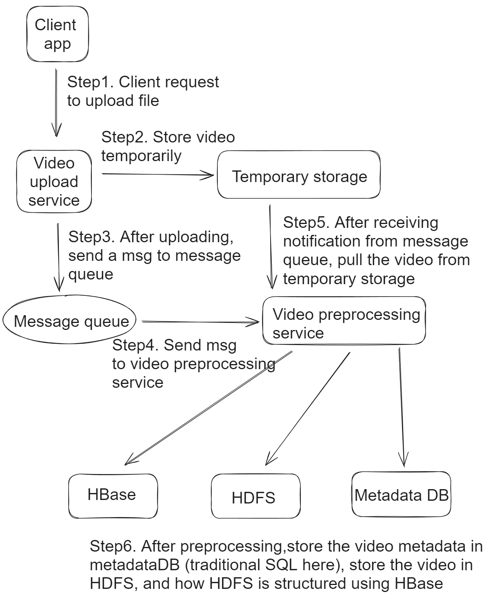
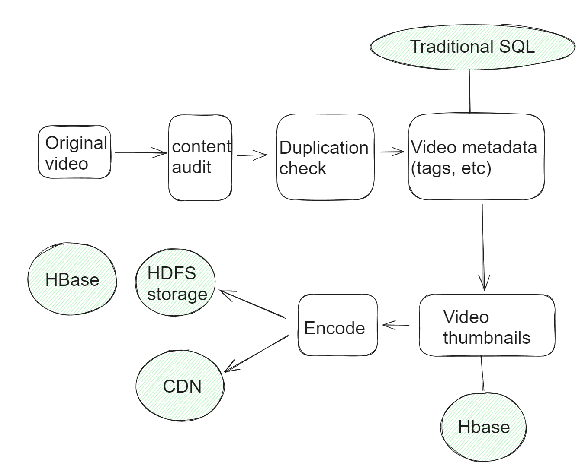

- [Video uploading](#video-uploading)
- [Video preprocessing](#video-preprocessing)
  - [Chain of responsibilities](#chain-of-responsibilities)

# Video uploading
* Video is uploaded to storage directly, not passing web server to save bandwidth. 

# Video preprocessing

## Chain of responsibilities
* Inspection: Make sure videos have good quality and not malformed.
* Thumbnail: Can be manually uploaded by the user or automatically generated by the system.
* Watermark: An image overlay on top of your video contains identifying information about your video. 
* Video transcoding: Videos are converted to support different container/codec. Video transcoding is to 
  * Raw video consumes large amount of storage space. 
  * Many browsers and devices only support certain form of encoding.
