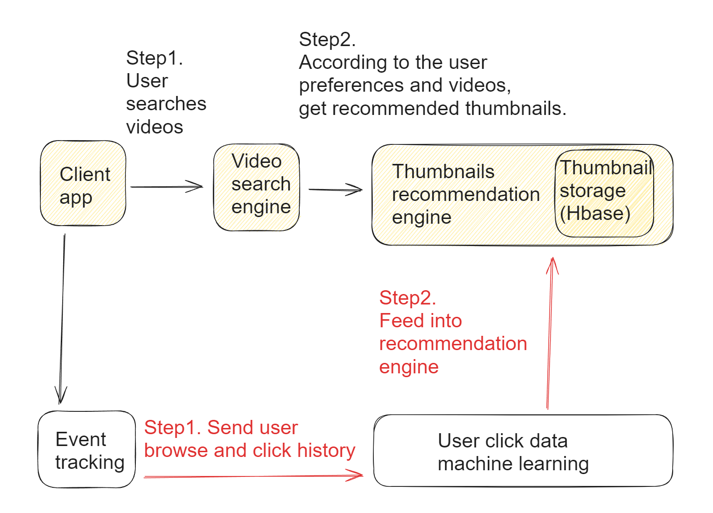

- [Video uploading](#video-uploading)
- [Video preprocessing - Chain of responsibilities](#video-preprocessing---chain-of-responsibilities)
  - [Content and duplication check](#content-and-duplication-check)
  - [Thumbnails](#thumbnails)
  - [Watermark](#watermark)
  - [Transcoding](#transcoding)
- [Video search](#video-search)

# Video uploading
* Video is uploaded to storage directly, not passing web server to save bandwidth. 

# Video preprocessing - Chain of responsibilities

## Content and duplication check
* Make sure videos have good quality and not malformed.

## Thumbnails
* Thumbnail: Can be manually uploaded by the user or automatically generated by the system.

## Watermark
* An image overlay on top of your video contains identifying information about your video. 

## Transcoding
* Video transcoding: Videos are converted to support different container/codec. Video transcoding is to 
  * Raw video consumes large amount of storage space. 
  * Many browsers and devices only support certain form of encoding.

* Video could be encoded into different resolution frames. In terms of which frames to play, it could be decided based on the network speed. 

# Video search
* when videos are uploaded, metadata (user, video title, etc) will be used to generate the inverse index. 
* When client app plays video, it could play the video on the fly using protocols such as MPEG-DASH. 
