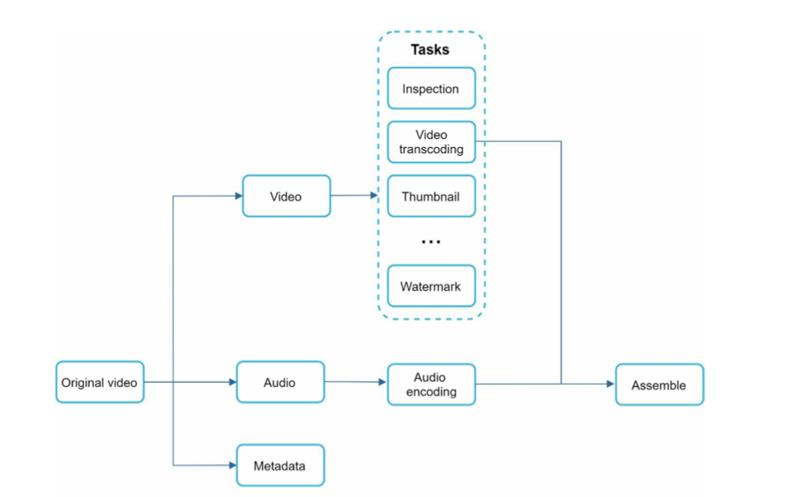
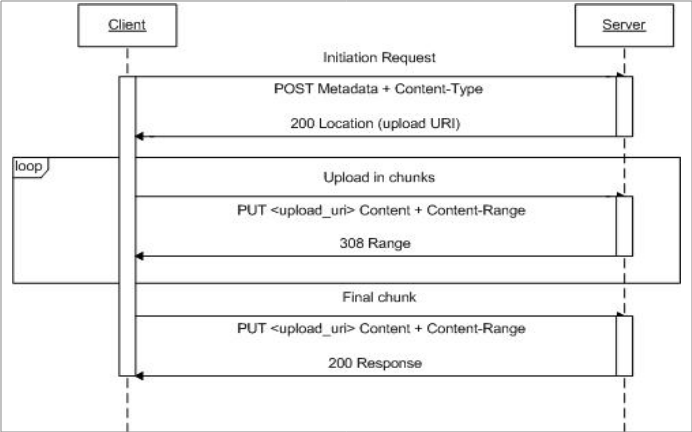

- [Video uploading](#video-uploading)
- [Video preprocessing](#video-preprocessing)
  - [Async upload](#async-upload)
  - [Resumable upload](#resumable-upload)
- [Video streaming flow](#video-streaming-flow)
  - [Adaptive bitrate segmentation](#adaptive-bitrate-segmentation)

# Video uploading
* Video is uploaded to storage directly, not passing web server to save bandwidth. 

# Video preprocessing
* Components:
  * Inspection: Make sure videos have good quality and not malformed.
  * Video transcoding: Videos are converted to support different container/codec. 
  * Thumbnail: Can be manually uploaded by the user or automatically generated by the system.
  * Watermark: An image overlay on top of your video contains identifying information about your video. 

* Video transcoding is to 
  * Raw video consumes large amount of storage space. 
  * Many browsers and devices only support certain form of encoding.

## Async upload

* Introduce message queue between component to make the process asynchronous. 
  * The encoding module does not need to wait for the download module. 
  * The upload module does not need to wait for encoding module. 

## Resumable upload

* Flowchart

* References:
  * Youtube: [https://developers.google.com/youtube/v3/guides/using_resumable_upload_protocol](https://developers.google.com/youtube/v3/guides/using_resumable_upload_protocol)
  * GoogleDrive: [https://developers.google.com/drive/api/v3/manage-uploads#resumable](https://developers.google.com/drive/api/v3/manage-uploads#resumable)
  * [https://googleapis.github.io/google-api-java-client/media-upload.html](https://googleapis.github.io/google-api-java-client/media-upload.html)

# Video streaming flow

## Adaptive bitrate segmentation

* Video could be encoded into different resolution frames. In terms of which frames to play, it could be decided based on the network speed. 

