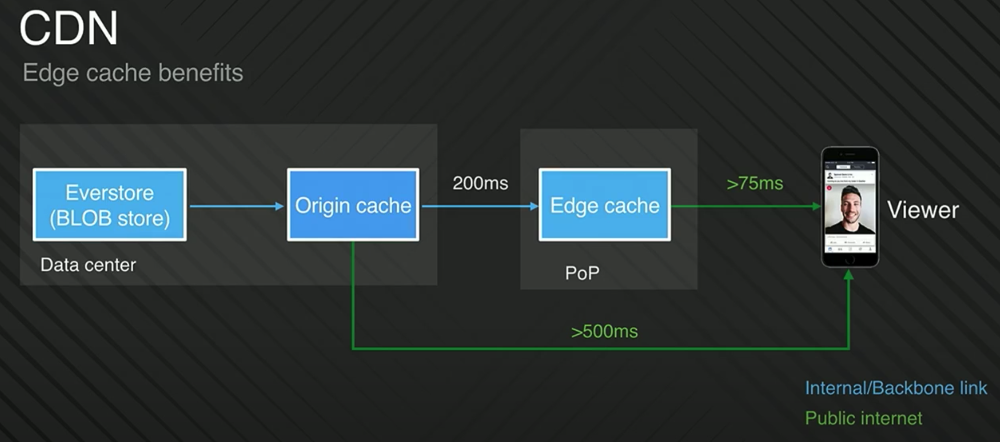
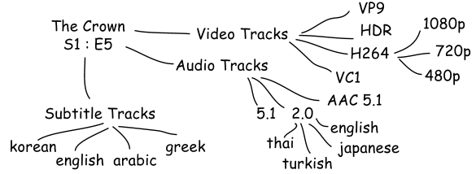
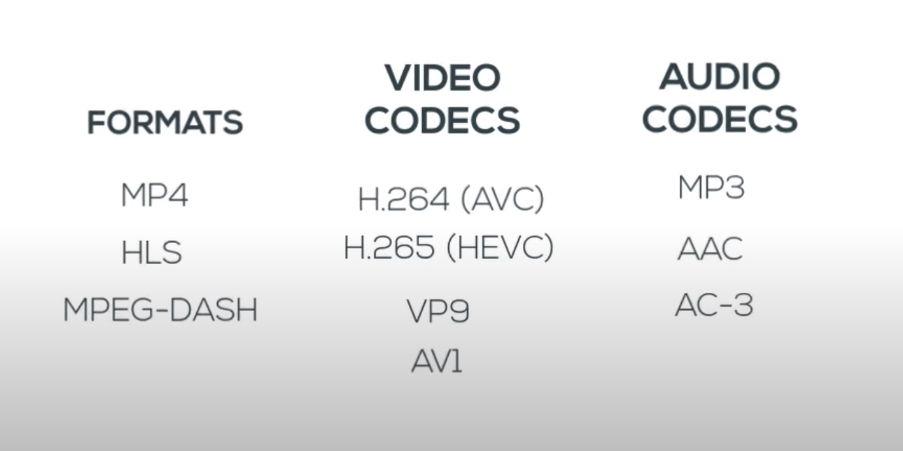
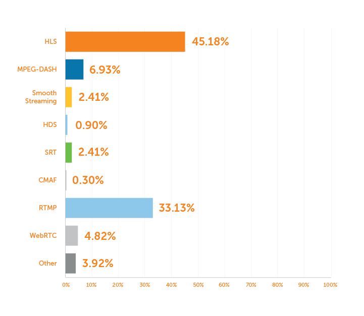

- [Func requirements](#func-requirements)
- [NonFunc requirements](#nonfunc-requirements)
  - [High performance](#high-performance)
  - [Scalability](#scalability)
- [Real world practices](#real-world-practices)
  - [Facebook](#facebook)
    - [Appendix](#appendix)
      - [Video formats](#video-formats)
      - [Container](#container)
      - [Codecs](#codecs)
      - [Streaming protocls](#streaming-protocls)
  - [TODO: Adaptive streaming](#todo-adaptive-streaming)

# Func requirements
* Upload videos online
* Watch videos online
* Search videos online

# NonFunc requirements
## High performance
## Scalability

# Real world practices
## Facebook

* Proactive CDN caching at Facebook: [https://www.youtube.com/watch?v=CbbeSg1t224\&ab_channel=JustinMiller](https://www.youtube.com/watch?v=CbbeSg1t224\&ab_channel=JustinMiller)
* Building and scaling a performant CDN: [https://www.youtube.com/watch?v=TLbzvbfWmfY\&ab_channel=Fastly](https://www.youtube.com/watch?v=TLbzvbfWmfY\&ab_channel=Fastly)
* How does Facebook encoding videos: [https://engineering.fb.com/2021/04/05/video-engineering/how-facebook-encodes-your-videos/](https://engineering.fb.com/2021/04/05/video-engineering/how-facebook-encodes-your-videos/)
* [Distributed processing at FB scale](https://www.cs.princeton.edu/\~wlloyd/papers/sve-sosp17.pdf)

**Facebook live**

* Facebook livestream architecture: [https://www.youtube.com/watch?v=IO4teCbHvZw\&ab_channel=InfoQ](https://www.youtube.com/watch?v=IO4teCbHvZw\&ab_channel=InfoQ)

**Youtube**

* [Summary of Youtube technology](https://medium.com/@martinomburajr/how-youtube-handles-streaming-4-000-000-000-daily-videos-without-a-hitch-8542741e957a)

### Appendix

#### Video formats

* One video episode could contain up to 1200 files. 

* References:
  * [Intro to video format](https://www.youtube.com/watch?v=XvoW-bwIeyY\&ab_channel=Qencode)

#### Container

* Container: Represented by video file extension. It includes video stream, audio stream and metadata (bitrate, device, resolution, time of creation, subtitles, etc.)  
  * FLV: Flash video format created by Adobe.
  * MP4: Standard MPEG-4 format.
  * WMV: Windows media video.
  * MOV: Apple quicktime

#### Codecs

* Video codecs: 
  * H.264 - the most commonly used video format
  * H.265(HEVC) - double compression rate of H.264, however need triple resources to encode, proprietary protocol. 
  * VP9
  * Av1 
* Audio codecs:
  * MP3 - Popular with wide support. Save space without noticeable quality loss. Limited functionality. 
  * AAC - Widely supported. More efficient than MP3. Limit on audio channel.
  * AC3 

#### Streaming protocls

* Defs: A standardized set of rules for storing containers, codecs, metadata, and folder structure. 
* TCP/IP based
  * RTP: RTSP and RTCP
  * RTMP: Real time messaging protocol
* HTTP based
  * MPEG4 (MPEG-4 Part10/12/14 )
  * HLS (Http Live stream)
    * .m3u8
  * MPEG-DASH (Dynamic adaptive streaming over HTTP)
  * RTMP
    * [https://www.wowza.com/blog/rtmp-streaming-real-time-messaging-protocol](https://www.wowza.com/blog/rtmp-streaming-real-time-messaging-protocol)
    * Quick dive: [https://www.youtube.com/watch?v=AoRepm5ks80\&ab_channel=Heavybit](https://www.youtube.com/watch?v=AoRepm5ks80\&ab_channel=Heavybit)

## TODO: Adaptive streaming
* https://underhood.blog/adaptive-http-streaming

* Facebook livestream: https://www.youtube.com/watch?v=IO4teCbHvZw&t=223s&ab_channel=InfoQ