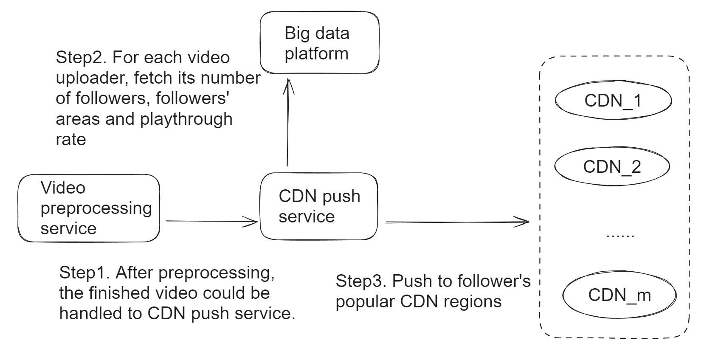

# Problem
* As discussed in estimation, the bandwidth requirement will be 

# CDN pushes
* Popular videos will be pushed to CDNs in a proactive manner. 
* Most of popular videos could be returned through CDNs.
* Most of video playthrough rate is not more than 30%, the videos could be split to several chunks. And only push certain chunks into CDNs.

``` 
# If designed properly, typically CDNs could handle 95% of traffic volumes and data center only needs to handle 5% of the total requirement. 

# Bandwidth requirement for data centers:
5% * 80 Tb/s = 4 Tb/s
```


