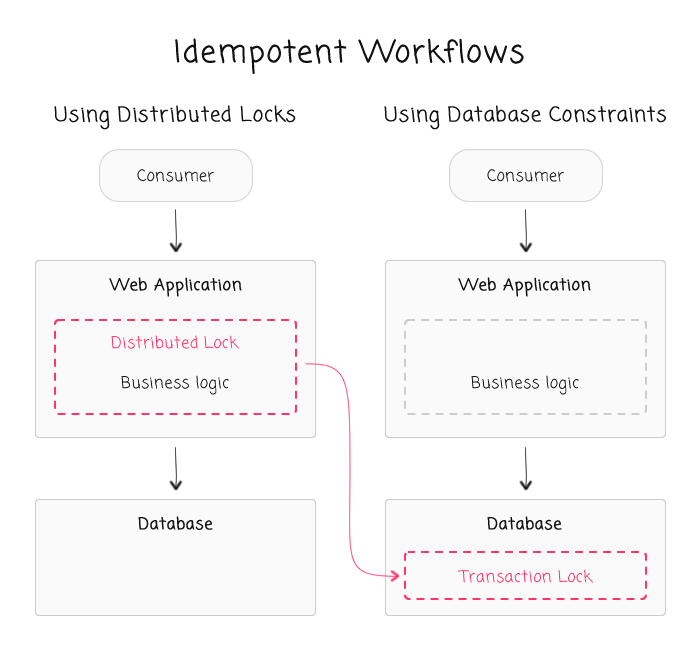
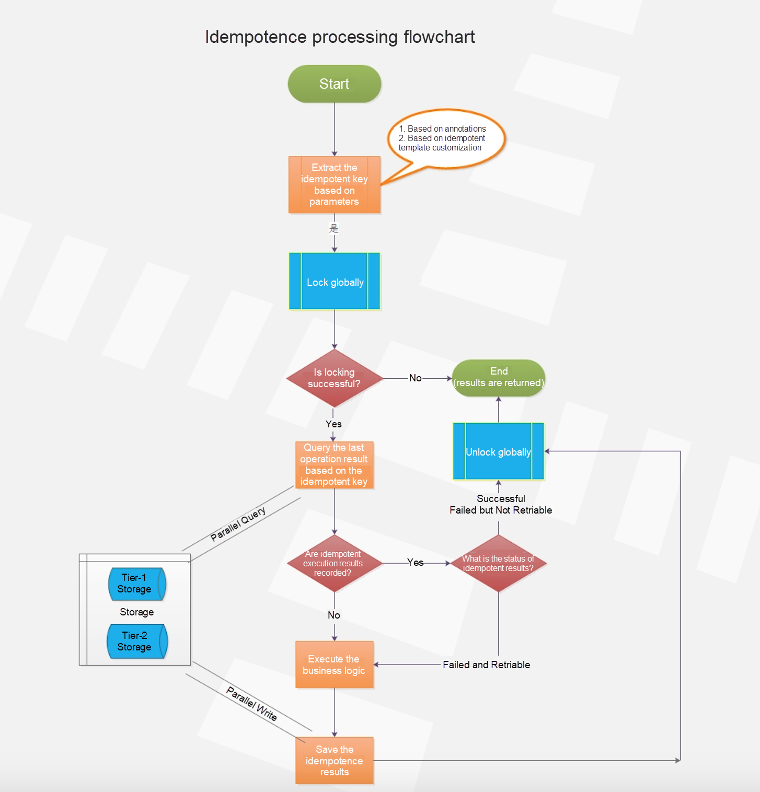

- [NonFunc requirements](#nonfunc-requirements)
  - [Correctness](#correctness)
  - [Resiliency](#resiliency)
    - [Idempotent](#idempotent)
      - [Idempotency key](#idempotency-key)
        - [Categories](#categories)
        - [Where to generate the idempotency key](#where-to-generate-the-idempotency-key)
      - [Business layer with distributed lock](#business-layer-with-distributed-lock)
      - [DB layer with unique constraints](#db-layer-with-unique-constraints)
        - [Create/Insert](#createinsert)
        - [Read/Select](#readselect)
        - [Delete](#delete)
- [Real world](#real-world)
  - [Stock trading system](#stock-trading-system)
  - [TODO: Payment system bbasics](#todo-payment-system-bbasics)
  - [TODO: Coinbase - NonFunc requirements](#todo-coinbase---nonfunc-requirements)
  - [Airbnb](#airbnb)
  - [TODO: Uber - Payment system](#todo-uber---payment-system)
  - [TODO: Stripe](#todo-stripe)
  - [Distributed transactions](#distributed-transactions)

# NonFunc requirements
## Correctness
* Any payment bugs that are related to correctness would cause an unacceptable customer experience. When an error occurs it needs to be corrected immediately. Further, the process to remediate such mistakes is time consuming, and usually is complicated due to various legal and compliance constraints.

## Resiliency
* 

### Idempotent

* Idempotency could be implemented in different layers of the service architecture.
  * For example, idempotency + distributed lock in business logic layer
  * For example, use database uniqueness constraints to implement in database layer

#### Idempotency key
* https://brandur.org/idempotency-keys
* https://brandur.org/http-transactions
* https://brandur.org/job-drain

##### Categories

* Request level idempotency: A random and unique key should be chosen from the client in order to ensure idempotency for the entire entity collection level. For example, if we wanted to allow multiple, different payments for a reservation booking (such as Pay Less Upfront), we just need to make sure the idempotency keys are different. UUID is a good example format to use for this.
* Entity level idempotency: Say we want to ensure that a given $10 payment with ID 1234 would only be refunded $5 once, since we can technically make $5 refund requests twice. We would then want to use a deterministic idempotency key based on the entity model to ensure entity-level idempotency. An example format would be “payment-1234-refund”. Every refund request for a unique payment would consequently be idempotent at the entity-level (Payment 1234).
* Ref: https://medium.com/airbnb-engineering/avoiding-double-payments-in-a-distributed-payments-system-2981f6b070bb

##### Where to generate the idempotency key

* Layers of architecture: App => Nginx => Network gateway => Business logic => Data access layer => DB / Cache
* Idempotency considerations should reside within data access layer, where CRUD operations happen.
  * The idempotency key could not be generated within app layer due to security reasons
  * The process is similar to OAuth
    1. Step1: App layer generates a code
    2. Step2: App talks to business layer with the generated code to get an idempotency key
    3. Step3: The generated idempotency keys are all stored within an external data store. Busines layer check the external data store with mapping from code => idempotency key
       * If exist, directly return the idempotency key
       * Otherwise, generate a new idempotency key, store it within external store and return the generated idempotency key.
  * An optimization on the process above: Don't always need to check the external data store because repeated requests are minorities. Could rely on DB optimistic concurrency control for it instead of checking every time. For example, below queries will only be executed when there is no conflicts.
    1. insert into … values … on DUPLICATE KEY UPDATE …
    2. update table set status = “paid” where id = xxx and status = “unpaid”;

#### Business layer with distributed lock

* Distributed lock
  * Scenario: Request only once within a short time window. e.g. User click accidently twice on the order button.
  * Please see [Distributed lock](https://github.com/DreamOfTheRedChamber/system-design-interviews/tree/b195bcc302b505e825a1fbccd26956fa29231553/distributedLock.md)
* https://www.alibabacloud.com/blog/four-major-technologies-behind-the-microservices-architecture_596216

#### DB layer with unique constraints
##### Create/Insert

* Example: Insert user values (uid, name, age, sex, ts) where uid is the primary key
* Needs a little work to guarantee idempotence: If the primary key is generated using DB auto-increment id, then it is not idempotent. The primary key should rely on id which is related with business logic.

##### Read/Select

* Idempotent
* Update
  * Example (Update to absolute value): Update user set age = 18 where uid = 58.
    * Suffers from ABA problem in multi-thread environment
      1. current age = 17
      2. operation A: set age = 18
      3. operation B: set age = 19
      4. operation A: set age = 18
    * Needs optimistic concurrency control (version number) to guarantee idempotence
      1. current age = 17
      2. operation A: set age = 19, v++ where v = 1;
      3. Operation B: set age = 18, v++ where v = 1;
  * Example (Update to relative value): Update user set age++ where uid = 58
    * Convert to absolute example

##### Delete

* Idempotent

* Reference: [https://www.bennadel.com/blog/3390-considering-strategies-for-idempotency-without-distributed-locking-with-ben-darfler.htm](https://www.bennadel.com/blog/3390-considering-strategies-for-idempotency-without-distributed-locking-with-ben-darfler.htm)

# Real world
* See the section within reference: [https://medium.com/airbnb-engineering/avoiding-double-payments-in-a-distributed-payments-system-2981f6b070bb](https://medium.com/airbnb-engineering/avoiding-double-payments-in-a-distributed-payments-system-2981f6b070bb)
* Stripe, Braintree, Paypal: How to Choose and Integrate Payment Gateways with Apps: https://yalantis.com/blog/payment-systems-integration-app-stripe-braintree-square/

## Stock trading system

## TODO: Payment system bbasics
* https://www.linkedin.com/pulse/system-design-practice-designing-payment-avik-das/

## TODO: Coinbase - NonFunc requirements
* https://blog.coinbase.com/how-we-build-payments-systems-at-coinbase-e99ba0eee7f3

## Airbnb
* Evolvement history and a bit hard to digest: https://medium.com/airbnb-engineering/scaling-airbnbs-payment-platform-43ebfc99b324
* Avoid double payment with eventual consistency: https://medium.com/airbnb-engineering/avoiding-double-payments-in-a-distributed-payments-system-2981f6b070bb
* Transaction integrity: https://medium.com/airbnb-engineering/measuring-transactional-integrity-in-airbnbs-distributed-payment-ecosystem-a670d6926d22

## TODO: Uber - Payment system
* https://underhood.blog/uber-payments-platform

## TODO: Stripe 
* API versioning: https://stripe.com/blog/api-versioning
* API rate limit: https://stripe.com/blog/rate-limiters
* API Idempotency: https://stripe.com/blog/idempotency
* History: https://stripe.com/blog/payment-api-design

## Distributed transactions
* https://www.zhihu.com/question/471722924
* https://www.sofastack.tech/blog/sofa-channel-4-retrospect/