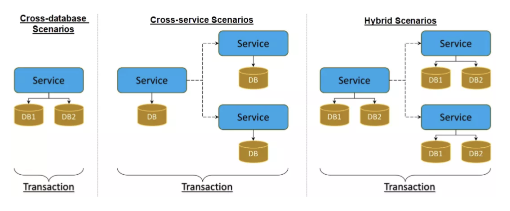
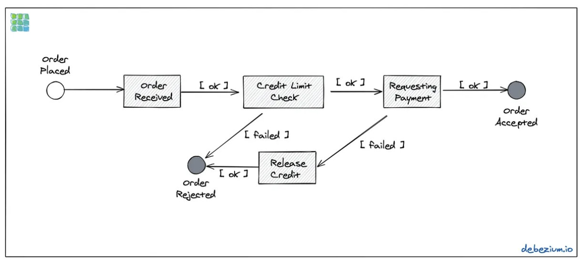
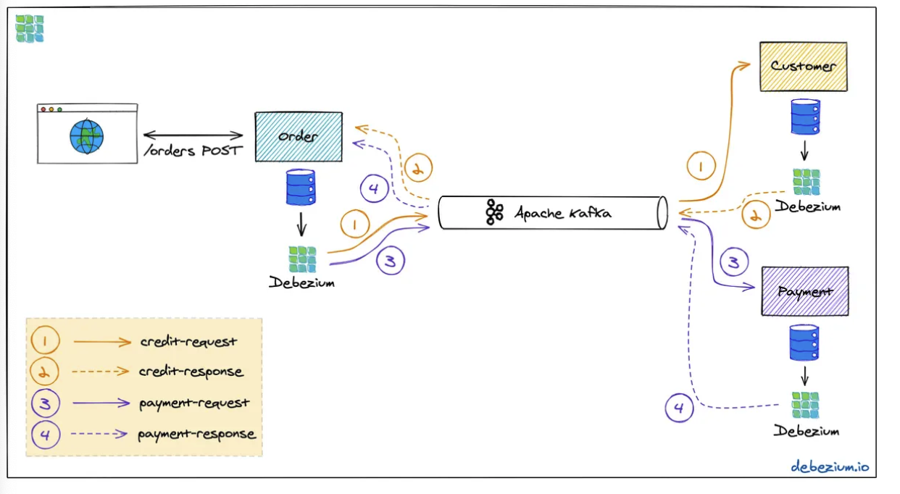
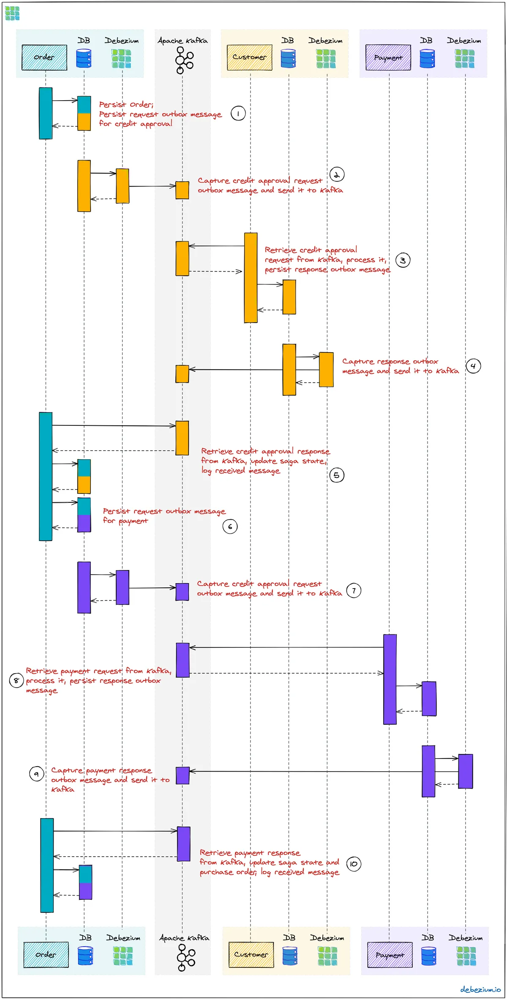
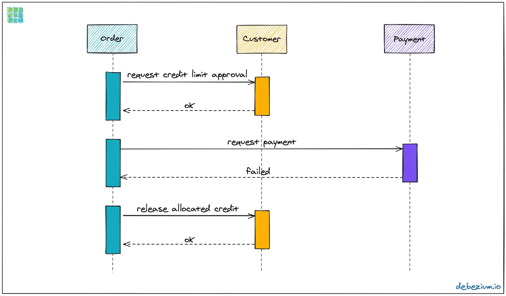
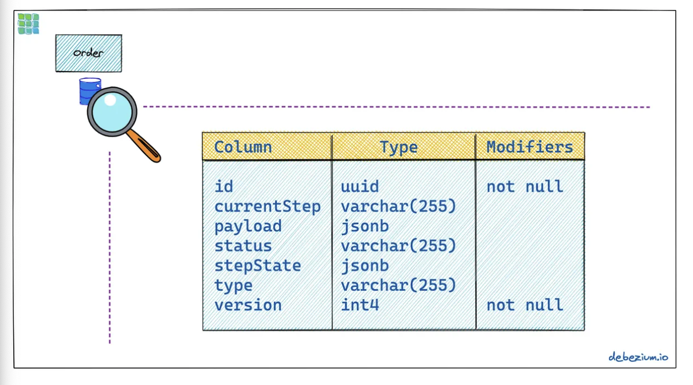

- [Correctness](#correctness)
- [Distributed transactions](#distributed-transactions)
  - [Applicable scenarios](#applicable-scenarios)
  - [Use transactional outbox to implement SAGA](#use-transactional-outbox-to-implement-saga)
    - [Transactional outbox](#transactional-outbox)
      - [Benefits](#benefits)
      - [Drawbacks](#drawbacks)
        - [More than once delivery](#more-than-once-delivery)
    - [Example problem for SAGA](#example-problem-for-saga)
      - [Apply outbox pattern on Saga orchestration](#apply-outbox-pattern-on-saga-orchestration)
      - [Ordering](#ordering)
      - [Two patterns for message relay](#two-patterns-for-message-relay)
        - [Transactional log tailing](#transactional-log-tailing)
        - [Polling publisher](#polling-publisher)
      - [Success and failure flow](#success-and-failure-flow)
      - [Storage](#storage)
      - [Example failure state transition for a purchase order whose payment fails](#example-failure-state-transition-for-a-purchase-order-whose-payment-fails)
- [References](#references)
  - [Overview of distributed transactions](#overview-of-distributed-transactions)
  - [ACID distributed transactions](#acid-distributed-transactions)
    - [Assumptions](#assumptions)
    - [Process](#process)
  - [Transaction message based distributed transaction](#transaction-message-based-distributed-transaction)
  - [Distributed Sagas](#distributed-sagas)
    - [Motivation](#motivation)
    - [Definition](#definition)
    - [Approaches](#approaches)
    - [References](#references-1)
  - [Distributed transactional middleware - Seata](#distributed-transactional-middleware---seata)
  - [Uber Cadence](#uber-cadence)


# Correctness
* Any payment bugs that are related to correctness would cause an unacceptable customer experience. When an error occurs it needs to be corrected immediately. Further, the process to remediate such mistakes is time consuming, and usually is complicated due to various legal and compliance constraints.

# Distributed transactions
## Applicable scenarios
* In general, there are three scenarios for distributed transactions:
  * Cross-database distributed transactions
  * Cross-service distributed transactions
  * Hybrid distributed transactions



## Use transactional outbox to implement SAGA
* Reference: infoq.com/articles/saga-orchestration-outbox/

### Transactional outbox
* https://microservices.io/patterns/data/transactional-outbox.html
* https://medium.com/engineering-varo/event-driven-architecture-and-the-outbox-pattern-569e6fba7216


#### Benefits
* 2PC is not used
Messages are guaranteed to be sent if and only if the database transaction commits
Messages are sent to the message broker in the order they were sent by the application

#### Drawbacks
This pattern has the following drawbacks:

* Potentially error prone since the developer might forget to publish the message/event after updating the database.

##### More than once delivery
* Problem: The Message Relay might publish a message more than once. It might, for example, crash after publishing a message but before recording the fact that it has done so. When it restarts, it will then publish the message again. 
* Solution: 
  * A message consumer must be idempotent, perhaps by tracking the IDs of the messages that it has already processed. Fortunately, since Message Consumers usually need to be idempotent (because a message broker can deliver messages more than once) this is typically not a problem.
  * To allow consumers to detect and ignore duplicate messages, each message should have a unique id. This could for instance be a UUID or a monotonically increasing sequence specific to each message producer, propagated as a Kafka message header.

### Example problem for SAGA



#### Apply outbox pattern on Saga orchestration



#### Ordering
* For scaling purposes, Kafka topics can be organized into multiple partitions.
* Only within a partition, it is guaranteed that a consumer will receive the messages in exactly the same order as they have been sent by the producer. As by default, all messages with the same key will go into the same partition, the unique id of a Saga is a natural choice for the Kafka message key. That way, the correct order of processing of the messages of one one Saga instance is ensured.
* Several Saga instances can be processed in parallel if they end up in different partitions of the topics used for the Saga message exchange.

#### Two patterns for message relay
##### Transactional log tailing
* https://microservices.io/patterns/data/transaction-log-tailing.html
* The mechanism for trailing the transaction log depends on the database:
  * MySQL binlog
  * Postgres WAL
  * AWS DynamoDB table streams

##### Polling publisher
* https://microservices.io/patterns/data/polling-publisher.html

#### Success and failure flow
* Success case


* Failure case


#### Storage
* id: Unique identifier of a given Saga instance, representing the creation of one particular purchase order
* currentStep: The step at which the Saga currently is, e.g., “credit-approval” or “payment”
* payload: An arbitrary data structure associated with a particular Saga instance, e.g., containing the id of the corresponding purchase order and other information useful during the Saga lifecycle; while the example implementation uses JSON as the payload format, one could also think of using other formats, for instance, Apache Avro, with payload schemas stored in a schema registry
* status: The current status of the Saga; one of STARTED, SUCCEEDED, ABORTING, or ABORTED
* stepState: A stringified JSON structure describing the status of the individual steps, e.g., "{\"credit-approval\":\"SUCCEEDED\",\"payment\":\"STARTED\"}"
* type: A nominal type of a Saga, e.g., “order-placement”; useful to tell apart different kinds of Sagas supported by one system
* version: An optimistic locking version, used to detect and reject concurrent updates to one Saga instance (in which case the message triggering the failing update needs to be retried, reloading the current state from the Saga log)



#### Example failure state transition for a purchase order whose payment fails
1. First, the order comes in and the “credit-approval” step gets started. At this point, a “credit-approval” request message has been persisted in the outbox table, too.

```json
{
  "id": "73707ad2-0732-4592-b7e2-79b07c745e45",
  "currentstep": null,
  "payload": "\"order-id\": 2, \"customer-id\": 456, \"payment-due\": 4999, \"credit-card-no\": \"xxxx-yyyy-dddd-9999\"}",
  "sagastatus": "STARTED",
  "stepstatus": "{}",
  "type": "order-placement",
  "version": 0
}
{
  "id": "73707ad2-0732-4592-b7e2-79b07c745e45",
  "currentstep": "credit-approval",
  "payload": "{ \"order-id\": 2, \"customer-id\": 456, ... }",
  "sagastatus": "STARTED",
  "stepstatus": "{\"credit-approval\": \"STARTED\"}",
  "type": "order-placement",
  "version": 1
}
```

2. Once this has been sent to Kafka, the order service will process it and send a reply message. The order service processes this by updating the Saga state and starting the payment step:

```json
{
  "id": "73707ad2-0732-4592-b7e2-79b07c745e45",
  "currentstep": "payment",
  "payload": "{ \"order-id\": 2, \"customer-id\": 456, ... }",
  "sagastatus": "STARTED",
  "stepstatus": "{\"payment\": \"STARTED\", \"credit-approval\": \"SUCCEEDED\"}",
  "type": "order-placement",
  "version": 2
}
```

3. Again a message is sent via the outbox table, now the “payment” request. This fails, and the payment system responds with a reply message indicating this fact. This means that the “credit-approval” step needs to be compensated via the customer system:

```json
{
  "id": "73707ad2-0732-4592-b7e2-79b07c745e45",
  "currentstep": "credit-approval",
  "payload": "{ \"order-id\": 2, \"customer-id\": 456, ... }",
  "sagastatus": "ABORTING",
  "stepstatus": "{\"payment\": \"FAILED\", \"credit-approval\": \"COMPENSATING\"}",
  "type": "order-placement",
  "version": 3
}
```

4. Once that has succeeded, the Saga is in its final state, ABORTED:

```
{
  "id": "73707ad2-0732-4592-b7e2-79b07c745e45",
  "currentstep": null,
  "payload": "{ \"order-id\": 2, \"customer-id\": 456, ... }",
  "sagastatus": "ABORTED",
  "stepstatus": "{\"payment\": \"FAILED\", \"credit-approval\": \"COMPENSATED\"}",
  "type": "order-placement",
  "version": 4
}
```

# References
## Overview of distributed transactions
* [In depth analysis](https://www.alibabacloud.com/blog/an-in-depth-analysis-of-distributed-transaction-solutions\_597232)

## ACID distributed transactions
* 2PC:
  1. [Reasoning behind two phase commit](https://github.com/DreamOfTheRedChamber/system-design-interviews/tree/b195bcc302b505e825a1fbccd26956fa29231553/files/princeton-2phasecommit.pdf)
  2. [Discuss failure cases of two phase commits](https://www.the-paper-trail.org/post/2008-11-27-consensus-protocols-two-phase-commit/)
  3. [Lecture](https://slideplayer.com/slide/4626345/)
  4. [2PC improvement NewSQL Percolator/PGXC GoldenDB](https://time.geekbang.org/column/article/278949)
* 3PC - Three phase commit
  * [https://www.the-paper-trail.org/post/2008-11-29-consensus-protocols-three-phase-commit/](https://www.the-paper-trail.org/post/2008-11-29-consensus-protocols-three-phase-commit/)
  * [http://courses.cs.vt.edu/\~cs5204/fall00/distributedDBMS/sreenu/3pc.html](http://courses.cs.vt.edu/\~cs5204/fall00/distributedDBMS/sreenu/3pc.html)

### Assumptions

* The protocol works in the following manner:
  1. One node is designated the coordinator, which is the master site, and the rest of the nodes in the network are called cohorts.
  2. Stable storage at each site and use of a write ahead log by each node.
  3. The protocol assumes that no node crashes forever, and eventually any two nodes can communicate with each other. The latter is not a big deal since network communication can typically be rerouted. The former is a much stronger assumption; suppose the machine blows up!

### Process
* Success case


* Failure case


## Transaction message based distributed transaction
* [Rocket MQ supports transactional message](https://rocketmq.apache.org/rocketmq/the-design-of-transactional-message/)


## Distributed Sagas
### Motivation
* Using distributed transaction to maintain data consistency suffers from the following two pitfalls
  * Many modern technologies including NoSQL databases such as MongoDB and Cassandra don't support them. Distributed transactions aren't supported by modern message brokers such as RabbitMQ and Apache Kafka.
  * It is a form of syncronous IPC, which reduces availability. In order for a distributed transaction to commit, all participating services must be available. If a distributed transaction involves two services that are 99.5% available, then the overall availability is 99\\%. Each additional service involved in a distributed transaction further reduces availability.
* Sagas are mechanisms to maintain data consistency in a microservice architecture without having to use distributed transactions.
* Distributed sagas execute transactions that span multiple physical databases by breaking them into smaller transactions and compensating transactions that operate on single databases.

### Definition

* High entry bar: First need to build a state machine. A saga is a state machine.
* A distributed saga is a collection of requests. Each request has a compensating request on failure. A dsitributed saga guarantees the following properties:
  1. Either all Requests in the Saga are succesfully completed, or
  2. A subset of Requests and their Compensating Requests are executed.
* Limitation: Does not guarantee the separation
  * Solution 1: Semantic lock

### Approaches

* Event-driven choreography: When there is no central coordination, each service produces and listen to other service’s events and decides if an action should be taken or not.
* Command/Orchestration: When a coordinator service is responsible for centralizing the saga’s decision making and sequencing business logic.

### References

* [https://dzone.com/articles/distributed-sagas-for-microservices](https://dzone.com/articles/distributed-sagas-for-microservices)
* [https://chrisrichardson.net/post/antipatterns/2019/07/09/developing-sagas-part-1.html](https://chrisrichardson.net/post/antipatterns/2019/07/09/developing-sagas-part-1.html)

## Distributed transactional middleware - Seata
* Seata is an implementation of variants 2PC.
* [https://github.com/seata/seata](https://github.com/seata/seata)

## Uber Cadence
* [TODO in Chinese](https://time.geekbang.org/course/detail/100053601-264150)
* [Cadence: The only workflow platform you'll ever need](https://www.youtube.com/watch?v=llmsBGKOuWI\&t=792s\&ab\_channel=UberEngineering)
* [Cadence meetup: Introduction to Cadence](https://www.youtube.com/watch?v=-BuIkhlc-RM\&ab\_channel=UberEngineering)
  * Use case: Long transaction example - UberEATS
* [Uber Cadence: Fault Tolerant Actor Framework](https://www.youtube.com/watch?v=qce\_AqCkFys\&ab\_channel=AICamp)
  * Use case: Long transaction example

