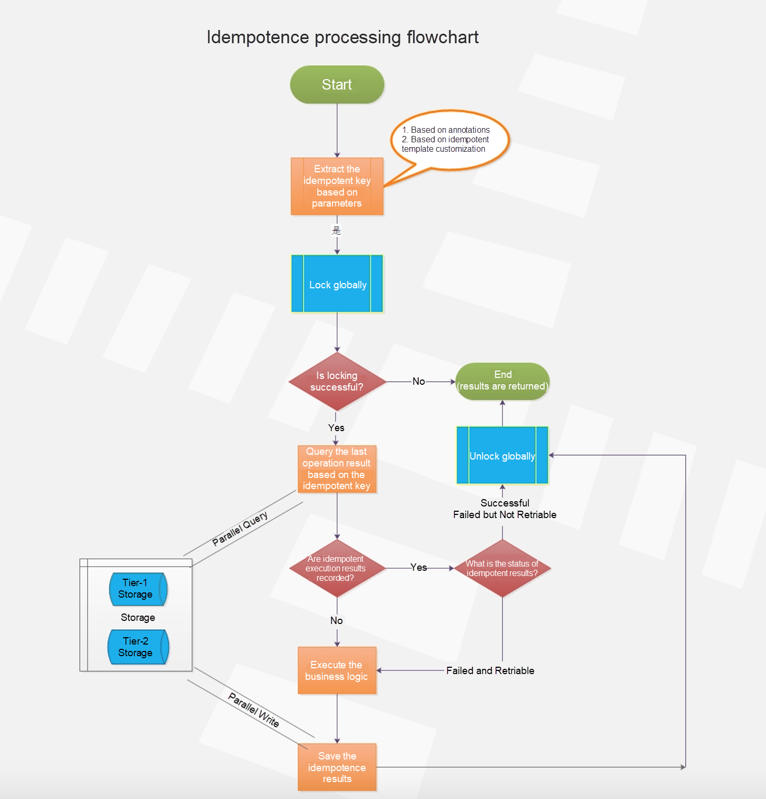

- [Idempotent](#idempotent)
  - [Def](#def)
  - [Implementation](#implementation)
    - [API layer](#api-layer)
    - [Idempotent create in DB layer](#idempotent-create-in-db-layer)
      - [Unique constraint on email](#unique-constraint-on-email)
      - [Serializable transaction](#serializable-transaction)
    - [Idempotent background job](#idempotent-background-job)
      - [Directly queue background job ?](#directly-queue-background-job-)
      - [Background staged job](#background-staged-job)
    - [Application layer](#application-layer)
      - [Idempotency key](#idempotency-key)
        - [Categories](#categories)
        - [Where to generate the idempotency key](#where-to-generate-the-idempotency-key)
      - [Business layer with distributed lock](#business-layer-with-distributed-lock)
  - [Retry](#retry)


# Idempotent
## Def
* The PUT method is idempotent. An idempotent method means that the result of a successful performed request is independent of the number of times it is executed.

## Implementation
* Idempotency could be implemented in different layers of the service architecture.
  * For example, idempotency + distributed lock in business logic layer
  * For example, use database uniqueness constraints to implement in database layer


### API layer
* POST is NOT idempotent.
* GET, PUT, DELETE, HEAD, OPTIONS and TRACE are idempotent.
* https://restfulapi.net/idempotent-rest-apis/

### Idempotent create in DB layer
* Ref: https://brandur.org/http-transactions
* Example: Insert user values (uid, email) where uid is the primary key
  * POST /users?email=jane@example.com

#### Unique constraint on email

```sql
CREATE TABLE users (
    id    BIGSERIAL PRIMARY KEY,
    email TEXT      NOT NULL CHECK (char_length(email) <= 255)
    CONSTRAINT UniqueEmail UNIQUE Email
);

-- our "user action" audit log
CREATE TABLE user_actions (
    id          BIGSERIAL   PRIMARY KEY,
    user_id     BIGINT      NOT NULL REFERENCES users (id),
    action      TEXT        NOT NULL CHECK (char_length(action) < 100),
    occurred_at TIMESTAMPTZ NOT NULL DEFAULT now()
);
```

#### Serializable transaction

```ruby
put "/users/:email" do |email|
  DB.transaction(isolation: :serializable) do
    user = User.find(email)
    halt(200, 'User exists') unless user.nil?

    # create the user
    user = User.create(email: email)

    # create the user action
    UserAction.create(user_id: user.id, action: 'created')

    # pass back a successful response
    [201, 'User created']
  end
end
```

```sql
-- Generated SQL from the above Ruby transactions
START TRANSACTION
    ISOLATION LEVEL SERIALIZABLE;

SELECT * FROM users
    WHERE email = 'jane@example.com';

INSERT INTO users (email)
    VALUES ('jane@example.com');

INSERT INTO user_actions (user_id, action)
    VALUES (1, 'created');

COMMIT;
```

### Idempotent background job
* Example: Insert user values (uid, email) where uid is the primary key
  * POST /users?email=jane@example.com
  * Make a request to an external service to tell it that an account has been created. 

```ruby
put "/users/:email" do |email|
  DB.transaction(isolation: :serializable) do
    user = User.find(email)
    halt(200, 'User exists') unless user.nil?

    # create the user
    user = User.create(email: email)

    # create the user action
    UserAction.create(user_id: user.id, action: 'created')

    # enqueue a job to tell an external support service
    # that a new user's been created
    enqueue(:create_user_in_support_service, email: email)

    ...
  end
end
```

#### Directly queue background job ?
* Then in the case of a transaction rollback (like we talked about above where two transactions conflict), we could end up with an invalid job in the queue. It’s referencing data that no longer exists, so no matter how many times job workers retried it, it can never succeed.

#### Background staged job
* Ref: https://brandur.org/job-drain
* A way around this is to create a job staging table into our database. Instead of sending jobs to the queue directly, they’re sent to a staging table first, and an enqueuer pulls them out in batches and puts them to the job queue.

```sql
CREATE TABLE staged_jobs (
    id       BIGSERIAL PRIMARY KEY,
    job_name TEXT      NOT NULL,
    job_args JSONB     NOT NULL
);
```

* The enqueuer selects jobs, enqueues them, and then removes them from the staging table 2. Because jobs are inserted into the staging table from within a transaction, its isolation property (ACID’s “I”) guarantees that they’re not visible to any other transaction until after the inserting transaction commits. A staged job that’s rolled back is never seen by the enqueuer, and doesn’t make it to the job queue.

* Here’s a rough implementation:

```ruby
loop do
  DB.transaction do
    # pull jobs in large batches
    job_batch = StagedJobs.order('id').limit(1000)

    if job_batch.count > 0
      # insert each one into the real job queue
      job_batch.each do |job|
        Sidekiq.enqueue(job.job_name, *job.job_args)
      end

      # and in the same transaction remove these records
      StagedJobs.where('id <= ?', job_batch.last).delete
    end
  end
end
```

### Application layer

#### Idempotency key
* https://brandur.org/idempotency-keys
* https://brandur.org/http-transactions
* https://brandur.org/job-drain

##### Categories

* Request level idempotency: A random and unique key should be chosen from the client in order to ensure idempotency for the entire entity collection level. For example, if we wanted to allow multiple, different payments for a reservation booking (such as Pay Less Upfront), we just need to make sure the idempotency keys are different. UUID is a good example format to use for this.
* Entity level idempotency: Say we want to ensure that a given $10 payment with ID 1234 would only be refunded $5 once, since we can technically make $5 refund requests twice. We would then want to use a deterministic idempotency key based on the entity model to ensure entity-level idempotency. An example format would be “payment-1234-refund”. Every refund request for a unique payment would consequently be idempotent at the entity-level (Payment 1234).
* Ref: https://medium.com/airbnb-engineering/avoiding-double-payments-in-a-distributed-payments-system-2981f6b070bb

##### Where to generate the idempotency key

* Layers of architecture: App => Nginx => Network gateway => Business logic => Data access layer => DB / Cache
* Idempotency considerations should reside within data access layer, where CRUD operations happen.
  * The idempotency key could not be generated within app layer due to security reasons
  * The process is similar to OAuth
    1. Step1: App layer generates a code
    2. Step2: App talks to business layer with the generated code to get an idempotency key
    3. Step3: The generated idempotency keys are all stored within an external data store. Busines layer check the external data store with mapping from code => idempotency key
       * If exist, directly return the idempotency key
       * Otherwise, generate a new idempotency key, store it within external store and return the generated idempotency key.
  * An optimization on the process above: Don't always need to check the external data store because repeated requests are minorities. Could rely on DB optimistic concurrency control for it instead of checking every time. For example, below queries will only be executed when there is no conflicts.
    1. insert into … values … on DUPLICATE KEY UPDATE …
    2. update table set status = “paid” where id = xxx and status = “unpaid”;


#### Business layer with distributed lock

* Distributed lock
  * Scenario: Request only once within a short time window. e.g. User click accidently twice on the order button.
  * Please see [Distributed lock](https://github.com/DreamOfTheRedChamber/system-design-interviews/tree/b195bcc302b505e825a1fbccd26956fa29231553/distributedLock.md)
* https://www.alibabacloud.com/blog/four-major-technologies-behind-the-microservices-architecture_596216




## Retry
* 

