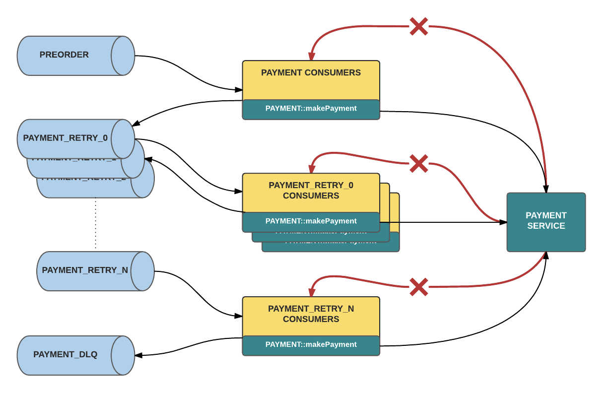

- [Idempotent](#idempotent)
  - [Def](#def)
  - [Implementation](#implementation)
    - [REST API layer](#rest-api-layer)
    - [Idempotent CREATE in DB layer](#idempotent-create-in-db-layer)
      - [Unique constraint on email](#unique-constraint-on-email)
      - [Serializable transaction](#serializable-transaction)
    - [Idempotent background job](#idempotent-background-job)
      - [Failure cases](#failure-cases)
      - [Transactionally-staged job drain](#transactionally-staged-job-drain)
        - [A rough implementation](#a-rough-implementation)
        - [Advantages over in-database queues](#advantages-over-in-database-queues)
    - [Application layer with idempotent key](#application-layer-with-idempotent-key)
      - [Def](#def-1)
      - [How to pass](#how-to-pass)
      - [Retention policy](#retention-policy)
      - [Idempotent DB schema design](#idempotent-db-schema-design)
      - [Example with rocket ride](#example-with-rocket-ride)
        - [Transaction1: Insert idempotency key](#transaction1-insert-idempotency-key)
        - [Transaction2: Create ride and audit record](#transaction2-create-ride-and-audit-record)
        - [Transaction3: Call stripe](#transaction3-call-stripe)
      - [Business layer with distributed lock](#business-layer-with-distributed-lock)
    - [Idempotent with external systems](#idempotent-with-external-systems)
      - [API-based integration with modern PSPs](#api-based-integration-with-modern-psps)
        - [Problem](#problem)
        - [Solution](#solution)
      - [Legacy batch integration with banks](#legacy-batch-integration-with-banks)
- [Retry](#retry)
  - [Simple client retries](#simple-client-retries)
    - [Exponential backoff with jittery](#exponential-backoff-with-jittery)
    - [Cons](#cons)
  - [Retry queues to rescue](#retry-queues-to-rescue)
    - [Multi-layer retry queue](#multi-layer-retry-queue)
    - [Deadletter queue](#deadletter-queue)
- [References](#references)


# Idempotent
## Def
* The PUT method is idempotent. An idempotent method means that the result of a successful performed request is independent of the number of times it is executed.

## Implementation
* Idempotency could be implemented in different layers of the service architecture.
  * For example, idempotency + distributed lock in business logic layer
  * For example, use database uniqueness constraints to implement in database layer


### REST API layer
* POST is NOT idempotent.
* GET, PUT, DELETE, HEAD, OPTIONS and TRACE are idempotent.
* https://restfulapi.net/idempotent-rest-apis/

### Idempotent CREATE in DB layer
* Ref: https://brandur.org/http-transactions
* Example: Insert user values (uid, email) where uid is the primary key
  * POST /users?email=jane@example.com

#### Unique constraint on email

```sql
CREATE TABLE users (
    id    BIGSERIAL PRIMARY KEY,
    email TEXT      NOT NULL CHECK (char_length(email) <= 255)
    CONSTRAINT UniqueEmail UNIQUE Email
);

-- our "user action" audit log
CREATE TABLE user_actions (
    id          BIGSERIAL   PRIMARY KEY,
    user_id     BIGINT      NOT NULL REFERENCES users (id),
    action      TEXT        NOT NULL CHECK (char_length(action) < 100),
    occurred_at TIMESTAMPTZ NOT NULL DEFAULT now()
);
```

#### Serializable transaction

```ruby
put "/users/:email" do |email|
  DB.transaction(isolation: :serializable) do
    user = User.find(email)
    halt(200, 'User exists') unless user.nil?

    # create the user
    user = User.create(email: email)

    # create the user action
    UserAction.create(user_id: user.id, action: 'created')

    # pass back a successful response
    [201, 'User created']
  end
end
```

```sql
-- Generated SQL from the above Ruby transactions
START TRANSACTION
    ISOLATION LEVEL SERIALIZABLE;

SELECT * FROM users
    WHERE email = 'jane@example.com';

INSERT INTO users (email)
    VALUES ('jane@example.com');

INSERT INTO user_actions (user_id, action)
    VALUES (1, 'created');

COMMIT;
```

### Idempotent background job
* Example: starts a transaction, executes a few DB operations, and queues a job somewhere in the middle:

```ruby
DB.transaction do |t|
  db_op1(t)
  queue_job()
  db_op2(t)
end
```

* Why put job queuing in transaction?
  * If you queue a job after a transaction is committed, you run the risk of your program crashing after the commit, but before the job makes it to the queue. Data is persisted, but the background work doesn’t get done.

#### Failure cases
* Case1 : If your queue is fast, the job enqueued by queue_job() is likely to fail. A worker starts running it before its enclosing transaction is committed, and it fails to access data that it expected to be available.
* Case2: A related problem are transaction rollbacks. In these cases data is discarded completely, and jobs inserted into the queue will never succeed no matter how many times they’re retried.


#### Transactionally-staged job drain
* Ref: https://brandur.org/job-drain
* A way around this is to create a job staging table into our database. Instead of sending jobs to the queue directly, they’re sent to a staging table first, and an enqueuer pulls them out in batches and puts them to the job queue.

```sql
CREATE TABLE staged_jobs (
    id       BIGSERIAL PRIMARY KEY,
    job_name TEXT      NOT NULL,
    job_args JSONB     NOT NULL
);
```

* The enqueuer selects jobs, enqueues them, and then removes them from the staging table. Because jobs are inserted into the staging table from within a transaction, its isolation property (ACID’s “I”) guarantees that they’re not visible to any other transaction until after the inserting transaction commits. A staged job that’s rolled back is never seen by the enqueuer, and doesn’t make it to the job queue.


* The enqueuer is also totally resistant to job loss. Jobs are only removed after they’re successfully transmitted to the queue, so even if the worker dies partway through, it will pick back up again and send along any jobs that it missed. At least once delivery semantics are guaranteed.


##### A rough implementation

```ruby
# Only one enqueuer should be running at any given time.
acquire_lock(:enqueuer) do

  loop do
    # Need at least repeatable read isolation level so that our DELETE after
    # enqueueing will see the same jobs as the original SELECT.
    DB.transaction(isolation_level: :repeatable_read) do
      jobs = StagedJob.order(:id).limit(BATCH_SIZE)

      unless jobs.empty?
        jobs.each do |job|
          Sidekiq.enqueue(job.job_name, *job.job_args)
        end

        StagedJob.where(Sequel.lit("id <= ?", jobs.last.id)).delete
      end
    end

    # If `staged_jobs` was empty, sleep for some time so
    # we're not continuously hammering the database with
    # no-ops.
    sleep_with_exponential_backoff
  end

end
```

##### Advantages over in-database queues
* https://brandur.org/job-drain#in-database-queues

### Application layer with idempotent key

* https://brandur.org/idempotency-keys

#### Def
* An idempotency key is a unique value that’s generated by a client and sent to an API along with a request. The server stores the key to use for bookkeeping the status of that request on its end. If a request should fail partway through, the client retries with the same idempotency key value, and the server uses it to look up the request’s state and continue from where it left off.
* For request-level idempotency, a random and unique key should be chosen from the client in order to ensure idempotency for the entire entity collection level. For example, if we wanted to allow multiple, different payments for a reservation booking (such as Pay Less Upfront), we just need to make sure the idempotency keys are different. UUID is a good example format to use for this.
* Entity-level idempotency is far more stringent and restrictive than request-level idempotency. Say we want to ensure that a given $10 payment with ID 1234 would only be refunded $5 once, since we can technically make $5 refund requests twice. We would then want to use a deterministic idempotency key based on the entity model to ensure entity-level idempotency. An example format would be “payment-1234-refund”. Every refund request for a unique payment would consequently be idempotent at the entity-level (Payment 1234).

#### How to pass
* A common way to transmit an idempotency key is through an HTTP header:

```
POST /v1/charges

...
Idempotency-Key: 0ccb7813-e63d-4377-93c5-476cb93038f3
...

amount=1000&currency=usd
```

#### Retention policy
* Keys are not meant to be used as a permanent request archive but rather as a mechanism for ensuring near-term correctness. Servers should recycle them out of the system beyond a horizon where they won’t be of much use – say 24 hours or so.


#### Idempotent DB schema design
* idempotency_key is unique across each user so that it’s possible to have the same idempotency key for different requests as long as it’s across different user accounts.

```sql
CREATE TABLE idempotency_keys (
    id              BIGSERIAL   PRIMARY KEY,
    created_at      TIMESTAMPTZ NOT NULL DEFAULT now(),
    idempotency_key TEXT        NOT NULL
        CHECK (char_length(idempotency_key) <= 100),
    last_run_at     TIMESTAMPTZ NOT NULL DEFAULT NOW(),
    locked_at       TIMESTAMPTZ DEFAULT now(),

    -- parameters of the incoming request
    request_method  TEXT        NOT NULL
        CHECK (char_length(request_method) <= 10),
    request_params  JSONB       NOT NULL,
    request_path    TEXT        NOT NULL
        CHECK (char_length(request_path) <= 100),

    -- for finished requests, stored status code and body
    response_code   INT         NULL,
    response_body   JSONB       NULL,

    recovery_point  TEXT        NOT NULL
        CHECK (char_length(recovery_point) <= 50),
    user_id         BIGINT      NOT NULL
);

CREATE UNIQUE INDEX idempotency_keys_user_id_idempotency_key
    ON idempotency_keys (user_id, idempotency_key);
```

#### Example with rocket ride


##### Transaction1: Insert idempotency key

```ruby
key = nil

atomic_phase(key) do
  key = IdempotencyKey.first(user_id: user.id, idempotency_key: key_val)

  if key
    # Programs sending multiple requests with different parameters but the
    # same idempotency key is a bug.
    if key.request_params != params
      halt 409, JSON.generate(wrap_error(Messages.error_params_mismatch))
    end

    # Only acquire a lock if the key is unlocked or its lock has expired
    # because the original request was long enough ago.
    if key.locked_at && key.locked_at > Time.now - IDEMPOTENCY_KEY_LOCK_TIMEOUT
      halt 409, JSON.generate(wrap_error(Messages.error_request_in_progress))
    end

    # Lock the key and update latest run unless the request is already
    # finished.
    if key.recovery_point != RECOVERY_POINT_FINISHED
      key.update(last_run_at: Time.now, locked_at: Time.now)
    end
  else
    key = IdempotencyKey.create(
      idempotency_key: key_val,
      locked_at:       Time.now,
      recovery_point:  RECOVERY_POINT_STARTED,
      request_method:  request.request_method,
      request_params:  Sequel.pg_jsonb(params),
      request_path:    request.path_info,
      user_id:         user.id,
    )
  end

  # no response and no need to set a recovery point
  NoOp.new
end
```

##### Transaction2: Create ride and audit record

```ruby
atomic_phase(key) do
  ride = Ride.create(
    idempotency_key_id: key.id,
    origin_lat:         params["origin_lat"],
    origin_lon:         params["origin_lon"],
    target_lat:         params["target_lat"],
    target_lon:         params["target_lon"],
    stripe_charge_id:   nil, # no charge created yet
    user_id:            user.id,
  )

  # in the same transaction insert an audit record for what happened
  AuditRecord.insert(
    action:        AUDIT_RIDE_CREATED,
    data:          Sequel.pg_jsonb(params),
    origin_ip:     request.ip,
    resource_id:   ride.id,
    resource_type: "ride",
    user_id:       user.id,
  )

  RecoveryPoint.new(RECOVERY_POINT_RIDE_CREATED)
end
```

##### Transaction3: Call stripe

```ruby
atomic_phase(key) do
  # retrieve a ride record if necessary (i.e. we're recovering)
  ride = Ride.first(idempotency_key_id: key.id) if ride.nil?

  # if ride is still nil by this point, we have a bug
  raise "Bug! Should have ride for key at #{RECOVERY_POINT_RIDE_CREATED}." \
    if ride.nil?

  raise "Simulated fail with `raise_error` param." if raise_error

  # Rocket Rides is still a new service, so during our prototype phase
  # we're going to give $20 fixed-cost rides to everyone, regardless of
  # distance. We'll implement a better algorithm later to better
  # represent the cost in time and jetfuel on the part of our pilots.
  begin
    charge = Stripe::Charge.create({
      amount:      20_00,
      currency:    "usd",
      customer:    user.stripe_customer_id,
      description: "Charge for ride #{ride.id}",
    }, {
      # Pass through our own unique ID rather than the value
      # transmitted to us so that we can guarantee uniqueness to Stripe
      # across all Rocket Rides accounts.
      idempotency_key: "rocket-rides-atomic-#{key.id}"
    })
  rescue Stripe::CardError
    # Sets the response on the key and short circuits execution by
    # sending execution right to 'finished'.
    Response.new(402, wrap_error(Messages.error_payment(error: $!.message)))
  rescue Stripe::StripeError
    Response.new(503, wrap_error(Messages.error_payment_generic))
  else
    ride.update(stripe_charge_id: charge.id)
    RecoveryPoint.new(RECOVERY_POINT_CHARGE_CREATED)
  end
end
```

#### Business layer with distributed lock
* Distributed lock
  * Scenario: Request only once within a short time window. e.g. User click accidently twice on the order button.
  * Please see [Distributed lock](https://github.com/DreamOfTheRedChamber/system-design-interviews/tree/b195bcc302b505e825a1fbccd26956fa29231553/distributedLock.md)
* https://www.alibabacloud.com/blog/four-major-technologies-behind-the-microservices-architecture_596216


### Idempotent with external systems
* [Build Uber's payment processing system](https://m.youtube.com/watch?v=MJABqwzBkHs&feature=emb_title)
* While each integration with PSPs and banks is different, we can distinguish two integrations styles

#### API-based integration with modern PSPs
* API-based integrations with modern PSP integrations, with REST-based APIs, exchanging data in JSON, one transaction at a time, near-real time

##### Problem
* Payments operations use several PSPs in a complex arrangement, and another PSP may be used if a payment fails with the originally selected one. Such practice may improve collection rate, but naively retrying a failed operation on another PSP may lead to double charging. 


##### Solution
* The approach Uber uses to avoid this problem is by using dedicated request storage consulted when a retry needs to be performed, to ensure that retry goes back to an original service (Figure 12).


#### Legacy batch integration with banks
* Integrations are done by exchanging files via SFTP, with relatively low frequency (day or hours).

# Retry
## Simple client retries
### Exponential backoff with jittery


### Cons
* Clogged batch processing. When we are required to process a large number of messages in real time, repeatedly failed messages can clog batch processing. The worst offenders consistently exceed the retry limit, which also means that they take the longest and use the most resources. Without a success response, the Kafka consumer will not commit a new offset and the batches with these bad messages would be blocked, as they are re-consumed again and again, as illustrated in figure below.


* Difficulty retrieving metadata. It can be cumbersome to obtain metadata on the retries, such as timestamps and nth retry.

## Retry queues to rescue


### Multi-layer retry queue
* A separate group of retry consumers will read off their corresponding retry queue. These consumers behave like those in the original architecture, except that they consume from a different Kafka topic. Meanwhile, executing multiple retries is accomplished by creating multiple topics, with a different set of listeners subscribed to each retry topic. When the handler of a particular topic returns an error response for a given message, it will publish that message to the next retry topic below it
* Delays before retry: each subsequent level of retry consumers can enforce a processing delay, in other words, a timeout that increases as a message steps down through each retry topic. This mechanism follows a leaky bucket pattern where flow rate is expressed by the blocking nature of the delayed message consumption within the retry queues. Consequently, our queues are not so much retry queues as they are delayed processing queues, where the re-execution of error cases is our best-effort delivery: handler invocation will occur at least after the configured timeout but possibly later.



### Deadletter queue
* If requests continue to fail retry after retry, we want to collect these failures in a DLQ for visibility and diagnosis. A DLQ should allow listing for viewing the contents of the queue, purging for clearing those contents, and merging for reprocessing the dead-lettered messages, allowing comprehensive resolution for all failures affected by a shared issue.

# References
* [Reliable Processing in a Streaming Payment System by Emilee Urbanek and Manas Kelshikar](https://m.youtube.com/watch?v=5TD8m7w1xE0)
* Stripe API Idempotency: https://stripe.com/blog/idempotency
* [Uber retry queue](https://eng.uber.com/reliable-reprocessing/)