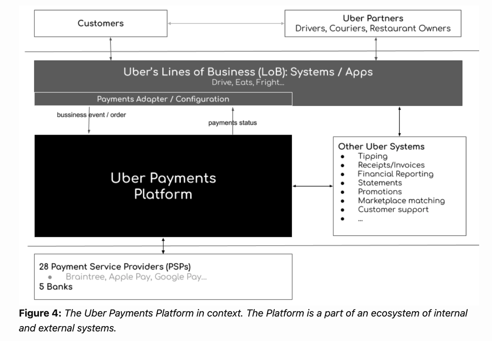
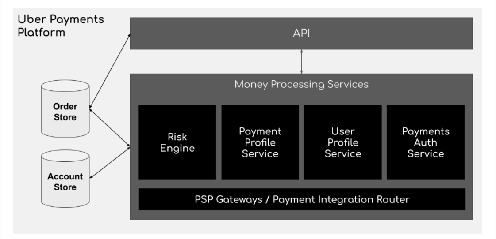
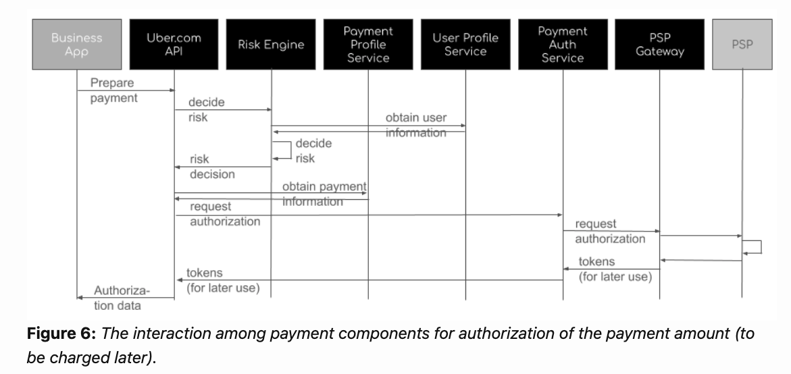
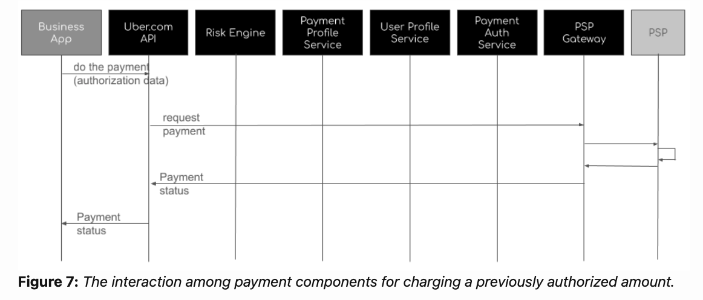

- [Func requiements](#func-requiements)
  - [Flowchart for authorization of payment amount](#flowchart-for-authorization-of-payment-amount)
- [NonFunc requirements](#nonfunc-requirements)
  - [Correctness](#correctness)
  - [Resiliency](#resiliency)
  - [Recoverability and traceability](#recoverability-and-traceability)
  - [Availability and integration velocity](#availability-and-integration-velocity)
  - [System maintainability and scalability](#system-maintainability-and-scalability)
- [Real world](#real-world)
  - [Coinbase - NonFunc requirements](#coinbase---nonfunc-requirements)
  - [Airbnb](#airbnb)
  - [Uber - Payment system](#uber---payment-system)
  - [TODO](#todo)

# Func requiements
* The Uber Payments Platform is a part of a broader ecosystem of Uber’s internal and external systems (Figure 4). Each of Uber businesses (Rides, Eats, Freight …) has its specific systems and apps. These systems obtain access to the functionality of the Payments Platform through the self-serviced, payment platform configuration layer. The Uber Payment platform also interacts with Uber internals systems for service such as reporting, invoicing, or tipping.

* Zooming in the Uber payment architecture, we can distinguish several key components:
  * API (a part of Uber.com API), providing a uniform interface to the payment functionality,
  * Risk Engine, making decisions about payment-related risks,
  * Payment Profile Service, providing the details of payment mechanisms,
  * User Profile Service, providing details about user payment and other settings,
  * Payment Auth Service, providing services for authentication of payments,
  * PSP Gateways, implementing the integration with payment service providers (PSPs),
  * Order store, storing data about orders, and
  * Account store, storing data about the accounts of payment parties.

## Flowchart for authorization of payment amount
* [Payments Integration at Uber: A Case Study by Gergely Orosz](https://www.youtube.com/watch?v=yooCE5B0SRA&feature=emb_title)

* Authorize a payment

* Charge an authorized payment

# NonFunc requirements
## Correctness
* Payments are one of the areas that have zero tolerance for any errors. Ensuring the product flows and features work as expected is of the utmost importance. Any payment bugs that are related to correctness would cause an unacceptable customer experience. When an error occurs it needs to be corrected immediately. Further, the process to remediate such mistakes is time consuming, and usually is complicated due to various legal and compliance constraints.
* In our systems, we have built multiple tiers to ensure correctness. These span from unit testing in implementation, production test/bug bash for any feature update or flow changes, monitoring on various error rates, authorization rates, and success rates; to anomaly detection and alerting set up to capture anything that could go wrong as regression due to new changes. Close support with the product loop also helps surface any correctness related issues.
Other than logical correctness, the correctness of system behavior could also be expanded to how exceptions are handled. We discuss some of these concepts in the following sections.

## Resiliency
* The second important aspect of correctness is how resilient the system is to external issues and bugs. For example, one of the most important concepts in the payments domain is called idempotency. This is necessary because if there is a retry initiative for any failed transaction, we must ensure the retry doesn’t result in any type of double charge.
* Usually, an end-to-end payments system would span the client-side, to the backend services, to the external partners where the payments transactions are handled on the backside. All transactions must be kept as atomic as possible. But some client-to-service or internal-to-external requests could be long, especially in timeout or failure cases, and we can only confirm the final results (success/failure) after minutes or hours later. So in some of those cases, we will initiate retries from upstream to downstream. If the whole end-to-end is not handling retry properly, i.e., the system is idempotent, it is inevitable to get into a situation of processing the same transaction twice, thus causing double charge or double payout.
* Once the idempotent quality is ensured, we also need to make sure to have the right design in place for auto-retry and user messaging, etc.

## Recoverability and traceability
* Another important thing to consider when having multiple layers from upstream to downstream is the data record. i.e., how we design data models, data recording, and propagation to ensure if any issues arise, we can do our best to recover the system state and trace what happened.
* Payments always use both cached data for speed and persistent data for recoverability. Whenever there is caching, then it is important to have the right strategy to guide as to when to write to which data layer. I.e. how we do data propagation when there is transient disagreement, how to identify the source of truth, and how we design the whole recovery process to ensure eventual consistency.
* Another key to capturing data properly is to keep a reliable record such that we can always trace what exactly happened. This is needed in different contexts including financial auditing, event logging, issue investigation need, etc.

## Availability and integration velocity
* When it comes to customer experience, the first thing users care about is whether the service is available for them to use. But the technical stack of a payment system consists of multiple layers. We therefore try to add as much redundancy as possible by duplication of critical components to increase reliability of our systems.
* Another important aspect of an international payments system is geographical coverage. The speed at which we can add new payment methods to new jurisdictions is crucial. To accelerate integration speed, it is important to have the right abstractions and abstraction layers to capture but also hide specific details. For example, a well-designed abstraction is when it can handle both push payments and pull payments; be used to represent both pay-in and payout; charge and refund; sync payment and async payment, etc.

## System maintainability and scalability
* Keeping the payment systems maintainable and scalable is of the utmost importance. The KISS principle states “Wherever possible, complexity should be avoided in a system — as simplicity guarantees the greatest levels of user acceptance and interaction.” This principle is especially critical when it comes to payment system design. Any over-complicated logic or knotty code can cause mysterious bugs in the future.

# Real world
* See the section within reference: [https://medium.com/airbnb-engineering/avoiding-double-payments-in-a-distributed-payments-system-2981f6b070bb](https://medium.com/airbnb-engineering/avoiding-double-payments-in-a-distributed-payments-system-2981f6b070bb)
* Stripe, Braintree, Paypal: How to Choose and Integrate Payment Gateways with Apps: https://yalantis.com/blog/payment-systems-integration-app-stripe-braintree-square/

## Coinbase - NonFunc requirements
* https://blog.coinbase.com/how-we-build-payments-systems-at-coinbase-e99ba0eee7f3

## Airbnb
* Evolvement history and a bit hard to digest: https://medium.com/airbnb-engineering/scaling-airbnbs-payment-platform-43ebfc99b324
* Avoid double payment with eventual consistency: https://medium.com/airbnb-engineering/avoiding-double-payments-in-a-distributed-payments-system-2981f6b070bb
* Transaction integrity: https://medium.com/airbnb-engineering/measuring-transactional-integrity-in-airbnbs-distributed-payment-ecosystem-a670d6926d22

## Uber - Payment system
* https://underhood.blog/uber-payments-platform

## TODO
* [知了一笑: 订单业务的设计与实现](https://www.cnblogs.com/cicada-smile/p/17225344.html)