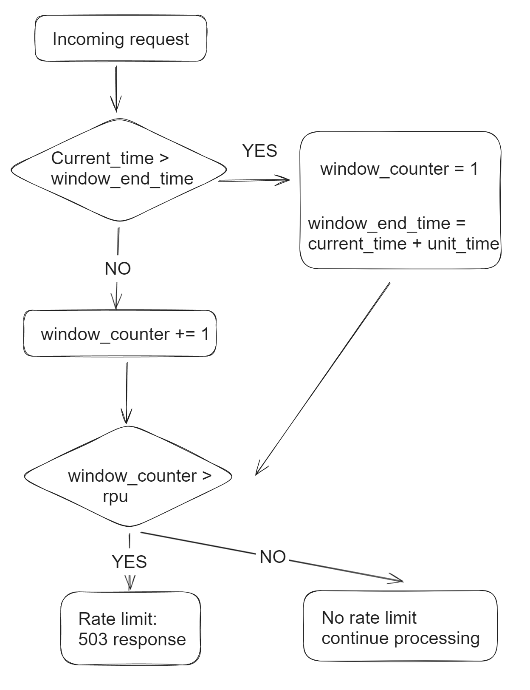
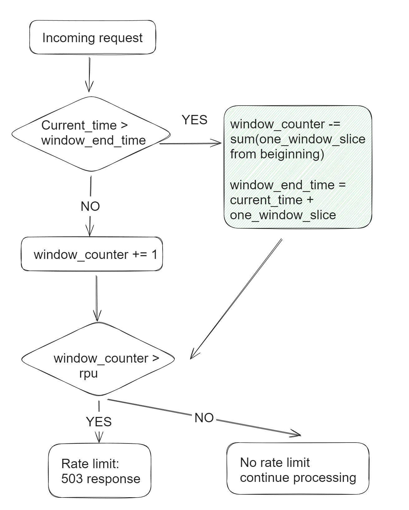
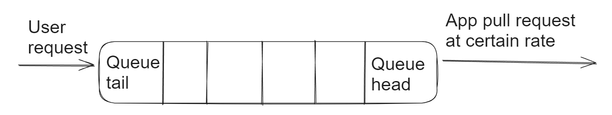

- [Fixed window](#fixed-window)
- [Sliding window](#sliding-window)
- [Leaky bucket](#leaky-bucket)
  - [Queue-based asynchronous implementation](#queue-based-asynchronous-implementation)
  - [Synchronous implementation](#synchronous-implementation)
- [Token bucket](#token-bucket)
  - [Token bucket vs leaky bucket](#token-bucket-vs-leaky-bucket)
  - [Token bucket algorithm implementation in Guava](#token-bucket-algorithm-implementation-in-guava)
    - [Assume the token bucket size is 1](#assume-the-token-bucket-size-is-1)
    - [Assume the token bucket size is bigger than 1](#assume-the-token-bucket-size-is-bigger-than-1)

# Fixed window



# Sliding window



# Leaky bucket

## Queue-based asynchronous implementation
* This implementation is asynchronous, and it is not suitable for scenario such as gateway rate limiting.



## Synchronous implementation

```c
// initialization:
time_interval = 100; // ms
number_of_blocking_threads = 0;
most_recent_request_timestamp = 0

while(true)
{
  sleep_time = sleep_time()
  if sleep_time == MAX_TIME
  {
    return 503;
  }
  elif sleep_time == 0
  {
    thread_do_its_job;
  }
  else
  {
    thread.sleep(sleep_time);
    most_recent_request_timestamp = now;
    number_of_blocking_threads -= 1
  }
}

// thread
long sleep_time()
{
  // Don't block if there is no recent request
  if( (now - most_recent_request_timestamp) >= time_interval 
      and number_of_blocking_threads <= 0）
  {
    most_recent_request_timestamp = now;
    return 0; // Don't block
  }

  // When there are too many threads blocked, the bucket will be leaky.
  if(number_of_blocking_threads > max_number_of_blocking) 
  {
    // max_number_of_blocking means that the blocking time will be too much
    // MAX_TIME means that the current request is rate limited
    return MAX_TIME;
  }

  // Wait in blocking mode
  number_of_blocking_threads += 1
  
  return time_interval * number_of_blocking_threads - (now - most_recent_request_timestamp);
}
```

# Token bucket
## Token bucket vs leaky bucket 
* The token bucket allows for sudden increase in traffic to some extent, while the leaky bucket is mainly used to ensure the smooth outflow rate.
* The token bucket limits the average inflow rate, allowing burst requests to be processed as long as there are tokens, supporting three tokens and four tokens at a time; the leaky bucket limits the constant outflow rate, that is, the outflow rate is a fixed constant value, such as the rate of all 1, but not one at a time and two at a time, so as to smooth the burst inflow rate;

```c
//initialization
most_recent_token_timestamp = 0
num_token = 0
interval_token_generation = 100 // ms

boolean acquireToken()
{
  // direct take token if there is token in token buckert
  if(num_token >= 1)
  {
    num_token -= 1；
    return true;
  }

  // when there is no token in bucket
  // recalculate the num of token in bucket
  num_token = min(MAX_TOKEN, num_token + (now - most_recent_token_timestamp) / interval_token_generation)
  if(num_token >= 1)
  {
    num_token -= 1；
    most_recent_token_timestamp = now;
    return true;
  }
  else
  {
    return false；
  }
}
```

## Token bucket algorithm implementation in Guava

* Reference: [Chinese article](https://time.geekbang.org/column/article/97231)

### Assume the token bucket size is 1

```java
class SimpleLimiter 
{
  // The moment to generate the next available token
  long next = System.nanoTime();
  // Duration for issuing token in ms
  long interval = 1000_000_000;

  // Def: Reserve the token
  // Return: The next moment when the token could be obtained
  synchronized long reserve(long now)
  {
    if (now > next)
    {
      // If current time is already older than the previous next available token time
      // Assign it to now
      next = now;
    }

    // Calculate the next moment that a token could be generated generate token
    long at=next;
    next += interval;

    // Return the duration that thread will need to wait
    return Math.max(at, 0L);
  }

  // Def: Acquire token
  void acquire() 
  {
    long now = System.nanoTime();

    // Reserve a token
    long at=reserve(now);
    long waitTime=max(at-now, 0);

    // If need to wait
    if(waitTime > 0) 
    {
      try 
      {
        TimeUnit.NANOSECONDS
          .sleep(waitTime);
      }
      catch(InterruptedException e)
      {
        e.printStackTrace();
      }
    }
  }
}
```

### Assume the token bucket size is bigger than 1

```java
class SimpleLimiter 
{
  // Current token number in the bucket
  long storedPermits = 0;
  // Capacity of token bucket
  long maxPermits = 3;
  // The next moment a token will be generated and available for reserve
  long next = System.nanoTime();
  // The duration to issue token
  long interval = 1000_000_000;

  // If current time is already older than the previous next available token time, assign it to now and update the number of tokens
  void resync(long now) 
  {
    if (now > next) 
    {
      // Newly generated token
      long newPermits=(now-next)/interval;
      // Add new tokens to the existing token number
      storedPermits=min(maxPermits, 
        storedPermits + newPermits);
      // Set the next moment a token will be generated and available for reserve as now
      next = now;
    }
  }

  // Def: Reserve the token
  // Return: The next moment when the token could be obtained
  synchronized long reserve(long now)
  {
    resync(now);
    long at = next;
    // The number of tokens in the token bucket
    long fb=min(1, storedPermits);
    // Calculate the net token requirement
    long nr = 1 - fb;
    // Calculate the next moment a token will be generated
    next = next + nr*interval;
    // Recalculate the number of tokens
    this.storedPermits -= fb;
    return at;
  }

  // Def: Acquire token
  void acquire() 
  {
    long now = System.nanoTime();

    // Reserve a token
    long at=reserve(now);
    long waitTime=max(at-now, 0);

    // If need to wait
    if(waitTime > 0) 
    {
      try 
      {
        TimeUnit.NANOSECONDS
          .sleep(waitTime);
      }
      catch(InterruptedException e)
      {
        e.printStackTrace();
      }
    }
  }
}
```

