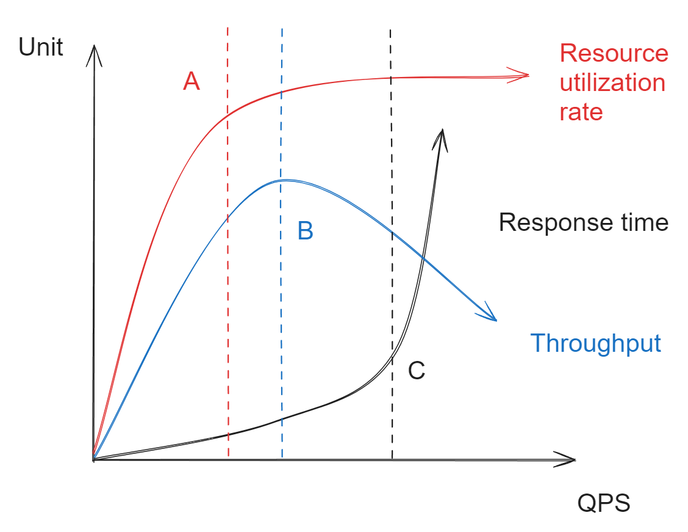

- [Type of rate limiting](#type-of-rate-limiting)
- [Handle rate limited request](#handle-rate-limited-request)
  - [If directly returning 429 to client](#if-directly-returning-429-to-client)
- [Request size](#request-size)
- [Deciding on rate limit threadshold](#deciding-on-rate-limit-threadshold)
  - [Observe the peak time QPS](#observe-the-peak-time-qps)
  - [Pressure test](#pressure-test)
  - [Reference related service](#reference-related-service)
  - [Manually estimation](#manually-estimation)
- [Rate limiting config sample](#rate-limiting-config-sample)

# Type of rate limiting
* Single machine vs cluster-based rate limiting. 
* Account-based rate limiting: VIP account vs general account. 
* Resource-based rate limiting: Specific IP address

# Handle rate limited request
1. Directly return service unavailable 429.
2. Turn synchronous requests to asynchrous handling. 
3. Synchronously block until available. 
4. Adjust load balancing mechanism. 

## If directly returning 429 to client
* The following response headers could be referenced. 


```java
// Once the request quota is drained, the API should return a 429 Too Many Request response, with a helpful error message wrapped in the usual error envelope: 

// X-Ratelimit-Remaining: The remaining number of allowed requests within the window. 
// X-Ratelimit-Limit: It indicates how many calls the client can make per time window.
// X-Ratelimit-Retry-After: The number of seconds to wait until you can make a request again without being throttled.
// X-RateLimit-Reset: should contain a UNIX timestamp describing the moment when the limit will be reset

X-RateLimit-Limit: 2000
X-RateLimit-Remaining: 0
X-RateLimit-Reset: 1404429213925
{
    "error": {
        "code": "bf-429",
        "message": "Request quota exceeded. Wait 3 minutes and try again.",
        "context": {
            "renewal": 1404429213925
        }
    }
}
```

# Request size
* Rate limit threshold is also related to the size of request. 
* If one machine handles all request with big payload, the other handles requests will small payload. Then the threshold should be adjusted accordingly. 

# Deciding on rate limit threadshold
## Observe the peak time QPS
* Watch the peak time QPS
  * Leave additional 20% capacity. Divide by machine number if needed.  

## Pressure test
* After pressure test, you could get some charts as follow:
  * A: If want best resource utilization  
  * B: If want best throughput, it is the tipping point where the system will crash. 
  * C: If want best response time



## Reference related service
* If a service A has a certain conversion rate to service B, then we could reference the rate limiting number for A when deciding on B. 

## Manually estimation
* The worst case scenario. 

# Rate limiting config sample
* Using the example of lyft envoy: [https://github.com/envoyproxy/ratelimit](https://github.com/envoyproxy/ratelimit)

```yaml
Url:/
rules:
 - actor:device     # Per device, account, resource, all
   unit:second      # unit
   rpu:10           # request per unit
   algo:TB          # algorithm
   scope:global     # global, local
 - actor:all
   unit:second
   rpu:50
   algo:W
   scope:local
```
