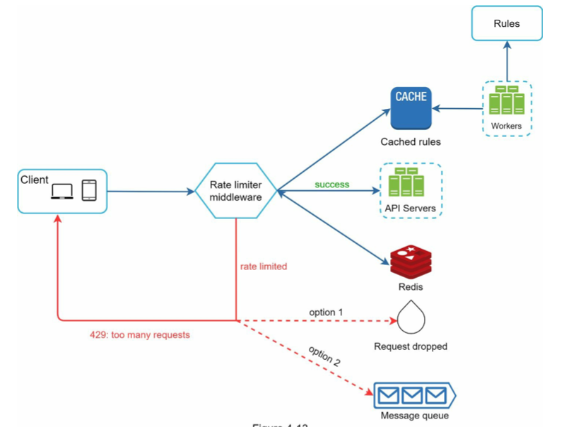
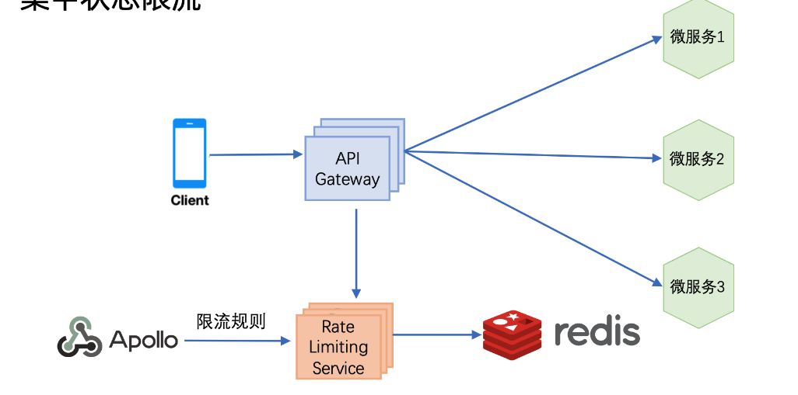
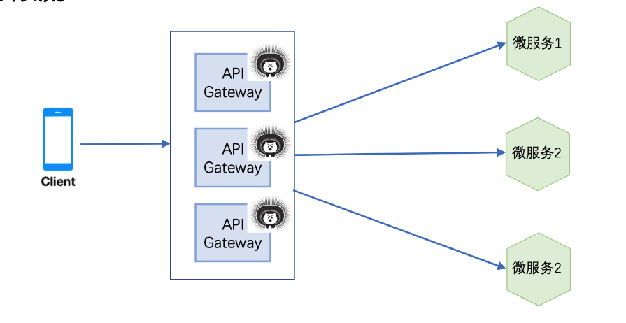

- [Nginx based rate limiting](#nginx-based-rate-limiting)
  - [Challenges](#challenges)
    - [Synchronization issues](#synchronization-issues)
- [Redis based rate limiter](#redis-based-rate-limiter)
  - [Implementation](#implementation)
    - [Sliding log implementation using ZSet](#sliding-log-implementation-using-zset)
    - [Sliding window implementation](#sliding-window-implementation)
    - [Token bucket implementation](#token-bucket-implementation)
  - [Challenges](#challenges-1)
    - [How to handle race conditions](#how-to-handle-race-conditions)
    - [Synchronization issues](#synchronization-issues-1)
      - [How to handle the additional latency introduce by performance](#how-to-handle-the-additional-latency-introduce-by-performance)
      - [How to avoid multiple round trips for different buckets](#how-to-avoid-multiple-round-trips-for-different-buckets)
      - [Performance bottleneck and single point failure due to Redis](#performance-bottleneck-and-single-point-failure-due-to-redis)
  - [Deployment mode](#deployment-mode)
    - [Centralized](#centralized)
    - [Distributed](#distributed)

# Nginx based rate limiting
## Challenges
### Synchronization issues

* Problem: When one server is not able to serve all requests, multiple rate limiter servers will need to be introduced. Then it comes the problem for synchronization between different rate limiter servers. 
* Solution: 
  * Sticky sessions: The simplest way to enforce the limit is to set up sticky sessions in your load balancer so that each consumer gets sent to exactly one node. The disadvantages include a lack of fault tolerance and scaling problems when nodes get overloaded.
  * Redis: See below for more information. 

# Redis based rate limiter

* Use a centralized data store such as Redis to store the counts for each window and consumer. Here is a high level architecture map. 

## Implementation

### Sliding log implementation using ZSet

* See [Dojo engineering blog for details](https://engineering.classdojo.com/blog/2015/02/06/rolling-rate-limiter/)
  1. Each identifier/user corresponds to a sorted set data structure. The keys and values are both equal to the (microsecond) times at which actions were attempted, allowing easy manipulation of this list.
  2. When a new action comes in for a user, all elements in the set that occurred earlier than (current time - interval) are dropped from the set.
  3. If the number of elements in the set is still greater than the maximum, the current action is blocked.
  4. If a minimum difference has been set and the most recent previous element is too close to the current time, the current action is blocked.
  5. The current action is then added to the set.
  6. Note: if an action is blocked, it is still added to the set. This means that if a user is continually attempting actions more quickly than the allowed rate, all of their actions will be blocked until they pause or slow their requests.
  7. If the limiter uses a redis instance, the keys are prefixed with namespace, allowing a single redis instance to support separate rate limiters.
  8. All redis operations for a single rate-limit check/update are performed as an atomic transaction, allowing rate limiters running on separate processes or machines to share state safely.

### Sliding window implementation

* [https://blog.callr.tech/rate-limiting-for-distributed-systems-with-redis-and-lua/](https://blog.callr.tech/rate-limiting-for-distributed-systems-with-redis-and-lua/)
* [https://github.com/wangzheng0822/ratelimiter4j](https://github.com/wangzheng0822/ratelimiter4j)

### Token bucket implementation

* [https://github.com/vladimir-bukhtoyarov/bucket4j](https://github.com/vladimir-bukhtoyarov/bucket4j)

## Challenges

### How to handle race conditions

1. Lock: Put a “lock” around the key in question, preventing any other processes from accessing or writing to the counter. This would quickly become a major performance bottleneck, and does not scale well, particularly when using remote servers like Redis as the backing datastore.
2. Lua script: Use a “set-then-get” approach, relying on Redis' atomic operators that implement locks in a very performant fashion, allowing you to quickly increment and check counter values without letting the atomic operations get in the way.

### Synchronization issues

#### How to handle the additional latency introduce by performance

1. In order to make these rate limit determinations with minimal latency, it’s necessary to make checks locally in memory. This can be done by relaxing the rate check conditions and using an eventually consistent model. For example, each node can create a data sync cycle that will synchronize with the centralized data store. 
2. Each node periodically pushes a counter increment for each consumer and window it saw to the datastore, which will atomically update the values. The node can then retrieve the updated values to update it’s in-memory version. This cycle of converge → diverge → reconverge among nodes in the cluster is eventually consistent.
   * [https://konghq.com/blog/how-to-design-a-scalable-rate-limiting-algorithm/](https://konghq.com/blog/how-to-design-a-scalable-rate-limiting-algorithm/)

#### How to avoid multiple round trips for different buckets

* Use Redis Pipeline to combine the INCRE and EXPIRE commands
* If using N multiple bucket sizes, still need N round trips to Redis. 
  * TODO: Could we also combine different bucket size together? How will the result for multiple results being passed back from Redis pipeline
* [Redis rate limiter implementation in python](https://www.binpress.com/rate-limiting-with-redis-1/)

#### Performance bottleneck and single point failure due to Redis

* Solution: ??

## Deployment mode

### Centralized

### Distributed

