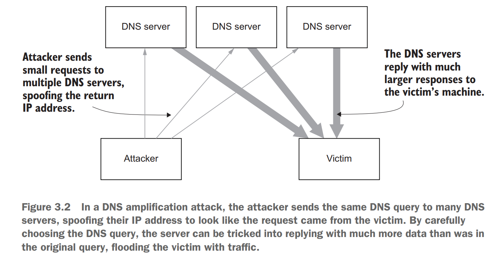

- [Goals](#goals)
  - [Security and availability- DDOS](#security-and-availability--ddos)
    - [Network layer DOS](#network-layer-dos)
    - [Application layer DOS](#application-layer-dos)
  - [COGS](#cogs)
- [Real world rate limiters](#real-world-rate-limiters)
  - [Ratelimiter within Resiliency4J](#ratelimiter-within-resiliency4j)
  - [Rate limit threshold](#rate-limit-threshold)
  - [Netflix concurrency limits](#netflix-concurrency-limits)
  - [Resiliency 4j](#resiliency-4j)
  - [Ratelimiter within CloudBouncer](#ratelimiter-within-cloudbouncer)
  - [Redis cell rate limiter](#redis-cell-rate-limiter)
  - [Implementations](#implementations)

# Goals

## Security and availability- DDOS

* Sharing access to limited resources: Requests made to an API where the limited resources are your server capacity, database load, etc.
* Limiting the number of second factor attempts that a user is allowed to perform, or the number of times they’re allowed to get their password wrong.

### Network layer DOS

### Application layer DOS

## COGS

* Certain services might want to limit actions based on the tier of their customer’s service, and thus create a revenue model based on rate limiting.

# Real world rate limiters

## Ratelimiter within Resiliency4J

* [https://blog.csdn.net/mickjoust/article/details/102411585](https://blog.csdn.net/mickjoust/article/details/102411585)

## Rate limit threshold

* Stripe: [https://stripe.com/blog/rate-limiters](https://stripe.com/blog/rate-limiters)
* Shopify: [https://help.shopify.com/en/api/reference/rest-admin-api-rate-limits](https://help.shopify.com/en/api/reference/rest-admin-api-rate-limits)
* Twitter: [https://developer.twitter.com/en/docs/twitter-api/v1/rate-limits](https://developer.twitter.com/en/docs/twitter-api/v1/rate-limits)
* Google doc: [https://developers.google.com/docs/api/limits](https://developers.google.com/docs/api/limits)

## Netflix concurrency limits

* Netflix Concurrency Limits: [https://github.com/Netflix/concurrency-limits](https://github.com/Netflix/concurrency-limits)

## Resiliency 4j

* Resiliency 4j said no for cache-based distributed rate limit: [https://github.com/resilience4j/resilience4j/issues/350](https://github.com/resilience4j/resilience4j/issues/350)
* Resiliency 4j adaptive capacity management: [https://github.com/resilience4j/resilience4j/issues/201](https://github.com/resilience4j/resilience4j/issues/201)

## Ratelimiter within CloudBouncer

* Use gossip protocol to sync redis counters
  * [https://yahooeng.tumblr.com/post/111288877956/cloud-bouncer-distributed-rate-limiting-at-yahoo](https://yahooeng.tumblr.com/post/111288877956/cloud-bouncer-distributed-rate-limiting-at-yahoo)

## Redis cell rate limiter

* An advanced version of GRCA algorithm
* References
  * You could find the intuition on [https://jameslao.com/post/gcra-rate-limiting/](https://jameslao.com/post/gcra-rate-limiting/)
  * It is implemented in Rust because it offers more memory security. [https://redislabs.com/blog/redis-cell-rate-limiting-redis-module/](https://redislabs.com/blog/redis-cell-rate-limiting-redis-module/)

## Implementations

* Github API rate limiting
* Bitly API rate limiting
* LinkedIn rate limiting
