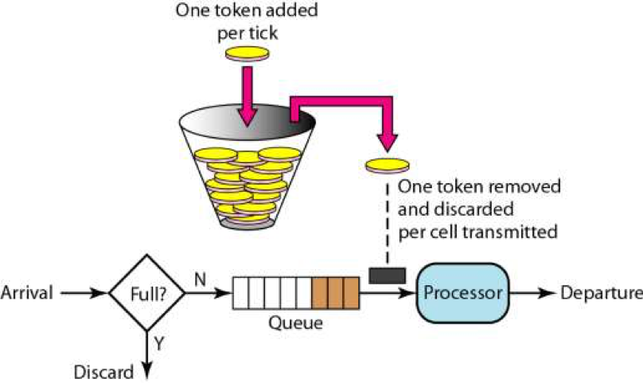
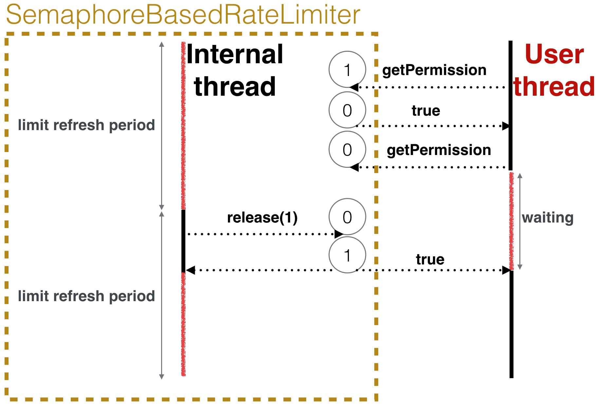
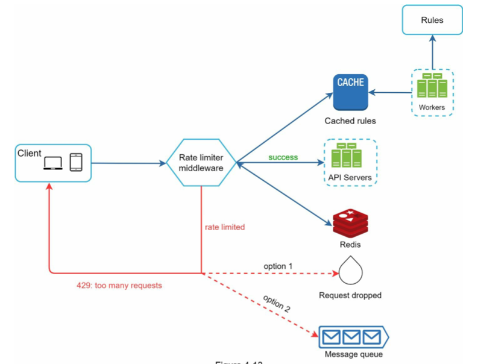
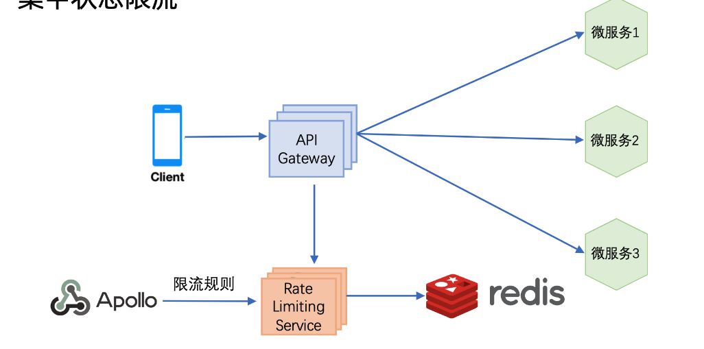
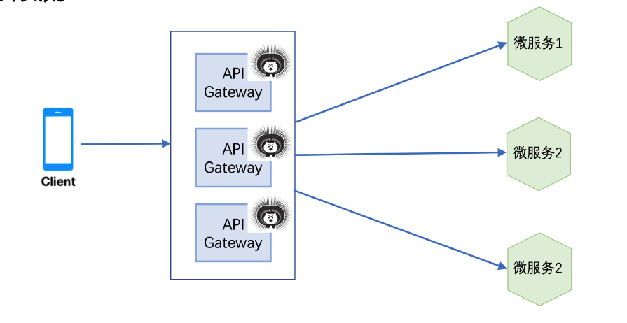

# Scenario_RateLimiter


* [Rate limiter](scenario_ratelimiter.md#rate-limiter)
  * [Goals](scenario_ratelimiter.md#goals)
    * [Security and availability- DDOS](scenario_ratelimiter.md#security-and-availability--ddos)
      * [Network layer DOS](scenario_ratelimiter.md#network-layer-dos)
      * [Application layer DOS](scenario_ratelimiter.md#application-layer-dos)
    * [COGS](scenario_ratelimiter.md#cogs)
  * [Single machine rate limit](scenario_ratelimiter.md#single-machine-rate-limit)
    * [Leaky bucket](scenario_ratelimiter.md#leaky-bucket)
    * [Token bucket](scenario_ratelimiter.md#token-bucket)
      * [Semaphore based impl](scenario_ratelimiter.md#semaphore-based-impl)
      * [Guava ratelimiter based on token bucket](scenario_ratelimiter.md#guava-ratelimiter-based-on-token-bucket)
        * [Warm up - Smooth ratelimiter](scenario_ratelimiter.md#warm-up---smooth-ratelimiter)
        * [Token bucket impl1: Producer consumer pattern](scenario_ratelimiter.md#token-bucket-impl1-producer-consumer-pattern)
        * [Token bucket impl2: Record the next time a token is available](scenario_ratelimiter.md#token-bucket-impl2-record-the-next-time-a-token-is-available)
      * [Leaky vs token bucket](scenario_ratelimiter.md#leaky-vs-token-bucket)
    * [Fixed window](scenario_ratelimiter.md#fixed-window)
    * [Sliding log](scenario_ratelimiter.md#sliding-log)
    * [Sliding window](scenario_ratelimiter.md#sliding-window)
  * [Distributed rate limit](scenario_ratelimiter.md#distributed-rate-limit)
    * [Nginx based rate limiting](scenario_ratelimiter.md#nginx-based-rate-limiting)
      * [Challenges](scenario_ratelimiter.md#challenges)
        * [Synchronization issues](scenario_ratelimiter.md#synchronization-issues)
    * [Redis based rate limiter](scenario_ratelimiter.md#redis-based-rate-limiter)
      * [Implementation](scenario_ratelimiter.md#implementation)
        * [Sliding log implementation using ZSet](scenario_ratelimiter.md#sliding-log-implementation-using-zset)
        * [Sliding window implementation](scenario_ratelimiter.md#sliding-window-implementation)
        * [Token bucket implementation](scenario_ratelimiter.md#token-bucket-implementation)
      * [Challenges](scenario_ratelimiter.md#challenges-1)
        * [How to handle race conditions](scenario_ratelimiter.md#how-to-handle-race-conditions)
        * [Synchronization issues](scenario_ratelimiter.md#synchronization-issues-1)
        * [How to handle the additional latency introduce by performance](scenario_ratelimiter.md#how-to-handle-the-additional-latency-introduce-by-performance)
        * [How to avoid multiple round trips for different buckets](scenario_ratelimiter.md#how-to-avoid-multiple-round-trips-for-different-buckets)
        * [Performance bottleneck and single point failure due to Redis](scenario_ratelimiter.md#performance-bottleneck-and-single-point-failure-due-to-redis)
      * [Deployment mode](scenario_ratelimiter.md#deployment-mode)
        * [Centralized](scenario_ratelimiter.md#centralized)
        * [Distributed](scenario_ratelimiter.md#distributed)
  * [Rate limiter protocols](scenario_ratelimiter.md#rate-limiter-protocols)
    * [Response headers](scenario_ratelimiter.md#response-headers)
    * [Rules](scenario_ratelimiter.md#rules)
  * [Real world rate limiters](scenario_ratelimiter.md#real-world-rate-limiters)
    * [Ratelimiter within Resiliency4J](scenario_ratelimiter.md#ratelimiter-within-resiliency4j)
    * [Rate limit threshold](scenario_ratelimiter.md#rate-limit-threshold)
    * [Netflix concurrency limits](scenario_ratelimiter.md#netflix-concurrency-limits)
    * [Resiliency 4j](scenario_ratelimiter.md#resiliency-4j)
    * [Ratelimiter within CloudBouncer](scenario_ratelimiter.md#ratelimiter-within-cloudbouncer)
    * [Redis cell rate limiter](scenario_ratelimiter.md#redis-cell-rate-limiter)
    * [Implementations](scenario_ratelimiter.md#implementations)

## Goals

### Security and availability- DDOS

* Sharing access to limited resources: Requests made to an API where the limited resources are your server capacity, database load, etc.
* Limiting the number of second factor attempts that a user is allowed to perform, or the number of times they’re allowed to get their password wrong.

#### Network layer DOS


#### Application layer DOS

### COGS

* Certain services might want to limit actions based on the tier of their customer’s service, and thus create a revenue model based on rate limiting.

## Single machine rate limit

### Leaky bucket

* The leaky bucket limits the constant outflow rate, which is set to a fixed value. Imagine a bucket partially filled with water and which has some fixed capacity (τ). The bucket has a leak so that some amount of water is escaping at a constant rate (T)
* Steps
  1. Initialize the counter to N at every tick of the clock
     1. If N is greater than the size of the packet in front of the queue send the packet to network and decrement the counter by the size of the packet.
     2. Reset the counter and go to Step - 1. 
* Pros:
  * The leaky bucket produces a very smooth rate limiting effect. A user can still exhaust their entire quota by filling their entire bucket nearly instantaneously, but after realizing the error, they should still have access to more quota quickly as the leak starts to drain the bucket. 
* Cons:
  * When compared with token bucket, packet will be discarded instead of token.
  * The leaky bucket is normally implemented using a background process that simulates a leak. It looks for any active buckets that need to be drained, and drains each one in turn. The naive leaky bucket’s greatest weakness is its “drip” process. If it goes offline or gets to a capacity limit where it can’t drip all the buckets that need to be dripped, then new incoming requests might be limited incorrectly. There are a number of strategies to help avoid this danger, but if we could build an algorithm without a drip, it would be fundamentally more stable.


### Token bucket

* The token bucket limits the average inflow rate and allows sudden increase in traffic. 
  * Steps
    1. A token is added every t time.
    2. The bucket can hold at most b tokens. If a token arrive when bucket is full the token will be discarded.
    3. When a packet of m bytes arrived m tokens are removed from the bucket and the packet is sent to the network.
    4. If less than n tokens are available no tokens will be removed from the bucket and the packet is considered to be non-comformant.
  * Pros
    * Smooth out the requests and process them at an approximately average rate. 
  * Cons
    * A burst of request could fill up the queue with old requests and starve the more recent requests from being processed. Does not guarantee that requests get processed within a fixed amount of time. Consider an antisocial script that can make enough concurrent requests that it can exhaust its rate limit in short order and which is regularly overlimit. Once an hour as the limit resets, the script bombards the server with a new series of requests until its rate is exhausted once again. In this scenario the server always needs enough extra capacity to handle these short intense bursts and which will likely go to waste during the rest of the hour. 



#### Semaphore based impl

* It's based on the simple idea that we can have one java.util.concurrent.Semaphore to store current permissions and all user threads will call semaphore.tryAcquire method, while we will have an additional internal thread and it will call semaphore.release when new limitRefreshPeriod starts.
* Reference: [https://dzone.com/articles/rate-limiter-internals-in-resilience4j](https://dzone.com/articles/rate-limiter-internals-in-resilience4j)



#### Guava ratelimiter based on token bucket

* Implemented on top of token bucket. It has two implementations:
* SmoothBursty / SmoothWarmup (The RateLimiterSmoothWarmingUp method has a warm-up period after teh startup. It gradually increases the distribution rate to the configured value. This feature is suitable for scenarios where the system needs some time to warm up after startup.)

**Warm up - Smooth ratelimiter**

* Motivation: How to gracefully deal past underutilization
  * Past underutilization could mean that excess resources are available. Then, the RateLimiter should speed up for a while, to take advantage of these resources. This is important when the rate is applied to networking (limiting bandwidth), where past underutilization typically translates to "almost empty buffers", which can be filled immediately.
  * Past underutilization could mean that "the server responsible for handling the request has become less ready for future requests", i.e. its caches become stale, and requests become more likely to trigger expensive operations (a more extreme case of this example is when a server has just booted, and it is mostly busy with getting itself up to speed).
* Implementation
  * When the RateLimiter is not used, this goes right (up to maxPermits)
  * When the RateLimiter is used, this goes left (down to zero), since if we have storedPermits, we serve from those first
  * When _unused_, we go right at a constant rate! The rate at which we move to the right is chosen as maxPermits / warmupPeriod. This ensures that the time it takes to go from 0 to maxPermits is equal to warmupPeriod.
  * When _used_, the time it takes, as explained in the introductory class note, is equal to the integral of our function, between X permits and X-K permits, assuming we want to spend K saved permits.

```
             ^ throttling
             |
       cold  +                  /
    interval |                 /.
             |                / .
             |               /  .   ← "warmup period" is the area of the trapezoid between
             |              /   .     thresholdPermits and maxPermits
             |             /    .
             |            /     .
             |           /      .
      stable +----------/  WARM .
    interval |          .   UP  .
             |          . PERIOD.
             |          .       .
           0 +----------+-------+--------------→ storedPermits
             0 thresholdPermits maxPermits
```

* References
  1. [https://segmentfault.com/a/1190000012875897?spm=a2c65.11461447.0.0.74817a50Dt3FUO](https://segmentfault.com/a/1190000012875897?spm=a2c65.11461447.0.0.74817a50Dt3FUO)
  2. [https://www.alibabacloud.com/blog/detailed-explanation-of-guava-ratelimiters-throttling-mechanism\_594820](https://www.alibabacloud.com/blog/detailed-explanation-of-guava-ratelimiters-throttling-mechanism\_594820)

**Token bucket impl1: Producer consumer pattern**

* Idea: Use a producer thread to add token to the queue according to a timer, and consumer thread pull token from the queue before consuming. 
* Cons: 
  * Rate limiting are usually used under high server loads. During such peak traffic time the server timer might not be that accurate and reliable. Furthermore, the timer will require to create a dedicated thread. 

**Token bucket impl2: Record the next time a token is available**

* Each time a token is expected, first take from the storedPermits; If not enough, then compare against nextFreeTicketMicros (update simultaneously using resync function) to see whether freshly generated tokens could satisfy the requirement. If not, sleep until nextFreeTicketMicros to acquire the next available fresh token. 
* [Link to the subpage](code/RateLimiter_TokenBucket.md)

#### Leaky vs token bucket

* Use case: 
  * The token bucket allows for sudden increase in traffic to some extent, while the leaky bucket is mainly used to ensure the smooth outflow rate.
  * The token bucket adds tokens to the bucket at a fixed rate. Whether the request is processed depends on whether the token in the bucket is sufficient or not. When the number of tokens decreases to zero, the new request is rejected. The leaky bucket outflows the request at a constant fixed rate at any rate of incoming request. When the number of incoming requests accumulates to the capacity of the leaky bucket, the new incoming request is rejected.
  * The token bucket limits the average inflow rate, allowing burst requests to be processed as long as there are tokens, supporting three tokens and four tokens at a time; the leaky bucket limits the constant outflow rate, that is, the outflow rate is a fixed constant value, such as the rate of all 1, but not one at a time and two at a time, so as to smooth the burst inflow rate;

### Fixed window

* Steps
  1. A window of size N is used to track the requests. 
  2. Each request increments the counter for the window.
  3. If the counter exceeds a threshold, the request is discarded. 
* Pros
  * It ensures recent requests get processed without being starved by old requests.
* Cons
  * Stamping elephant problem: A single burst of traffic that occurs near the boundary of a window can result in twice the rate of requests being processed, because it will allow requests for both the current and next windows within a short time. 
  * If many consumers wait for a reset window, for example at the top of the hour, then they may stampede your API at the same time.

### Sliding log

* Steps
  1. Tracking a time stamped log for each consumer’s request. 
  2. These logs are usually stored in a hash set or table that is sorted by time. Logs with timestamps beyond a threshold are discarded. 
  3. When a new request comes in, we calculate the sum of logs to determine the request rate. If the request would exceed the threshold rate, then it is held.
* Pros
  * It does not suffer from the boundary conditions of fixed windows. The rate limit will be enforced precisely. - Since the sliding log is tracked for each consumer, you don’t have the stampede effect that challenges fixed windows
* Cons
  * It can be very expensive to store an unlimited number of logs for every request. It’s also expensive to compute because each request requires calculating a summation over the consumer’s prior requests, potentially across a cluster of servers.

### Sliding window

* Steps
  1. Like the fixed window algorithm, we track a counter for each fixed window. 
  2. Next, we account for a weighted value of the previous window’s request rate based on the current timestamp to smooth out bursts of traffic.
* Pros
  * It avoids the starvation problem of leaky bucket.
  * It also avoids the bursting problems of fixed window implementations.
* Please see the section on [https://hechao.li/2018/06/25/Rate-Limiter-Part1/](https://hechao.li/2018/06/25/Rate-Limiter-Part1/) for detailed rate limiter implementations.

## Distributed rate limit

### Nginx based rate limiting

#### Challenges

**Synchronization issues**

* Problem: When one server is not able to serve all requests, multiple rate limiter servers will need to be introduced. Then it comes the problem for synchronization between different rate limiter servers. 
* Solution: 
  * Sticky sessions: The simplest way to enforce the limit is to set up sticky sessions in your load balancer so that each consumer gets sent to exactly one node. The disadvantages include a lack of fault tolerance and scaling problems when nodes get overloaded.
  * Redis: See below for more information. 

### Redis based rate limiter

* Use a centralized data store such as Redis to store the counts for each window and consumer. Here is a high level architecture map. 



#### Implementation

**Sliding log implementation using ZSet**

* See [Dojo engineering blog for details](https://engineering.classdojo.com/blog/2015/02/06/rolling-rate-limiter/)
  1. Each identifier/user corresponds to a sorted set data structure. The keys and values are both equal to the (microsecond) times at which actions were attempted, allowing easy manipulation of this list.
  2. When a new action comes in for a user, all elements in the set that occurred earlier than (current time - interval) are dropped from the set.
  3. If the number of elements in the set is still greater than the maximum, the current action is blocked.
  4. If a minimum difference has been set and the most recent previous element is too close to the current time, the current action is blocked.
  5. The current action is then added to the set.
  6. Note: if an action is blocked, it is still added to the set. This means that if a user is continually attempting actions more quickly than the allowed rate, all of their actions will be blocked until they pause or slow their requests.
  7. If the limiter uses a redis instance, the keys are prefixed with namespace, allowing a single redis instance to support separate rate limiters.
  8. All redis operations for a single rate-limit check/update are performed as an atomic transaction, allowing rate limiters running on separate processes or machines to share state safely.

**Sliding window implementation**

* [https://blog.callr.tech/rate-limiting-for-distributed-systems-with-redis-and-lua/](https://blog.callr.tech/rate-limiting-for-distributed-systems-with-redis-and-lua/)
* [https://github.com/wangzheng0822/ratelimiter4j](https://github.com/wangzheng0822/ratelimiter4j)

**Token bucket implementation**

* [https://github.com/vladimir-bukhtoyarov/bucket4j](https://github.com/vladimir-bukhtoyarov/bucket4j)

#### Challenges

**How to handle race conditions**

1. Lock: Put a “lock” around the key in question, preventing any other processes from accessing or writing to the counter. This would quickly become a major performance bottleneck, and does not scale well, particularly when using remote servers like Redis as the backing datastore.
2. Lua script: Use a “set-then-get” approach, relying on Redis' atomic operators that implement locks in a very performant fashion, allowing you to quickly increment and check counter values without letting the atomic operations get in the way.

**Synchronization issues**

**How to handle the additional latency introduce by performance**

1. In order to make these rate limit determinations with minimal latency, it’s necessary to make checks locally in memory. This can be done by relaxing the rate check conditions and using an eventually consistent model. For example, each node can create a data sync cycle that will synchronize with the centralized data store. 
2. Each node periodically pushes a counter increment for each consumer and window it saw to the datastore, which will atomically update the values. The node can then retrieve the updated values to update it’s in-memory version. This cycle of converge → diverge → reconverge among nodes in the cluster is eventually consistent.
   * [https://konghq.com/blog/how-to-design-a-scalable-rate-limiting-algorithm/](https://konghq.com/blog/how-to-design-a-scalable-rate-limiting-algorithm/)

**How to avoid multiple round trips for different buckets**

* Use Redis Pipeline to combine the INCRE and EXPIRE commands
* If using N multiple bucket sizes, still need N round trips to Redis. 
  * TODO: Could we also combine different bucket size together? How will the result for multiple results being passed back from Redis pipeline
* [Redis rate limiter implementation in python](https://www.binpress.com/rate-limiting-with-redis-1/)

**Performance bottleneck and single point failure due to Redis**

* Solution: ??

#### Deployment mode

**Centralized**



**Distributed**



## Rate limiter protocols

### Response headers

* X-Ratelimit-Remaining: The remaining number of allowed requests within the window. 
* X-Ratelimit-Limit: It indicates how many calls the client can make per time window.
* X-Ratelimit-Retry-After: The number of seconds to wait until you can make a request again without being throttled.
* X-RateLimit-Reset: should contain a UNIX timestamp describing the moment when the limit will be reset

```
// Once the request quota is drained, the API should return a 429 Too Many Request response, with a helpful error message wrapped in the usual error envelope: 


X-RateLimit-Limit: 2000
X-RateLimit-Remaining: 0
X-RateLimit-Reset: 1404429213925
{
    "error": {
        "code": "bf-429",
        "message": "Request quota exceeded. Wait 3 minutes and try again.",
        "context": {
            "renewal": 1404429213925
        }
    }
}
```

### Rules

* Using the example of lyft envoy: [https://github.com/envoyproxy/ratelimit](https://github.com/envoyproxy/ratelimit)

```
domain: auth descriptors:
- key: auth_type 
  Value: login 
  rate_limit:
    unit: minute 
    requests_per_unit: 5
```

## Real world rate limiters

### Ratelimiter within Resiliency4J

* [https://blog.csdn.net/mickjoust/article/details/102411585](https://blog.csdn.net/mickjoust/article/details/102411585)

### Rate limit threshold

* Stripe: [https://stripe.com/blog/rate-limiters](https://stripe.com/blog/rate-limiters)
* Shopify: [https://help.shopify.com/en/api/reference/rest-admin-api-rate-limits](https://help.shopify.com/en/api/reference/rest-admin-api-rate-limits)
* Twitter: [https://developer.twitter.com/en/docs/twitter-api/v1/rate-limits](https://developer.twitter.com/en/docs/twitter-api/v1/rate-limits)
* Google doc: [https://developers.google.com/docs/api/limits](https://developers.google.com/docs/api/limits)

### Netflix concurrency limits

* Netflix Concurrency Limits: [https://github.com/Netflix/concurrency-limits](https://github.com/Netflix/concurrency-limits)

### Resiliency 4j

* Resiliency 4j said no for cache-based distributed rate limit: [https://github.com/resilience4j/resilience4j/issues/350](https://github.com/resilience4j/resilience4j/issues/350)
* Resiliency 4j adaptive capacity management: [https://github.com/resilience4j/resilience4j/issues/201](https://github.com/resilience4j/resilience4j/issues/201)

### Ratelimiter within CloudBouncer

* Use gossip protocol to sync redis counters
  * [https://yahooeng.tumblr.com/post/111288877956/cloud-bouncer-distributed-rate-limiting-at-yahoo](https://yahooeng.tumblr.com/post/111288877956/cloud-bouncer-distributed-rate-limiting-at-yahoo)

### Redis cell rate limiter

* An advanced version of GRCA algorithm
* References
  * You could find the intuition on [https://jameslao.com/post/gcra-rate-limiting/](https://jameslao.com/post/gcra-rate-limiting/)
  * It is implemented in Rust because it offers more memory security. [https://redislabs.com/blog/redis-cell-rate-limiting-redis-module/](https://redislabs.com/blog/redis-cell-rate-limiting-redis-module/)

### Implementations

* Github API rate limiting
* Bitly API rate limiting
* LinkedIn rate limiting
