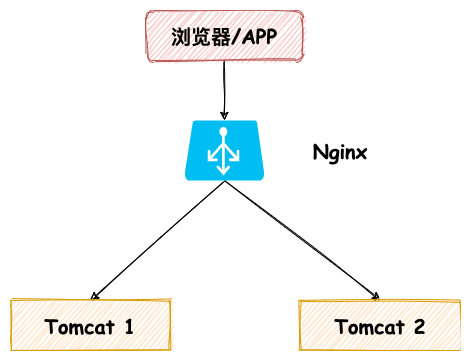
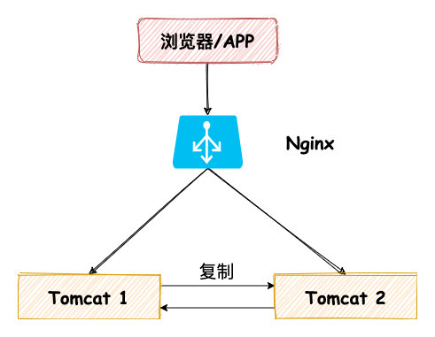
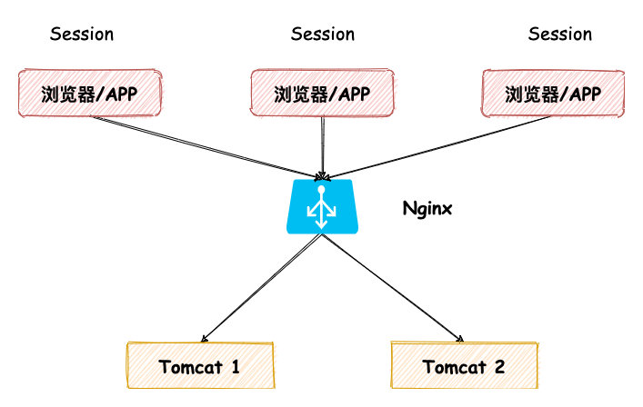
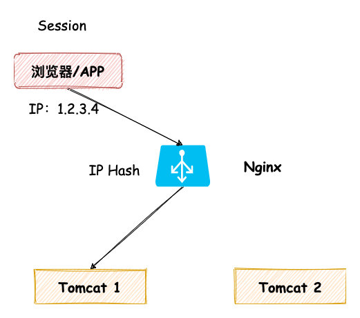
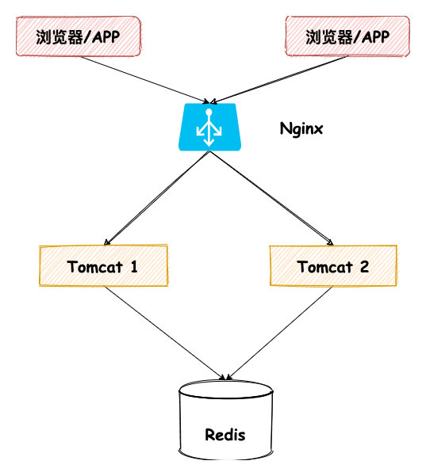

# Scenario\_SessionServer

* [Session Server](scenario_sessionserver.md#session-server)
  * [Problme](scenario_sessionserver.md#problme)
  * [Possible approaches](scenario_sessionserver.md#possible-approaches)
    * [Replicate session across servers](scenario_sessionserver.md#replicate-session-across-servers)
    * [Store session data in cookie](scenario_sessionserver.md#store-session-data-in-cookie)
    * [Sticky session](scenario_sessionserver.md#sticky-session)
    * [Shared storage](scenario_sessionserver.md#shared-storage)
  * [Architecture](scenario_sessionserver.md#architecture)
    * [Sesssion server internal design](scenario_sessionserver.md#sesssion-server-internal-design)
    * [How to design a high performant memory based LRU cache](scenario_sessionserver.md#how-to-design-a-high-performant-memory-based-lru-cache)
    * [How to design a high-performant large volume persistent ConcurrentHashmap](scenario_sessionserver.md#how-to-design-a-high-performant-large-volume-persistent-concurrenthashmap)

## Session Server

### Problme

### Possible approaches

* Reference: [In Chinese 四种Session方式](https://zhuanlan.zhihu.com/p/165357745)

#### Replicate session across servers

* Def: Copy session data across multiple servers. Built-in support by servers such as Tomcat. 
* Cons:
  * Not scalable: When there is a large number of servers N, each time needs to replicate to the rest N-1 machines. Will take a lot of intranet bandwidth. 
  * Limit by single machine memory: Server session is stored inside memory and will be limited to the memory capacity of a single machine. 

#### Store session data in cookie

* Def: Store session in client cookie
* Cons: 
  * All client to server traffic needs to come with cookie. If the size of cookie is big, then high consumption on network bandwidth. 
  * Session data size will be limited to cookie size \(usually 4K limit\)

#### Sticky session

* Def: Change the load balancer strategy to guarantee that the request from the same client always land on the same server. For example, Nginx supports load balancing strategy based on IP hash, userId, loginId, etc.
* Cons:
  * Uneven traffic. There will be cases when all machines within a company share a single external Ip address. Relying on sticky session based routing will result in uneven traffic distribution. 
  * Tight Coupling between application and load balancing: When the number of server increases, the configuration on Nginx also needs to be changed. 
  * Bad user experience: Lose session data if tomcat server restarts. The user needs to sign in again. 

#### Shared storage

* Def: Store data in a shared storage such as Redis
* Example:
  * Redis
  * Microsoft implementation:  ASP.NET State Server Protocol
* Pros:
  * When server restarts / scales horizontally, no loss of session data
* Cons:
  * An additional call to Redis upon each request

### Architecture

* Problems
  * where to store SessionId and SessionServer mapping?
  * What if session server dies
  * Upgrade and scale
  * Service discovery

#### Sesssion server internal design

#### How to design a high performant memory based LRU cache

* Thread unsafe LRU Cache
* Thread safe LRU Cache
* Thread safe and high performant LRU cache
  * segment lock - Determine the number of segment numbers 
  * OkCache: An implementation already on github
* Industrial implementation
  * Guava Cache
  * Caffenine
    * Window TinyLFU
    * High concurrent RingBuffer

#### How to design a high-performant large volume persistent ConcurrentHashmap

* BigCache
* Store all sessionId to memory. Session value could be persistent to disk
  * SessioId: Fixed length 8B
  * SessionValue: On average 10KB
* Industrial implementation
  * Yahoo HaloDB

