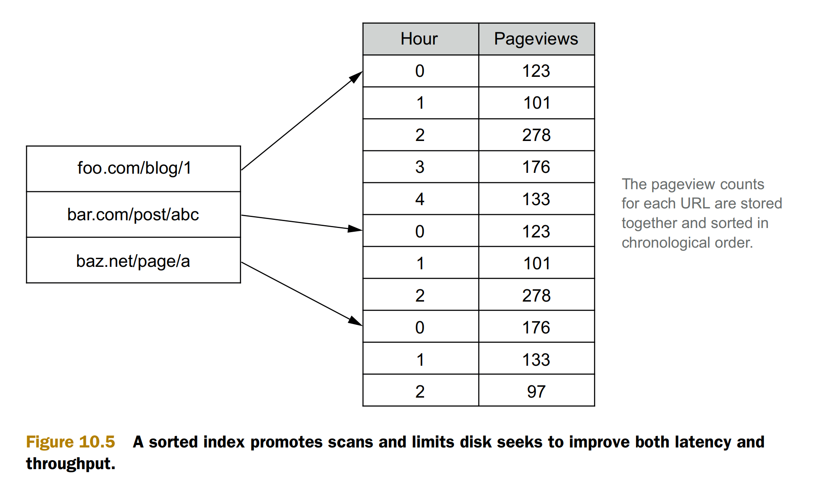
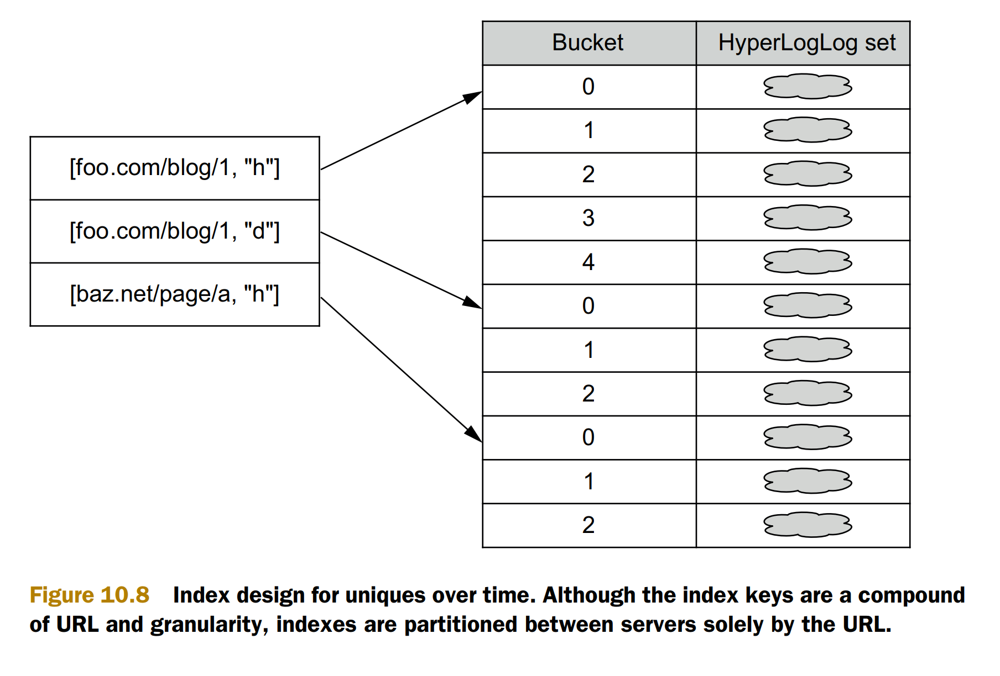
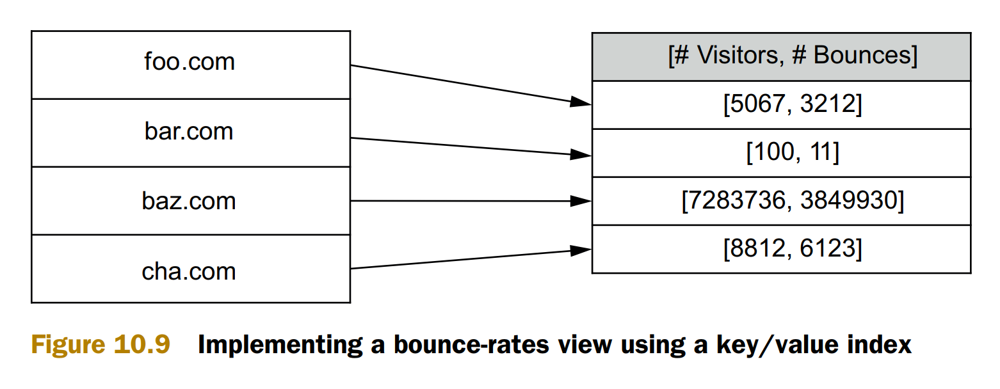

# Def
* The serving layer consists of databases that index and serve the results of the batch layer

# Requirements
* Batch writable—The batch views for a serving layer are produced from scratch.
When a new version of a view becomes available, it must be possible to completely swap out the older version with the updated view.
* Scalable—A serving layer database must be capable of handling views of arbitrary size. As with the distributed filesystems and batch computation framework
previously discussed, this requires it to be distributed across multiple machines.
* Random reads—A serving layer database must support random reads, with
indexes providing direct access to small portions of the view. This requirement
is necessary to have low latency on queries.
* Fault-tolerant—Because a serving layer database is distributed, it must be tolerant of machine failures.

# Index design
## Pageview

## Unique visitors

## Bounce rate

