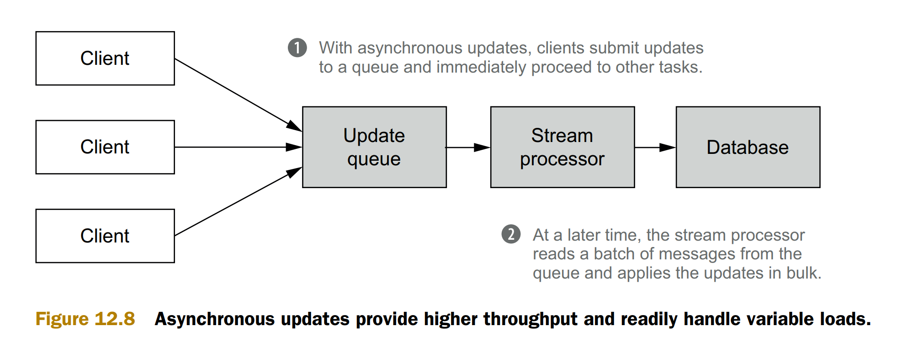

# Requirements
* Random reads—A realtime view should support fast random reads to answer
queries quickly. This means the data it contains must be indexed.
* Random writes—To support incremental algorithms, it must also be possible to
modify a realtime view with low latency.
* Scalability—As with the serving layer views, the realtime views should scale with
the amount of data they store and the read/write rates required by the application. Typically this implies that realtime views can be distributed across many
machines.
* Fault tolerance—If a disk or a machine crashes, a realtime view should continue
to function normally. Fault tolerance is accomplished by replicating data across
machines so there are backups should a single machine fail.

# Asynchronous design

# Page view 

