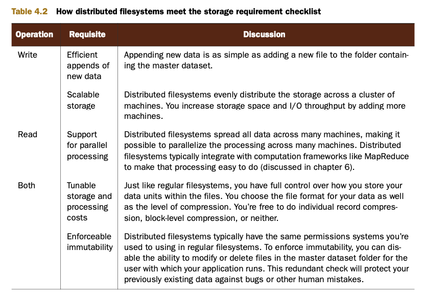
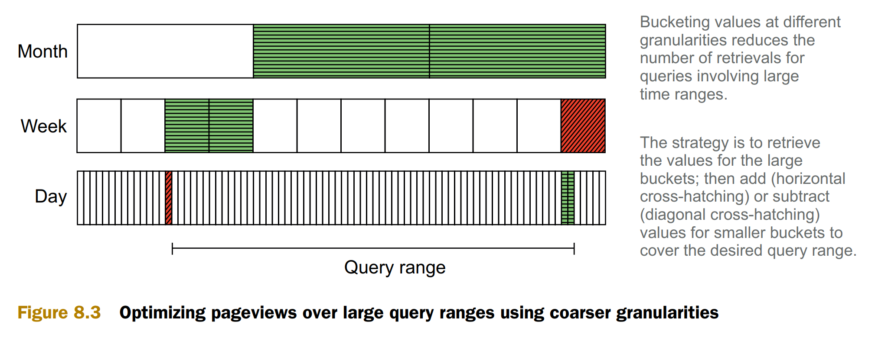
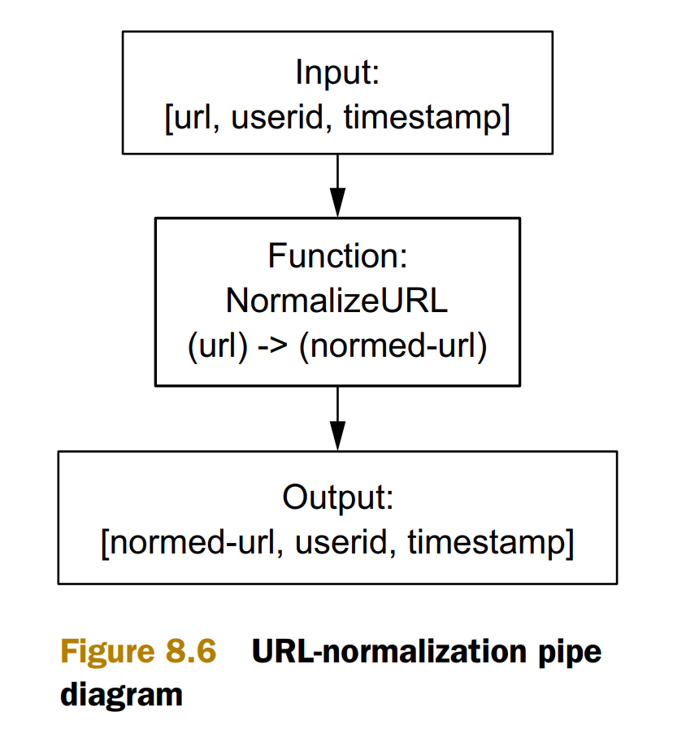

- [SuperWebAnalytics.com requiements](#superwebanalyticscom-requiements)
  - [Functional requirements](#functional-requirements)
  - [NonFunctional requirements](#nonfunctional-requirements)
- [Overview](#overview)
- [Batch layer architecture](#batch-layer-architecture)
  - [Data model](#data-model)
  - [Storage requirements](#storage-requirements)
    - [DFS (Distributed file systems)](#dfs-distributed-file-systems)
    - [Partition](#partition)
    - [Pail on top of DFS](#pail-on-top-of-dfs)
    - [Recomputation vs incremental algorithm](#recomputation-vs-incremental-algorithm)
  - [Workflow overview](#workflow-overview)
    - [Time bucket](#time-bucket)
    - [Flowchart](#flowchart)
      - [Url normalization](#url-normalization)
    - [User id normalization](#user-id-normalization)
- [Serving layer architecture](#serving-layer-architecture)
- [Speed layer architecture](#speed-layer-architecture)
- [References](#references)

# SuperWebAnalytics.com requiements
## Functional requirements
* Pageview counts by URL sliced by time—Example queries are “What are the pageviews for each day over the past year?” and “How many pageviews have there been in the past 12 hours?”
* Unique visitors by URL sliced by time—Example queries are “How many unique people visited this domain in 2010?” and “How many unique people visited this domain each hour for the past three days?”
* Bounce-rate analysis—“What percentage of people visit the page without visiting any other pages on this website?”

## NonFunctional requirements
* Real time metrics

# Overview

# Batch layer architecture
## Data model

## Storage requirements

### DFS (Distributed file systems)

### Partition

### Pail on top of DFS

### Recomputation vs incremental algorithm

## Workflow overview

### Time bucket

### Flowchart

#### Url normalization

### User id normalization

# Serving layer architecture

# Speed layer architecture

# References
* Book "Big Data: Principles and best practices of scalable and real-time data systems". Nathan Marz, James Warren