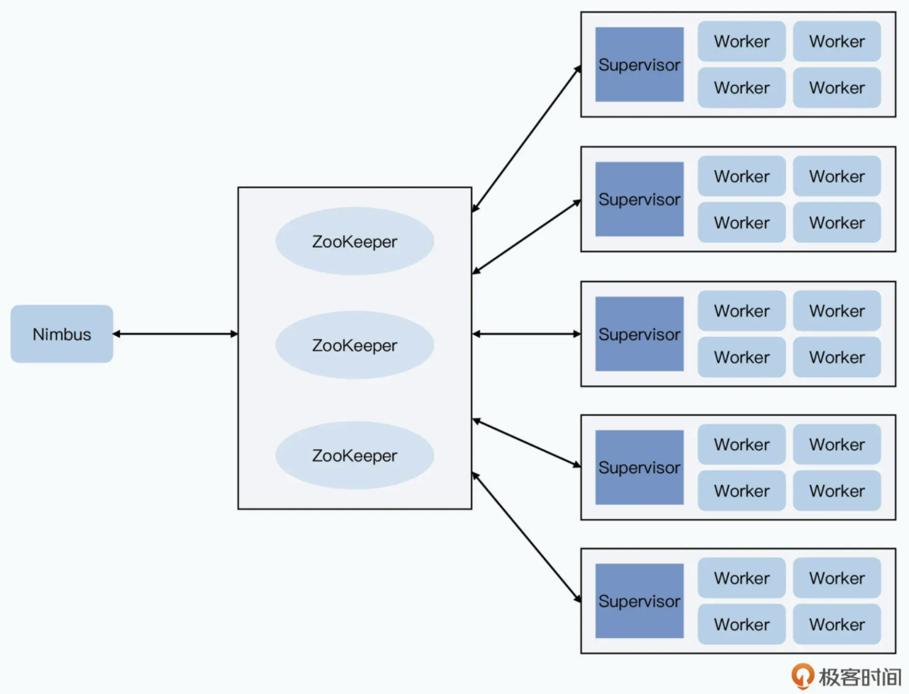
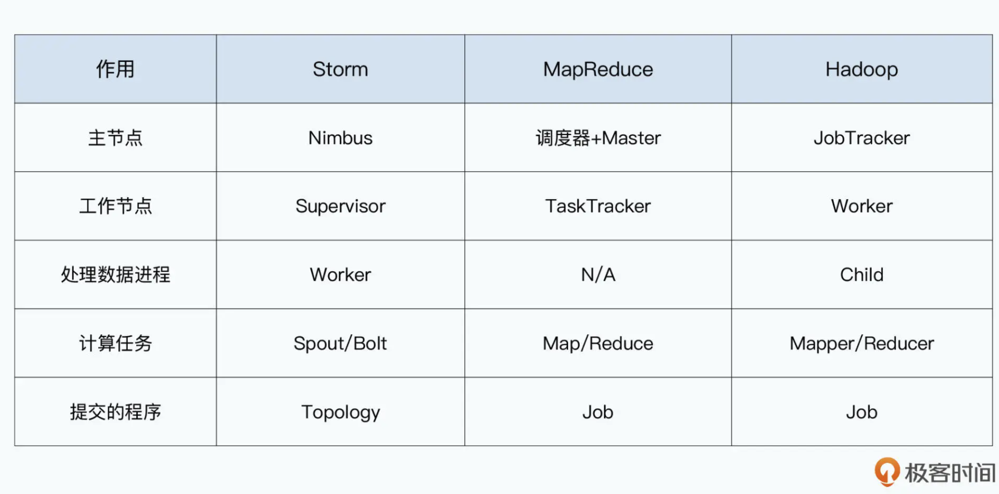

- [History](#history)
- [Model](#model)
- [architecture](#architecture)
  - [Nimbus](#nimbus)
  - [Supervisor](#supervisor)
  - [Worker](#worker)
  - [Zookeeper](#zookeeper)
- [Fault tolerant](#fault-tolerant)

# History
* Storm is an improvements on Yahoo S4. It solved the following pain points:
  * Yahoo S4 will create a huge number of PE, consuming huge number of memory and GC cost. 
  * Yahoo S4 needs to embed data distribution logic into business logic layer. 

# Model
* Spout: Data source. 
* Tuple: The minimum unit for data transmission. A key, value pair. 
* Streams: A stream contain huge number of tuples. 
* Bolts: The place where business logic is calculated. 

# architecture

## Nimbus
* Master node in cluster. Resource manager and job scheduler. 

## Supervisor
* Receive jobs from Nimus. 
* Monitor whether workers are alive. 
* Assign jobs to workers. 

## Worker
* Each worker process is an independent JVM. 

## Zookeeper
* Nimbus write corresponding tasks to Zookeeper for durability and high availability. 

# Fault tolerant
