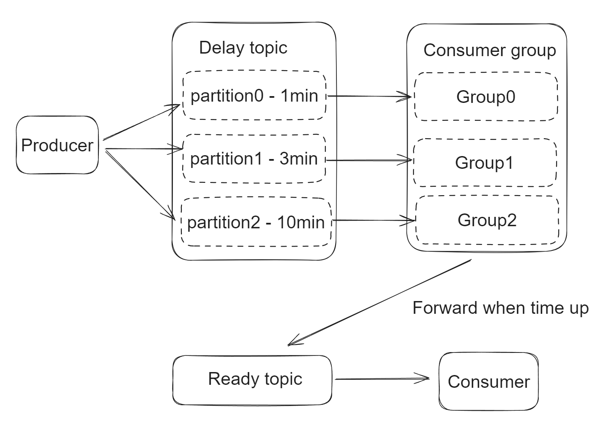
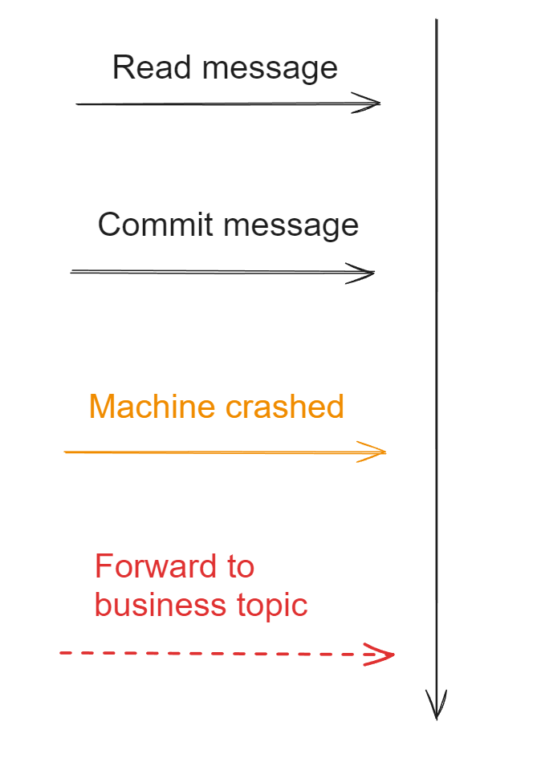

- [Fixed time delay (Kafka based)](#fixed-time-delay-kafka-based)
  - [Flowchart](#flowchart)
  - [Rebalance](#rebalance)
    - [Probem](#probem)
    - [Solution](#solution)
  - [Consistency](#consistency)
    - [Problem](#problem)
    - [Commit message first, then forward](#commit-message-first-then-forward)
    - [Forward message first, then commit](#forward-message-first-then-commit)

# Fixed time delay (Kafka based)

## Flowchart
* Delay topics are divided by different delay intervals. 
* Each delay topic corresponds to a dedicated consumer group. 

## Rebalance 
### Probem
* Each time when dedicated consumer groups consume a message, the consumer group will sleep for certain period. 
* During the sleep, Kafka will judge that consumers are crashed. And a rebalance will be performed. 

### Solution
1. Consumer group pulls a message (suppose offset = N after consumption), and check the remaining delay time t.  
2. Consumer group pauses the consumption and slept for delay time t. 
   * During the pause, consumer group will still have poll request, but it won't actually poll data. 
3. After sleep, consumer group resumes from offset = N. 

## Consistency
### Problem
* Commit message first vs forward to business topic first?

### Commit message first, then forward
* If machine crashed in the middle, the message will not be delivered to business topic. 

### Forward message first, then commit
* As long as message receiver could guarantee idempotency, then this will be the ideal solution. 

