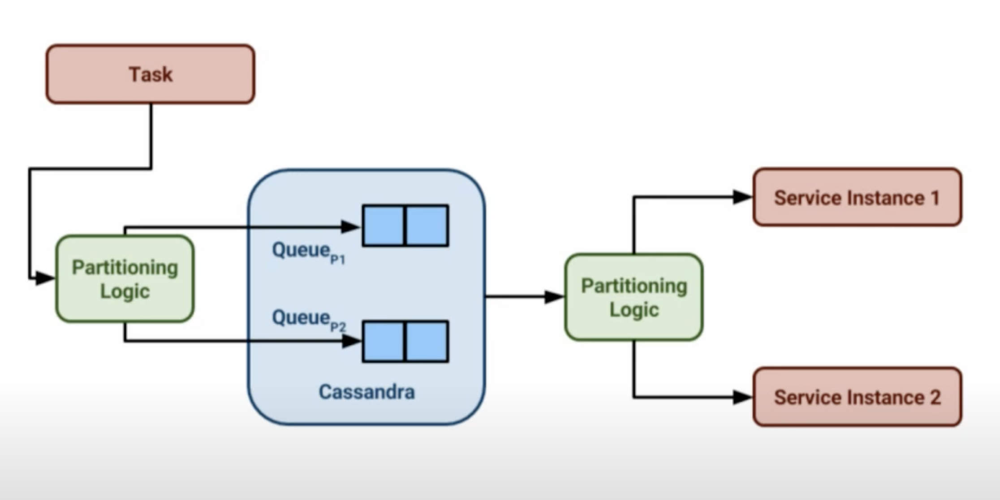
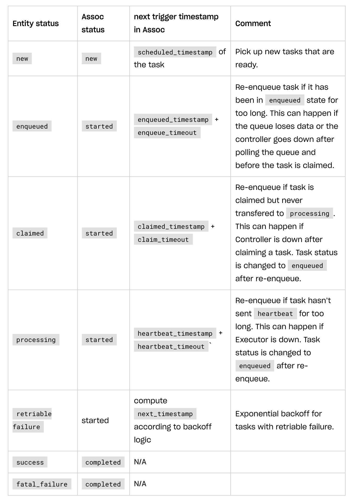

- [Pager duty task scheduler](#pager-duty-task-scheduler)
  - [Cassandra + WorkerQueue](#cassandra--workerqueue)
  - [Cassandra + Kafka + Akka](#cassandra--kafka--akka)
    - [Dynamic load](#dynamic-load)
      - [Kafka](#kafka)
      - [Consumer service](#consumer-service)
      - [Cassandra](#cassandra)
    - [Outages](#outages)
      - [Kafka](#kafka-1)
      - [Cassandra](#cassandra-1)
      - [Service](#service)
    - [Task ordering](#task-ordering)
- [Dropbox ATF](#dropbox-atf)
  - [Flowchart](#flowchart)
  - [Components](#components)
    - [Frontend](#frontend)
    - [Task Store](#task-store)
    - [Store Consumer](#store-consumer)
      - [Steps](#steps)
    - [Queue](#queue)
    - [Controller](#controller)
    - [Executor](#executor)
    - [Heartbeat and Status Controller (HSC)](#heartbeat-and-status-controller-hsc)
  - [Data model](#data-model)
  - [Lifecycle of a task](#lifecycle-of-a-task)
  - [Task and assoc states](#task-and-assoc-states)
  - [At-least-once task execution](#at-least-once-task-execution)
  - [No concurrent task execution](#no-concurrent-task-execution)
  - [Isolation](#isolation)
  - [Delivery latency](#delivery-latency)
- [References](#references)

# Pager duty task scheduler
* https://www.youtube.com/watch?v=s3GfXTnzG_Y&ab_channel=StrangeLoopConference
* The main problem is it uses Cassandra and Kafka; we don’t have any experience for both neither do we have other use cases than the scheduler which will need Cassandra or Kafka. I’m always reluctant to hosting new database systems, database systems are complex by nature and are not easy when it comes to scaling them. It’s a no go then.

## Cassandra + WorkerQueue
  * A queue is a column in Cassandra and time is the row.
  * Another component pulls tasks from Cassandra and schedule using a worker pool. 
  * Improved with partition logic




* Difficulties with old solutions
  * Partition logic is complex and custom
  * Low throughput due to IOs

## Cassandra + Kafka + Akka
* Production statistics:
  * Execute 3.1 million jobs per months
  * 8,000 task hourly spikes
* Components
  * Kafka - for task buffering and execution
  * Cassandra - for task persistence
  * Akka - for task execution
* In-memory tasks from Kafka and regularly pulling tasks from Cassandra.

* Challenges
  * Dynamic load
  * Datacenter outages
  * Task ordering


### Dynamic load
#### Kafka
* Dynamic load in Kafka: Improve Kafka automatically rebalances. 
  * Initial setup
  * Increase in number of broker needs to be triggered manually. Increase to 3.
  * Increase to 6.
  * Should not increase the number of partitions unlimited ??? 


#### Consumer service
* Dynamic load in service itself
  * Consumers are grouped and healthiness is tracked by Kafka.
  * How fast this process could be actually depends on the how quickly services could respond. 
  * Initial setup


  * Increase service node to 3


#### Cassandra
* Dynamic load in Cassandra
  * Ring based load balancing

### Outages
#### Kafka
* Setup:
  * 6 brokers evenly split across 3 DCs.
  * 3 replicas per parition, one in each DC. 
  * Writes replicated to >= 2 DCs. Min in-sync replica: 2
  * Partition leadership failsover automatically

* Outage scenario: Lost Data Center 3. 
  * Broker1 becomes leader for partition P3. 
  * Broker4 becomes leader for partition P6. 
  * However, since only requires 2 in-sync replica, writes still succeed. 


#### Cassandra
* Setup
  * 5 nodes in 3 DCs.
  * Replication factor of 5
  * Quorum writes guarantee replication to >= 2 DCs.
  * Quorum reads will get latest written value. 
* Outage scenario: Lost DC1
  * Quoram read. Although nodes 4/5 has stale data, Cassandra's policy for last write wins. 


#### Service
* Kafka will detect the healthiness of consumers and reassigns partitions to healthy instances. 
* This will work because:
  * Any service instance can work any task. 
  * Idempotency means that task may be repeated. 
* Outage scenario: Lost DC3
  * Reassign partition3 to service instances 1. 


### Task ordering
* Task defined for any single logical queue


* Solution:
  * Logical queue is executed by one service instance. 
  * But one service instance is executing multiple logical queues
  * A failing task stops its logical queue
  * How to prevent all queues being stopped?


# Dropbox ATF 
## Flowchart


## Components
### Frontend
* This is the service that schedules requests via an RPC interface. The frontend accepts RPC requests from clients and schedules tasks by interacting with ATF’s task store described below.

### Task Store
* ATF tasks are stored in and triggered from the task store. The task store could be any generic data store with indexed querying capability. In ATF’s case, We use our in-house metadata store Edgestore to power the task store. More details can be found in the Data Model section below.

### Store Consumer
* The Store Consumer is a service that periodically polls the task store to find tasks that are ready for execution and pushes them onto the right queues, as described in the queue section below. These could be tasks that are newly ready for execution, or older tasks that are ready for execution again because they either failed in a retriable way on execution, or were dropped elsewhere within the ATF system. 

#### Steps
* Below is a simple walkthrough of the Store Consumer’s function: 
* Repeat every second:
  1. poll tasks ready for execution from task store
  2. push tasks onto the right queues
  3. update task statuses

* The Store Consumer polls tasks that failed in earlier execution attempts. This helps with the at-least-once guarantee that the ATF system provides. More details on how the Store Consumer polls new and previously failed tasks is presented in the Lifecycle of a task section below.

### Queue
* ATF uses AWS Simple Queue Service (SQS) to queue tasks internally. These queues act as a buffer between the Store Consumer and Controllers (described below). Each &lt;lambda, priority&gt; pair gets a dedicated SQS queue. The total number of SQS queues used by ATF is #lambdas x #priorities.

### Controller
* Worker hosts are physical hosts dedicated for task execution. Each worker host has one controller process responsible for polling tasks from SQS queues in a background thread, and then pushing them onto process local buffered queues. The Controller is only aware of the lambdas it is serving and thus polls only the limited set of necessary queues. 
* The Controller serves tasks from its process local queue as a response to NextWork RPCs. This is the layer where execution level task prioritization occurs. The Controller has different process level queues for tasks of different priorities and can thus prioritize tasks in response to NextWork RPCs.

### Executor
* The Executor is a process with multiple threads, responsible for the actual task execution. Each thread within an Executor process follows this simple loop:

while True:
  w = get_next_work()
  do_work(w)

* Each worker host has a single Controller process and multiple executor processes. Both the Controller and Executors work in a “pull” model, in which active loops continuously long-poll for new work to be done.

### Heartbeat and Status Controller (HSC)
* The HSC serves RPCs for claiming a task for execution (ClaimTask), setting task status after execution (SetResults) and heartbeats during task execution (Heartbeat). ClaimTask requests originate from the Controllers in response to NextWork requests. Heartbeat and SetResults requests originate from executor processes during and after task execution. The HSC interacts with the task store to update the task status on the kind of request it receives.

## Data model
* ATF uses our in-house metadata store, Edgestore, as a task store. Edgestore objects can be Entities or Associations (assoc), each of which can have user-defined attributes.
  * Associations are used to represent relationships between entities. Edgestore supports indexing only on attributes of associations.
* Based on this design, we have two kinds of ATF-related objects in Edgestore. 
  * The ATF association stores scheduling information, such as the next scheduled timestamp at which the Store Consumer should poll a given task (either for the first time or for a retry). 
  * The ATF entity stores all task related information that is used to track the task state and payload for task execution. We query on associations from the Store Consumer in a pull model to pick up tasks ready for execution.

## Lifecycle of a task
1. Client performs a Schedule RPC call to Frontend with task information, including execution time. 
2. Frontend creates Edgestore entity and assoc for the task. 
3. When it is time to process the task, Store Consumer pulls the task from Edgestore and pushes it to a related SQS queue. 
4. Executor makes NextWork RPC call to Controller, which pulls tasks from the SQS queue, makes a ClaimTask RPC to the HSC and then returns the task to the Executor. 
5. Executor invokes the callback for the task. While processing, Executor performs Heartbeat RPC calls to Heartbeat and Status Controller (HSC). Once processing is done,
6. Executor performs TaskStatus RPC call to HSC. 
7. Upon getting Heartbeat and TaskStatus RPC calls, HSC updates the Edgestore entity and assoc.

## Task and assoc states
* Every state update in the lifecycle of a task is accompanied by an update to the next trigger timestamp in the assoc. This ensures that the Store Consumer pulls the task again if there is no change in state of the task within the next trigger timestamp. This helps ATF achieve its at-least-once delivery guarantee by ensuring that no task is dropped.

* The store consumer polls for tasks based on the following query:

```
assoc_status= && next_timestamp<=time.now()
```

* Below is the state machine that defines task state transitions: 




## At-least-once task execution
* At-least-once execution is guaranteed in ATF by retrying a task until it completes execution (which is signaled by a Success or a FatalFailure state). All ATF system errors are implicitly considered retriable failures, and lambda owners have an option of marking tasks with a RetriableFailure state. Tasks might be dropped from the ATF execution pipeline in different parts of the system through transient RPC failures and failures on dependencies like Edgestore or SQS. These transient failures at different parts of the system do not affect the at-least-once guarantee, though, because of the system of timeouts and re-polling from Store Consumer.

## No concurrent task execution
* Concurrent task execution is avoided through a combination of two methods in ATF. First, tasks are explicitly claimed through an exclusive task state (Claimed) before starting execution. Once the task execution is complete, the task status is updated to one of Success, FatalFailure or RetriableFailure. A task can be claimed only if its existing task state is Enqueued (retried tasks go to the Enqueued state as well once they are re-pushed onto SQS).
* However, there might be situations where once a long running task starts execution, its heartbeats might fail repeatedly yet the task execution continues. ATF would retry this task by polling it from the store consumer because the heartbeat timeouts would’ve expired. This task can then be claimed by another worker and lead to concurrent execution. 
* To avoid this situation, there is a termination logic in the Executor processes whereby an Executor process terminates itself as soon as three consecutive heartbeat calls fail. Each heartbeat timeout is large enough to eclipse three consecutive heartbeat failures. This ensures that the Store Consumer cannot pull such tasks before the termination logic ends them—the second method that helps achieve this guarantee.

## Isolation
* Isolation of lambdas is achieved through dedicated worker clusters, dedicated queues, and dedicated per-lambda scheduling quotas. In addition, isolation across different priorities within the same lambda is likewise achieved through dedicated queues and scheduling bandwidth.

## Delivery latency
* ATF use cases do not require ultra-low task delivery latencies. Task delivery latencies on the order of a couple of seconds are acceptable. Tasks ready for execution are periodically polled by the Store Consumer and this period of polling largely controls the task delivery latency. Using this as a tuning lever, ATF can achieve different delivery latencies as required. Increasing poll frequency reduces task delivery latency and vice versa. Currently, we have calibrated ATF to poll for ready tasks once every two seconds.


# References
* Timing wheel: https://0x709394.me/How-To%20Design%20A%20Reliable%20Distributed%20Timer
