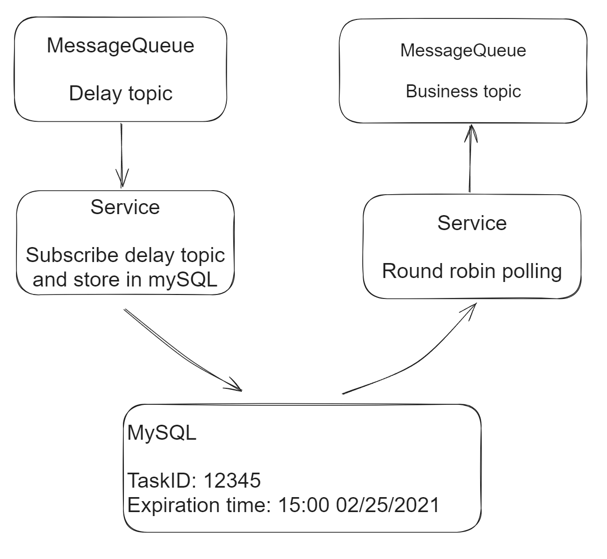

- [MySQL-based](#mysql-based)
  - [Pros](#pros)
  - [Cons](#cons)
  - [Flowchart](#flowchart)
  - [MySQL storage partitioning](#mysql-storage-partitioning)
  - [MySQL storage sharding](#mysql-storage-sharding)

# MySQL-based
## Pros
* Easy to support customized delay time

## Cons
* It will be hard to support large concurrent number of requests. 
* For example, if the delay latency is within 0.5s, then the round robin rate should be bigger than twice per second. And if there are thousands of tasks to dispatch to message queue, it wouldn't be able to finish sending the traffic. 

## Flowchart
* Creates a table within a database, uses a timer thread to scan the table periodically. 



```sql
INT taskId
TIME expired
INT maxRetryAllowed
INT job status (0: newly created; 1: started; 2: failed; 3: succeeded)
```

## MySQL storage partitioning
* Partition by week, month, date

## MySQL storage sharding
* Choose the sharding key:
  * Business topic: If delay topics have different frequency, then data will not spread evenly across shards. If messages delivering to the same business topic will be delivered on the same delay topic, then message ordering could be preserved. 
  * Round robin could help reduce uneven distribution. 

