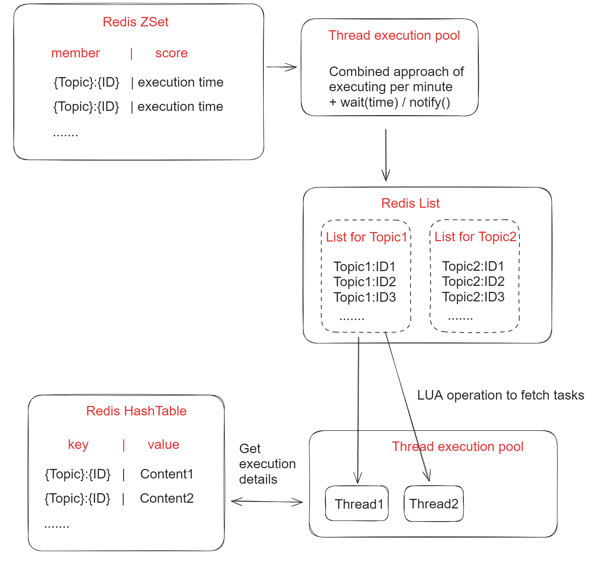

- [Redis based delay queue](#redis-based-delay-queue)
  - [Flowchart](#flowchart)
  - [Redis ZSet](#redis-zset)
  - [Timer](#timer)
  - [Redis List](#redis-list)
  - [Dispatcher](#dispatcher)
  - [Job pool: Redis HashTable](#job-pool-redis-hashtable)
- [References](#references)

# Redis based delay queue

## Flowchart



## Redis ZSet
* Delay queue: A list of ordered queues which store all delayed/reserved jobs (only stores job Id)

```
redis cli> ZADD delayqueue <future_timestamp> "messsage"
redis cli> MULTI
redis cli> ZRANGEBYSCORE delayqueue 0 <current_timestamp>
redis cli> ZREMRANGEBYSCORE delayqueue 0 <current_timestamp>
redis cli> EXEC
```

## Timer
* Scan delay bucket and put expired jobs into ready queue

## Redis List 
* Ready queue: A list of ordered queues which store jobs in Ready state.
  * Topic: The same category of job collections

## Dispatcher
* It will poll the delay queue and move items to the corresponding topic within ready queues if the tasks are ready. 
* Worker: Workers use BLPOP on the ready queue and process the message. Once done, the response could be put in a response queue and send to consumer. 

## Job pool: Redis HashTable

* JobPool: Store all metadata about jobs
  * Stores as key value pairs. Key is job id and value is job struct. 
  * Job struct contains the following:
    1. topic: job category. Needed because each category will has its own callback function. 
    2. id: job unique identifier
    3. delayTime: time to delay before executing the task
    4. ttr: timeout duration for this job to be executed
    5. body: job content
    6. callback: http url for calling a specific function

# References
* [基于 Redis 自研延迟队列](https://hacpai.com/article/1565796946371)
