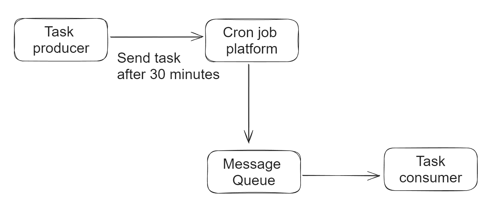

- [Cron to put into message queue after expiration](#cron-to-put-into-message-queue-after-expiration)
  - [Flowchart](#flowchart)
  - [Cons](#cons)
- [Timer to scan database periodically](#timer-to-scan-database-periodically)
  - [Flowchart](#flowchart-1)
  - [Cons](#cons-1)

# Cron to put into message queue after expiration

## Flowchart
* Task producers set timer to send tasks to queue after certain time (30minutes). 
* The most popular timer implementation is based on Cron job. 
  * Cron and crontab: https://www.hostgator.com/help/article/what-are-cron-jobs



## Cons
* Could not support high concurrent volume because most timer middleware don't support it. 


# Timer to scan database periodically
## Flowchart
* Creates a table within a database, uses a timer thread to scan the table periodically. 

```sql
INT taskId
TIME expired
INT maxRetryAllowed
INT job status (0: newly created; 1: started; 2: failed; 3: succeeded)
```

## Cons
* Not performing well under large volume and concurrent requests. 
* Lag against actual execution time due to the scan frequency. 
