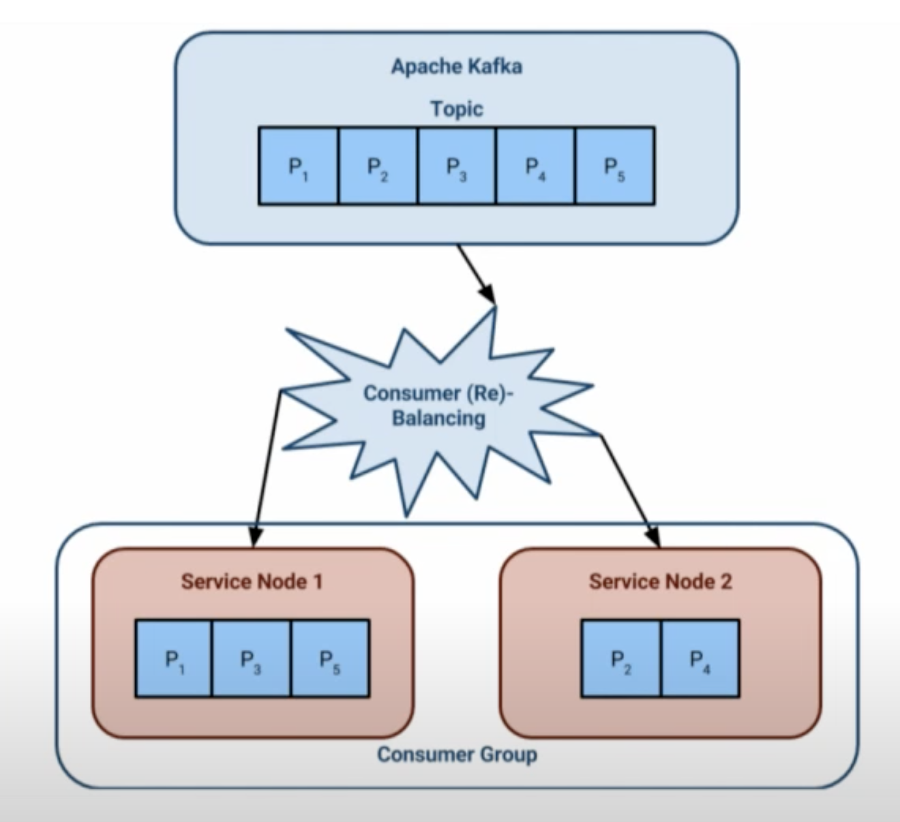

- [Timer + Database](#timer--database)
- [Redis + MySQL](#redis--mysql)
  - [Algorithm](#algorithm)
  - [Components](#components)
- [Pager duty task scheduler](#pager-duty-task-scheduler)
  - [Cassandra + WorkerQueue](#cassandra--workerqueue)
  - [Cassandra + Kafka + Akka](#cassandra--kafka--akka)
    - [Dynamic load](#dynamic-load)
      - [Kafka](#kafka)
      - [Consumer service](#consumer-service)
      - [Cassandra](#cassandra)
    - [Outages](#outages)
      - [Kafka](#kafka-1)
      - [Cassandra](#cassandra-1)
      - [Service](#service)
    - [Task ordering](#task-ordering)
- [Redis based async queue - TODO](#redis-based-async-queue---todo)
- [Timing wheel](#timing-wheel)
  - [Step1. Insert pending task](#step1-insert-pending-task)
  - [Step2. Pull task out from slot](#step2-pull-task-out-from-slot)
  - [Step3. Have a central clock](#step3-have-a-central-clock)
  - [Step4. Guarantee that each task is only executed once](#step4-guarantee-that-each-task-is-only-executed-once)
  - [Step5. Scheduler component for global clock and only once execution](#step5-scheduler-component-for-global-clock-and-only-once-execution)
  - [Step6. Thread pool](#step6-thread-pool)
  - [Step7. Decoupling with message queue](#step7-decoupling-with-message-queue)
- [Dropbox ATF](#dropbox-atf)
  - [Flowchart](#flowchart)
  - [Components](#components-1)
    - [Frontend](#frontend)
    - [Task Store](#task-store)
    - [Store Consumer](#store-consumer)
      - [Steps](#steps)
    - [Queue](#queue)
    - [Controller](#controller)
    - [Executor](#executor)
    - [Heartbeat and Status Controller (HSC)](#heartbeat-and-status-controller-hsc)
  - [Data model](#data-model)
  - [Lifecycle of a task](#lifecycle-of-a-task)
  - [Task and assoc states](#task-and-assoc-states)
- [References](#references)

# Timer + Database

* Initial solution: Creates a table within a database, uses a timer thread to scan the table periodically. 
* Cons:
  * If the volume of data is large and there is a high frequency of insertion rate, then it won't be efficient to lookup and update records. 
  * There is a difference between when task is scheduled to be executed and when the task should be executed. 
* How to optimize: 
  * Shard the table according to task id to boost the lookup efficiency. 

```
INT taskId
TIME expired
INT maxRetryAllowed
INT job status (0: newly created; 1: started; 2: failed; 3: succeeded)
```

# Redis + MySQL

## Algorithm

```
redis> ZADD delayqueue <future_timestamp> "messsage"
redis> MULTI
redis> ZRANGEBYSCORE delayqueue 0 <current_timestamp>
redis> ZREMRANGEBYSCORE delayqueue 0 <current_timestamp>
redis> EXEC
```

## Components


* JobPool: Store all metadata about jobs
  * Stores as key value pairs. Key is job id and value is job struct. 
  * Job struct contains the following:
    1. topic: job category. Needed because each category will has its own callback function. 
    2. id: job unique identifier
    3. delayTime: time to delay before executing the task
    4. ttr: timeout duration for this job to be executed
    5. body: job content
    6. callback: http url for calling a specific function
* Timer: Scan delay bucket and put expired jobs into ready queue
* Delay queue: A list of ordered queues which store all delayed/reserved jobs (only stores job Id)
* Ready queue: A list of ordered queues which store jobs in Ready state.
  * Topic: The same category of job collections
* Response queue: Stores the responses
* Database: Stores the message content
* Dispatcher: It will poll the delay queue and move items to the corresponding topic within ready queues if the tasks are ready. 
* Worker: Workers use BLPOP on the ready queue and process the message. Once done, the response could be put in a response queue and send to consumer. 


# Pager duty task scheduler
* https://www.youtube.com/watch?v=s3GfXTnzG_Y&ab_channel=StrangeLoopConference
* The main problem is it uses Cassandra and Kafka; we don’t have any experience for both neither do we have other use cases than the scheduler which will need Cassandra or Kafka. I’m always reluctant to hosting new database systems, database systems are complex by nature and are not easy when it comes to scaling them. It’s a no go then.

## Cassandra + WorkerQueue
  * A queue is a column in Cassandra and time is the row.
  * Another component pulls tasks from Cassandra and schedule using a worker pool. 
  * Improved with partition logic


* Difficulties with old solutions
  * Partition logic is complex and custom
  * Low throughput due to IOs

## Cassandra + Kafka + Akka
* Production statistics:
  * Execute 3.1 million jobs per months
  * 8,000 task hourly spikes
* Components
  * Kafka - for task buffering and execution
  * Cassandra - for task persistence
  * Akka - for task execution
* In-memory tasks from Kafka and regularly pulling tasks from Cassandra.

* Challenges
  * Dynamic load
  * Datacenter outages
  * Task ordering


### Dynamic load
#### Kafka
* Dynamic load in Kafka: Improve Kafka automatically rebalances. 
  * Initial setup
  * Increase in number of broker needs to be triggered manually. Increase to 3.
  * Increase to 6.
  * Should not increase the number of partitions unlimited ??? 


#### Consumer service
* Dynamic load in service itself
  * Consumers are grouped and healthiness is tracked by Kafka.
  * How fast this process could be actually depends on the how quickly services could respond. 
  * Initial setup


  * Increase service node to 3


#### Cassandra
* Dynamic load in Cassandra
  * Ring based load balancing

### Outages
#### Kafka
* Setup:
  * 6 brokers evenly split across 3 DCs.
  * 3 replicas per parition, one in each DC. 
  * Writes replicated to >= 2 DCs. Min in-sync replica: 2
  * Partition leadership failsover automatically

* Outage scenario: Lost Data Center 3. 
  * Broker1 becomes leader for partition P3. 
  * Broker4 becomes leader for partition P6. 
  * However, since only requires 2 in-sync replica, writes still succeed. 


#### Cassandra
* Setup
  * 5 nodes in 3 DCs.
  * Replication factor of 5
  * Quorum writes guarantee replication to >= 2 DCs.
  * Quorum reads will get latest written value. 
* Outage scenario: Lost DC1
  * Quoram read. Although nodes 4/5 has stale data, Cassandra's policy for last write wins. 


#### Service
* Kafka will detect the healthiness of consumers and reassigns partitions to healthy instances. 
* This will work because:
  * Any service instance can work any task. 
  * Idempotency means that task may be repeated. 
* Outage scenario: Lost DC3
  * Reassign partition3 to service instances 1. 


### Task ordering
* Task defined for any single logical queue


* Solution:
  * Logical queue is executed by one service instance. 
  * But one service instance is executing multiple logical queues
  * A failing task stops its logical queue
  * How to prevent all queues being stopped?


# Redis based async queue - TODO
* Wait notify + Regular schedule
  * Motivation: When there are multiple consumers for delay queue, each one of them will possess a different timestamp. Suppose consumer A will move the next delay task within 1 minute and all other consumers will only start moving after 1 hour. If consumer A dies and does not restart, then it will at least 1 hour for the task to be moved to ready queue. A regular scanning of delay queue will compensate this defficiency. 
  * When will nextTime be updated:
    * Scenario for starting: When delayQueue polling thread gets started, nextTime = 0 ; Since it must be smaller than the current timestamp, a peeking operation will be performed on top of delayQueue.  
      * If there is an item in the delayQueue, nextTime = delayTime from the message; 
      * Otherwise, nextTime = Long.MaxValue
    * Scenario for execution: While loop will always be executed on a regular basis
      * If nextTime is bigger than current time, then wait(nextTime - currentTime)
      * Otherwise, the top of the delay queue will be polled out to the ready queue. 
    * Scenario for new job being added: Compare delayTime of new job with nextTime
      * If nextTime is bigger than delayTime, nextTime = delayTime; notify all delayQueue polling threads. 
      * Otherwise, wait(nextTime - currentTime)


* Assumption: QPS 1000, maximum retention period 7 days, 

**How to scale?**

**Fault tolerant**

* For a message in ready queue, if server has not received acknowledgement within certain period (e.g. 5min), the message will be put inside Ready queue again. 
* There needs to be a leader among server nodes. Otherwise message might be put into ready queue repeatedly. 
* How to guarantee that there is no message left during BLPOP and server restart?
  * Kill the Redis blpop client when shutting down the server. 
  * [https://hacpai.com/article/1565796946371](https://hacpai.com/article/1565796946371)


# Timing wheel
## Step1. Insert pending task
* We are going to implement Hashed Timing Wheel algorithm with TableKV, supposing there are 10m buckets, and current time is 2021:08:05 11:17:33 +08=(the UNIX timestamp is =1628176653), there is a timer task which is going to be triggered 10s later with start_time = 1628176653 + 10 (or 100000010s later, start_time = 1628176653 + 10 + 100000000), these tasks both will be stored into bucket start_time % 100000000 = 28176663


## Step2. Pull task out from slot
* As clock tick-tacking to 2021:08:05 11:17:43 +08(1628176663), we need to pull tasks out from slot by calculating the bucket number: current_timestamp(1628176663) % 100000000 = 28176663. After locating the bucket number, we find all tasks in bucket 28176663 with start_time < currenttimestamp=, then we get all expected expiry tasks.


## Step3. Have a central clock
* In order to get the correct time, it's necessary to maintain a monotonic global clock(Of course, it's not the only way to go, there are several ways to handle time and order). Since everything we care about clock is Unix timestamp, we could maintain a global system clock represented by Unix timestamp. All machines request the global clock every second to get the current time, fetching the expiry tasks later.


## Step4. Guarantee that each task is only executed once
* Steps:
  1. All machines fetch global timestamp(timestamp A) with version
  2. All machines increase timestamp(timestamp B) and update version(optimistic locking), only one machine will success because of optimistic locking.
  3. Then the machine acquired mutex is authorized to fetch expiry tasks with timestamp A, the other machines failed to acquire mutex is suspended to wait for 1 seconds.
  4. Loop back to step 1 with timestamp B.


## Step5. Scheduler component for global clock and only once execution
* We could encapsulate the role who keep acquiring lock and fetch expiry data as an individual component named scheduler.
* Expiry processing is responsible for invoked the user-supplied callback or other user requested action. In distributed computing, it's common to execute a procedure by RPC(Remote Procedure Call). In our case, A RPC request is executed when timer task is expiry, from timer service to callback service. Thus, the caller(user) needs to explicitly tell the timer, which service should I execute with what kind of parameters data while the timer task is triggered.
* We could pack and serialize this meta information and parameters data into binary data, and send it to the timer. When pulling data out from slot, the timer could reconstruct Request/Response/Client type and set it with user-defined data, the next step is a piece of cake, just executing it without saying.


## Step6. Thread pool
* Perhaps there are many expiry tasks needed to triggered, in order to handle as many tasks as possible, you could create a thread pool, process pool, coroutine pool to execute RPC concurrently.


## Step7. Decoupling with message queue
* Supposing the callback service needs tons of operation, it takes a hundred of millisecond. Even though you have created a thread/process/coroutine pool to handle the timer task, it will inevitably hang, resulting in the decrease of throughout.
* As for this heavyweight processing case, Message Queue is a great answer. Message queues can significantly simplify coding of decoupled services, while improving performance, reliability and scalability. It's common to combine message queues with Pub/Sub messaging design pattern, timer could publish task data as message, and timer subscribes the same topic of message, using message queue as a buffer. Then in subscriber, the RPC client executes to request for callback service.


# Dropbox ATF 
## Flowchart


## Components
### Frontend
* This is the service that schedules requests via an RPC interface. The frontend accepts RPC requests from clients and schedules tasks by interacting with ATF’s task store described below.

### Task Store
* ATF tasks are stored in and triggered from the task store. The task store could be any generic data store with indexed querying capability. In ATF’s case, We use our in-house metadata store Edgestore to power the task store. More details can be found in the Data Model section below.

### Store Consumer
* The Store Consumer is a service that periodically polls the task store to find tasks that are ready for execution and pushes them onto the right queues, as described in the queue section below. These could be tasks that are newly ready for execution, or older tasks that are ready for execution again because they either failed in a retriable way on execution, or were dropped elsewhere within the ATF system. 

#### Steps
* Below is a simple walkthrough of the Store Consumer’s function: 
* Repeat every second:
  1. poll tasks ready for execution from task store
  2. push tasks onto the right queues
  3. update task statuses

* The Store Consumer polls tasks that failed in earlier execution attempts. This helps with the at-least-once guarantee that the ATF system provides. More details on how the Store Consumer polls new and previously failed tasks is presented in the Lifecycle of a task section below.

### Queue
* ATF uses AWS Simple Queue Service (SQS) to queue tasks internally. These queues act as a buffer between the Store Consumer and Controllers (described below). Each &lt;lambda, priority&gt; pair gets a dedicated SQS queue. The total number of SQS queues used by ATF is #lambdas x #priorities.

### Controller
* Worker hosts are physical hosts dedicated for task execution. Each worker host has one controller process responsible for polling tasks from SQS queues in a background thread, and then pushing them onto process local buffered queues. The Controller is only aware of the lambdas it is serving and thus polls only the limited set of necessary queues. 
* The Controller serves tasks from its process local queue as a response to NextWork RPCs. This is the layer where execution level task prioritization occurs. The Controller has different process level queues for tasks of different priorities and can thus prioritize tasks in response to NextWork RPCs.

### Executor
* The Executor is a process with multiple threads, responsible for the actual task execution. Each thread within an Executor process follows this simple loop:

while True:
  w = get_next_work()
  do_work(w)

* Each worker host has a single Controller process and multiple executor processes. Both the Controller and Executors work in a “pull” model, in which active loops continuously long-poll for new work to be done.

### Heartbeat and Status Controller (HSC)
* The HSC serves RPCs for claiming a task for execution (ClaimTask), setting task status after execution (SetResults) and heartbeats during task execution (Heartbeat). ClaimTask requests originate from the Controllers in response to NextWork requests. Heartbeat and SetResults requests originate from executor processes during and after task execution. The HSC interacts with the task store to update the task status on the kind of request it receives.

## Data model
* ATF uses our in-house metadata store, Edgestore, as a task store. Edgestore objects can be Entities or Associations (assoc), each of which can have user-defined attributes.
  * Associations are used to represent relationships between entities. Edgestore supports indexing only on attributes of associations.
* Based on this design, we have two kinds of ATF-related objects in Edgestore. 
  * The ATF association stores scheduling information, such as the next scheduled timestamp at which the Store Consumer should poll a given task (either for the first time or for a retry). 
  * The ATF entity stores all task related information that is used to track the task state and payload for task execution. We query on associations from the Store Consumer in a pull model to pick up tasks ready for execution.

## Lifecycle of a task
1. Client performs a Schedule RPC call to Frontend with task information, including execution time. 
2. Frontend creates Edgestore entity and assoc for the task. 
3. When it is time to process the task, Store Consumer pulls the task from Edgestore and pushes it to a related SQS queue. 
4. Executor makes NextWork RPC call to Controller, which pulls tasks from the SQS queue, makes a ClaimTask RPC to the HSC and then returns the task to the Executor. 
5. Executor invokes the callback for the task. While processing, Executor performs Heartbeat RPC calls to Heartbeat and Status Controller (HSC). Once processing is done,
6. Executor performs TaskStatus RPC call to HSC. 
7. Upon getting Heartbeat and TaskStatus RPC calls, HSC updates the Edgestore entity and assoc.

## Task and assoc states
* Every state update in the lifecycle of a task is accompanied by an update to the next trigger timestamp in the assoc. This ensures that the Store Consumer pulls the task again if there is no change in state of the task within the next trigger timestamp. This helps ATF achieve its at-least-once delivery guarantee by ensuring that no task is dropped.

* The store consumer polls for tasks based on the following query:

```
assoc_status= && next_timestamp<=time.now()
```

* Below is the state machine that defines task state transitions: 


# References
* Timing wheel: https://0x709394.me/How-To%20Design%20A%20Reliable%20Distributed%20Timer
