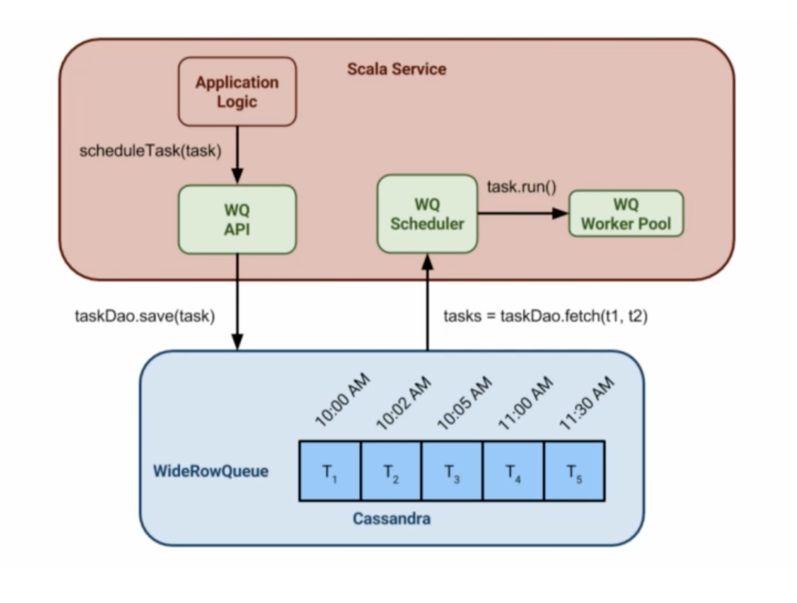
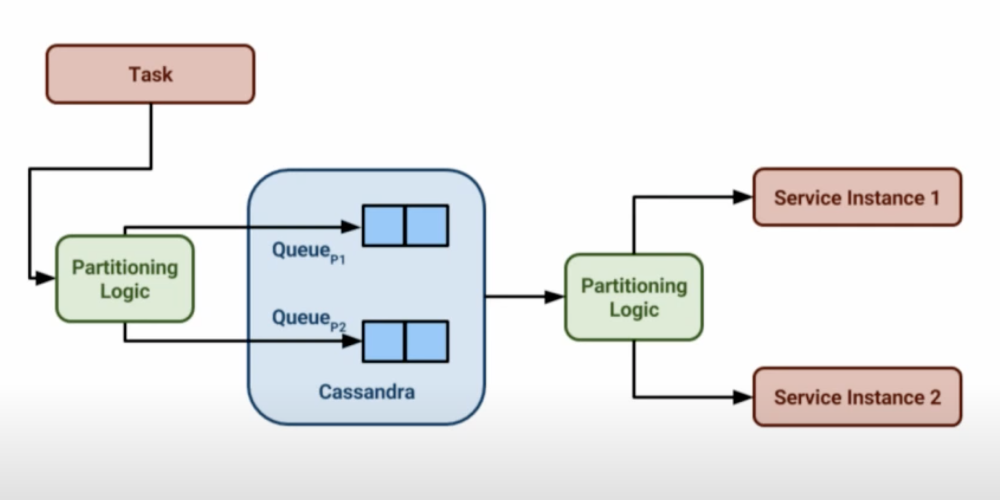
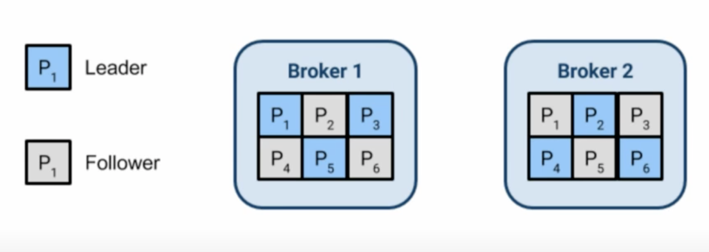
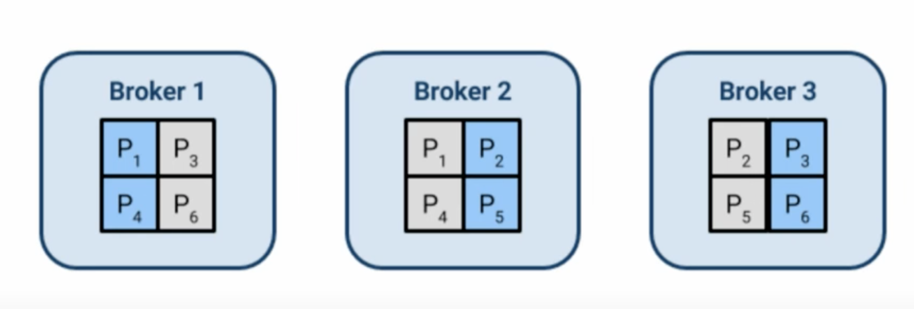
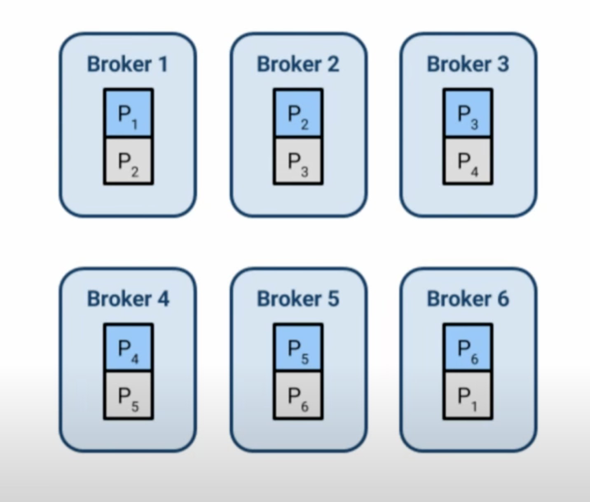

- [Distributed](#distributed)
  - [Timer + Database](#timer--database)
  - [Redis + MySQL](#redis--mysql)
    - [Algorithm](#algorithm)
    - [Components](#components)
  - [Pager duty task scheduler](#pager-duty-task-scheduler)
    - [Cassandra + WorkerQueue](#cassandra--workerqueue)
    - [Cassandra + Kafka + Akka](#cassandra--kafka--akka)
      - [Dynamic load](#dynamic-load)
        - [Kafka](#kafka)
        - [Consumer service](#consumer-service)
        - [Cassandra](#cassandra)
      - [Outages](#outages)
        - [Kafka](#kafka-1)
        - [Cassandra](#cassandra-1)
        - [Service](#service)
      - [Task ordering](#task-ordering)
  - [Timing wheel](#timing-wheel)

# Distributed
## Timer + Database

* Initial solution: Creates a table within a database, uses a timer thread to scan the table periodically. 
* Cons:
  * If the volume of data is large and there is a high frequency of insertion rate, then it won't be efficient to lookup and update records. 
  * There is a difference between when task is scheduled to be executed and when the task should be executed. 
* How to optimize: 
  * Shard the table according to task id to boost the lookup efficiency. 

```
INT taskId
TIME expired
INT maxRetryAllowed
INT job status (0: newly created; 1: started; 2: failed; 3: succeeded)
```

## Redis + MySQL

### Algorithm

```
redis> ZADD delayqueue <future_timestamp> "messsage"
redis> MULTI
redis> ZRANGEBYSCORE delayqueue 0 <current_timestamp>
redis> ZREMRANGEBYSCORE delayqueue 0 <current_timestamp>
redis> EXEC
```

### Components


* JobPool: Store all metadata about jobs
  * Stores as key value pairs. Key is job id and value is job struct. 
  * Job struct contains the following:
    1. topic: job category. Needed because each category will has its own callback function. 
    2. id: job unique identifier
    3. delayTime: time to delay before executing the task
    4. ttr: timeout duration for this job to be executed
    5. body: job content
    6. callback: http url for calling a specific function
* Timer: Scan delay bucket and put expired jobs into ready queue
* Delay queue: A list of ordered queues which store all delayed/reserved jobs (only stores job Id)
* Ready queue: A list of ordered queues which store jobs in Ready state.
  * Topic: The same category of job collections
* Response queue: Stores the responses
* Database: Stores the message content
* Dispatcher: It will poll the delay queue and move items to the corresponding topic within ready queues if the tasks are ready. 
* Worker: Workers use BLPOP on the ready queue and process the message. Once done, the response could be put in a response queue and send to consumer. 


## Pager duty task scheduler
* https://www.youtube.com/watch?v=s3GfXTnzG_Y&ab_channel=StrangeLoopConference
* The main problem is it uses Cassandra and Kafka; we don’t have any experience for both neither do we have other use cases than the scheduler which will need Cassandra or Kafka. I’m always reluctant to hosting new database systems, database systems are complex by nature and are not easy when it comes to scaling them. It’s a no go then.

### Cassandra + WorkerQueue
  * A queue is a column in Cassandra and time is the row.
  * Another component pulls tasks from Cassandra and schedule using a worker pool. 
  * Improved with partition logic





* Difficulties with old solutions
  * Partition logic is complex and custom
  * Low throughput due to IOs

### Cassandra + Kafka + Akka
* Production statistics:
  * Execute 3.1 million jobs per months
  * 8,000 task hourly spikes
  * 
* Components
  * Kafka - for task buffering and execution
  * Cassandra - for task persistence
  * Akka - for task execution
* In-memory tasks from Kafka and regularly pulling tasks from Cassandra.

* Challenges
  * Dynamic load
  * Datacenter outages
  * Task ordering


#### Dynamic load
##### Kafka
* Dynamic load in Kafka: Improve Kafka automatically rebalances. 
  * Initial setup
  * Increase in number of broker needs to be triggered manually. Increase to 3.
  * Increase to 6.
  * Should not increase the number of partitions unlimited ??? 





##### Consumer service
* Dynamic load in service itself
  * Consumers are grouped and healthiness is tracked by Kafka.
  * How fast this process could be actually depends on the how quickly services could respond. 
  * Initial setup


  * Increase service node to 3


##### Cassandra
* Dynamic load in Cassandra
  * Ring based load balancing

#### Outages
##### Kafka
* Setup:
  * 6 brokers evenly split across 3 DCs.
  * 3 replicas per parition, one in each DC. 
  * Writes replicated to >= 2 DCs. Min in-sync replica: 2
  * Partition leadership failsover automatically

* Outage scenario: Lost Data Center 3. 
  * Broker1 becomes leader for partition P3. 
  * Broker4 becomes leader for partition P6. 
  * However, since only requires 2 in-sync replica, writes still succeed. 


##### Cassandra
* Setup
  * 5 nodes in 3 DCs.
  * Replication factor of 5
  * Quorum writes guarantee replication to >= 2 DCs.
  * Quorum reads will get latest written value. 
* Outage scenario: Lost DC1
  * Quoram read. Although nodes 4/5 has stale data, Cassandra's policy for last write wins. 


##### Service
* Kafka will detect the healthiness of consumers and reassigns partitions to healthy instances. 
* This will work because:
  * Any service instance can work any task. 
  * Idempotency means that task may be repeated. 
* Outage scenario: Lost DC3
  * Reassign partition3 to service instances 1. 


#### Task ordering
* Task defined for any single logical queue


* Solution:
  * Logical queue is executed by one service instance. 
  * But one service instance is executing multiple logical queues
  * A failing task stops its logical queue
  * How to prevent all queues being stopped?


## Timing wheel

**Simple wheel**

* Keep a large timing wheel
* A curser in the timing wheel moves one location every time unit (just like a seconds hand in the clock)
* If the timer interval is within a rotation from the current curser position then put the timer in the corresponding location
* Requires exponential amount of memory

**Hashed wheel (sorted)**

* Sorted Lists in each bucket
* The list in each bucket can be insertion sorted
* Hence START_TIMER takes O(n) time in the worst case
* If  n < WheelSize then average O(1)

**Hashed wheel (unsorted)**

* Unsorted list in each bucket
* List can be kept unsorted to avoid worst case O(n) latency for START_TIMER
* However worst case PER_TICK_BOOKKEEPING = O(n)
* Again, if n < WheelSize then average O(1)

**Hierarchical wheels**

* START_TIMER = O(m) where m is the number of wheels. The bucket value on each wheel needs to be calculated
* STOP_TIMER = O(1)
* PER_TICK_BOOKKEEPING = O(1)  on avg.
