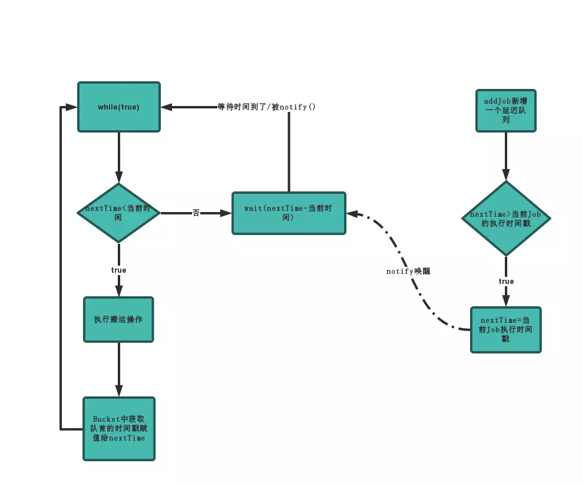
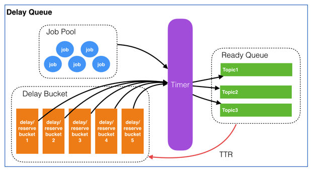

- [Redis based async queue - TODO](#redis-based-async-queue---todo)
  - [How to scale?](#how-to-scale)
  - [Fault tolerant](#fault-tolerant)
- [Redis + MySQL](#redis--mysql)
  - [Algorithm](#algorithm)
  - [Components](#components)

# Redis based async queue - TODO
* Wait notify + Regular schedule
  * Motivation: When there are multiple consumers for delay queue, each one of them will possess a different timestamp. Suppose consumer A will move the next delay task within 1 minute and all other consumers will only start moving after 1 hour. If consumer A dies and does not restart, then it will at least 1 hour for the task to be moved to ready queue. A regular scanning of delay queue will compensate this defficiency. 
  * When will nextTime be updated:
    * Scenario for starting: When delayQueue polling thread gets started, nextTime = 0 ; Since it must be smaller than the current timestamp, a peeking operation will be performed on top of delayQueue.  
      * If there is an item in the delayQueue, nextTime = delayTime from the message; 
      * Otherwise, nextTime = Long.MaxValue
    * Scenario for execution: While loop will always be executed on a regular basis
      * If nextTime is bigger than current time, then wait(nextTime - currentTime)
      * Otherwise, the top of the delay queue will be polled out to the ready queue. 
    * Scenario for new job being added: Compare delayTime of new job with nextTime
      * If nextTime is bigger than delayTime, nextTime = delayTime; notify all delayQueue polling threads. 
      * Otherwise, wait(nextTime - currentTime)



* Assumption: QPS 1000, maximum retention period 7 days, 

## How to scale?

## Fault tolerant
* For a message in ready queue, if server has not received acknowledgement within certain period (e.g. 5min), the message will be put inside Ready queue again. 
* There needs to be a leader among server nodes. Otherwise message might be put into ready queue repeatedly. 
* How to guarantee that there is no message left during BLPOP and server restart?
  * Kill the Redis blpop client when shutting down the server. 
  * [https://hacpai.com/article/1565796946371](https://hacpai.com/article/1565796946371)


* Initial solution: Creates a table within a database, uses a timer thread to scan the table periodically. 
* Cons:
  * If the volume of data is large and there is a high frequency of insertion rate, then it won't be efficient to lookup and update records. 
  * There is a difference between when task is scheduled to be executed and when the task should be executed. 
* How to optimize: 
  * Shard the table according to task id to boost the lookup efficiency. 

```
INT taskId
TIME expired
INT maxRetryAllowed
INT job status (0: newly created; 1: started; 2: failed; 3: succeeded)
```

# Redis + MySQL

## Algorithm

```
redis> ZADD delayqueue <future_timestamp> "messsage"
redis> MULTI
redis> ZRANGEBYSCORE delayqueue 0 <current_timestamp>
redis> ZREMRANGEBYSCORE delayqueue 0 <current_timestamp>
redis> EXEC
```

## Components



* JobPool: Store all metadata about jobs
  * Stores as key value pairs. Key is job id and value is job struct. 
  * Job struct contains the following:
    1. topic: job category. Needed because each category will has its own callback function. 
    2. id: job unique identifier
    3. delayTime: time to delay before executing the task
    4. ttr: timeout duration for this job to be executed
    5. body: job content
    6. callback: http url for calling a specific function
* Timer: Scan delay bucket and put expired jobs into ready queue
* Delay queue: A list of ordered queues which store all delayed/reserved jobs (only stores job Id)
* Ready queue: A list of ordered queues which store jobs in Ready state.
  * Topic: The same category of job collections
* Response queue: Stores the responses
* Database: Stores the message content
* Dispatcher: It will poll the delay queue and move items to the corresponding topic within ready queues if the tasks are ready. 
* Worker: Workers use BLPOP on the ready queue and process the message. Once done, the response could be put in a response queue and send to consumer. 