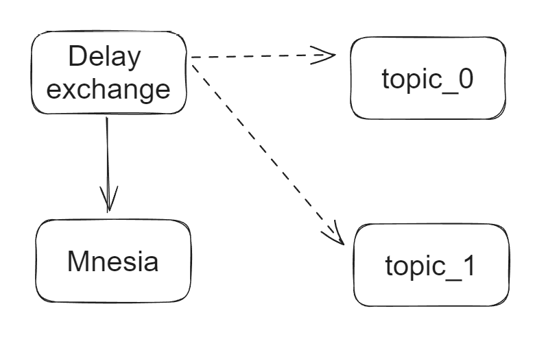
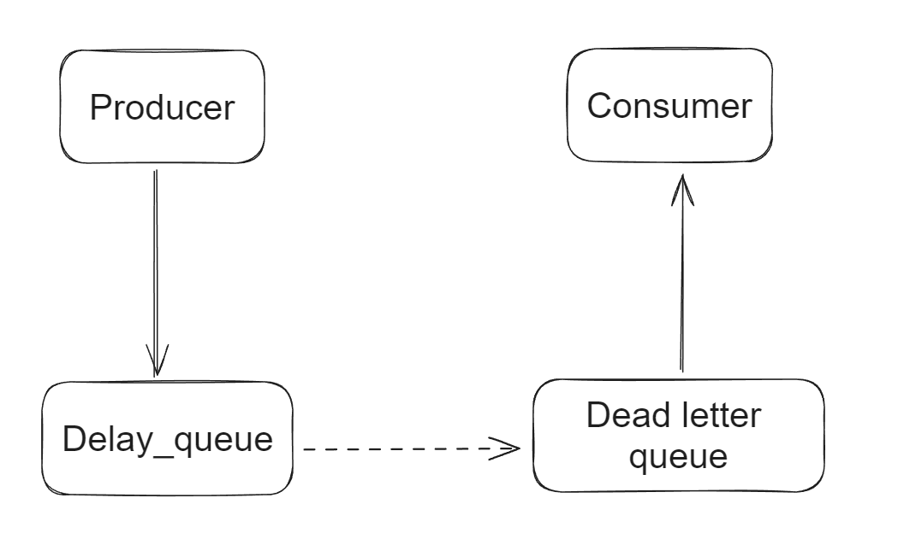

- [rabbitmq\_delayed\_message\_exchange plugin](#rabbitmq_delayed_message_exchange-plugin)
  - [Flowchart](#flowchart)
  - [Cons](#cons)
- [Dead letter queue](#dead-letter-queue)
  - [Flowchart](#flowchart-1)
  - [Cons](#cons-1)

# rabbitmq_delayed_message_exchange plugin
## Flowchart
1. The message will be put into delayed exchange. Within delayed exchange, the message will be stored inside Mnesia (A file-based database). 
2. Once the delayed period is passed, messages will be delivered to the message queue. 

## Cons
* Before messages are delivered to target queue, they are stored in servers' local file-based DB Mnesia. If the node becomes unavailable or the data has not been flushed to disk, they will be lost. 
* It does not support high concurrent volume and big data size. 

# Dead letter queue
## Flowchart
1. Delay queue has no consumers and an expiration time. 
2. When messages get expired, they will be delivered to dead letter queue. 

## Cons
* TTL threshold is set on the queue level. Each queue will have a different expiration time. If customized delay time is needed, then lots of queue need to be created. 