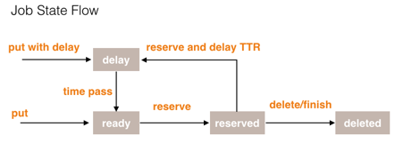
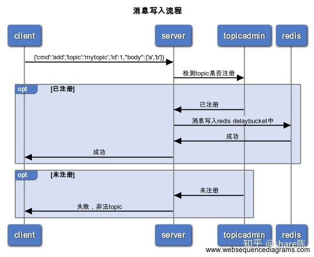
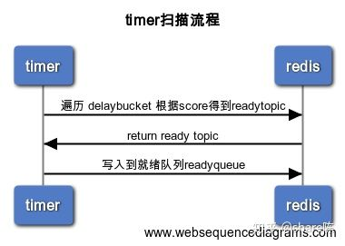

- [Single machine](#single-machine)
  - [PriorityQueue](#priorityqueue)
  - [Flow chart (In Chinese)](#flow-chart-in-chinese)
    - [Job state flow](#job-state-flow)

# Single machine

## PriorityQueue

**DelayQueue implementation in JDK**

* Internal structure: DelayQueue is a specialized PriorityQueue that orders elements based on their delay time.
* Characteristics: When the consumer wants to take an element from the queue, they can take it only when the delay for that particular element has expired.
* Pros:
  * Not introduce other dependencies 
* Cons: 
  * It is only a data structure implementation and all queue elements will be stored within JVM memory. It would require large amounts of efforts to build a scalable delay queue implementation on top of it. 

**Delayed interface**

* Algorithm: When the consumer tries to take an element from the queue, the DelayQueue will execute getDelay() to find out if that element is allowed to be returned from the queue. If the getDelay() method will return zero or a negative number, it means that it could be retrieved from the queue.
* Data structure:

```
public class DelayQueue<E extends Delayed>
                    extends AbstractQueue<E>
                    implements BlockingQueue<E>
```

```
// Each element we want to put into the DelayQueue needs to implement the Delayed interface
public class DelayObject implements Delayed {
    private String data;
    private long startTime;

    public DelayObject(String data, long delayInMilliseconds) {
        this.data = data;
        this.startTime = System.currentTimeMillis() + delayInMilliseconds;
    }

    // It will return the remaining delay associated with the item in the top of the PriorityQueue in the given time unit. 
    @Override
    public long getDelay(TimeUnit unit) {
        long diff = startTime - System.currentTimeMillis();
        return unit.convert(diff, TimeUnit.MILLISECONDS);
    }

    // The elements in the DelayQueue will be sorted according to the expiration time. The item that will expire first is kept at the head of the queue and the element with the highest expiration time is kept at the tail of the queue:
    @Override
    public int compareTo(Delayed o) {
        return Ints.saturatedCast(
          this.startTime - ((DelayObject) o).startTime);
    }
}
```

**Test with Producer/Consumer pattern**

```
// DelayedQueue is a blocking queue. When delayedQueue.take() method is called, it will only return when there is an item to be returned. 
public class DelayQueueProducer implements Runnable 
{  
    private BlockingQueue<DelayObject> queue;
    private Integer numberOfElementsToProduce;
    private Integer delayOfEachProducedMessageMilliseconds;

    // standard constructor

    @Override
    public void run() 
    {
        for (int i = 0; i < numberOfElementsToProduce; i++) 
        {
            DelayObject object
              = new DelayObject(
                UUID.randomUUID().toString(), delayOfEachProducedMessageMilliseconds);
            System.out.println("Put object: " + object);
            try 
            {
                queue.put(object);
                Thread.sleep(500);
            } 
            catch (InterruptedException ie) 
            {
                ie.printStackTrace();
            }
        }
    }
}

public class DelayQueueConsumer implements Runnable 
{
    private BlockingQueue<DelayObject> queue;
    private Integer numberOfElementsToTake;
    public AtomicInteger numberOfConsumedElements = new AtomicInteger();

    // standard constructors

    @Override
    public void run() {
        for (int i = 0; i < numberOfElementsToTake; i++) 
        {
            try 
            {
                DelayObject object = queue.take();
                numberOfConsumedElements.incrementAndGet();
                System.out.println("Consumer take: " + object);
            } 
            catch (InterruptedException e) 
            {
                e.printStackTrace();
            }
        }
    }
}
```

**Reference**

* [https://www.baeldung.com/java-delay-queue](https://www.baeldung.com/java-delay-queue)

## Flow chart (In Chinese)

### Job state flow



* Ready: The job is ready to be consumed.
* Delay: The job needs to wait for the proper clock cycle.
* Reserved: The job has been read by the consumer, but has not got an acknowledgement (delete/finish)
* Deleted: Consumer has acknowledged and finished.

**Produce delay task**



* What is topic admin ???
*

**Execute delay task**



**Timer mechanism (Signaling)**

* Busy waiting
  * Def: Setting the signal values in some shared object variable. Thread A may set the boolean member variable hasDataToProcess to true from inside a synchronized block, and thread B may read the hasDataToProcess member variable, also inside a synchronized block.
  * Example:     Thread B is constantly checking signal from thread A which causes hasDataToProcess() to return true on a loop. This is called busy waiting

```java
// class definition
public class MySignal
{
  protected boolean hasDataToProcess = false;

  public synchronized boolean hasDataToProcess()
  {
    return this.hasDataToProcess;
  }

  public synchronized void setHasDataToProcess(boolean hasData)
  {
    this.hasDataToProcess = hasData;  
  }
}

...

// main program
protected MySignal sharedSignal = ...

// Thread B is busy waiting for thread a to set 

while(!sharedSignal.hasDataToProcess())
{
  //do nothing... busy waiting
}
```

* Wait notify
  * Pros: 
    * Reduce the CPU load caused by waiting thread in busy waiting mode. 
  * Cons: 
    * Missed signals: if you call notify() before wait() it is lost.
    * it can be sometimes unclear if notify() and wait() are called on the same object.
    * There is nothing in wait/notify which requires a state change, yet this is required in most cases.
    * Spurious wakeups: wait() can return spuriously

```java
// Clients: Insert delayed tasks to delayQueues (Redis sorted set)
InsertDelayTasks(String msg)
{
    // score = current time + delay time
    redis.zdd(delayTaskSortedSets,score,msg)

    // the number of elements in delayTaskSortedSets
    len = zcount(delayTaskSortedSets, 0, -1)

    // notify polling thread if there exists delayed tasks to be executed
    synchronized(delayTaskSortedSets)
    {
        if(len > 0)
        {
            delayTaskSortedSets.notify()
        }
    } 
}

// DelayQueue server polling thread: Scan delayQueues and put expired tasks to ready queue
GetDelayMsg()
{   
    while(True)
    {
        // Wait until the number of elements inside delayTasksSortedTask is bigger than 0 
        synchronized(delayTaskSortedSets)
        {
            while (0 == zcount(delayTaskSortedSets,0, -1))
            {
                delayTaskSortedSets.wait()
            }
        }

        // Peek the top element from delayTasksSortedSet
        msg = redis.zcard(delayTaskSortedSets,0,1)
        waittime = score - curtime

        if(waittime > 0)
        {
            // Still need to wait
            synchronized(delayTaskSortedSets)
            {
                delayTaskSortedSets.wait(waittime)
            }
        }
        else
        {
            // Add to an element to ReadyQueue
            readyQueue.put(delayTaskSortedSets, msg)
            redis.zrem(msg);
        }
    }
}

// ReadyQueue server processing thread: Process ReadyQueue elements 
ProcessReady()
{
    while(True)
    {
        msg = blockingReadyQueue.take()
        MQ.insert(msg)
    }

    mq.inset(msg)
}
```

* Wait notify + Regular schedule
  * Motivation: When there are multiple consumers for delay queue, each one of them will possess a different timestamp. Suppose consumer A will move the next delay task within 1 minute and all other consumers will only start moving after 1 hour. If consumer A dies and does not restart, then it will at least 1 hour for the task to be moved to ready queue. A regular scanning of delay queue will compensate this defficiency. 
  * When will nextTime be updated:
    * Scenario for starting: When delayQueue polling thread gets started, nextTime = 0 ; Since it must be smaller than the current timestamp, a peeking operation will be performed on top of delayQueue.  
      * If there is an item in the delayQueue, nextTime = delayTime from the message; 
      * Otherwise, nextTime = Long.MaxValue
    * Scenario for execution: While loop will always be executed on a regular basis
      * If nextTime is bigger than current time, then wait(nextTime - currentTime)
      * Otherwise, the top of the delay queue will be polled out to the ready queue. 
    * Scenario for new job being added: Compare delayTime of new job with nextTime
      * If nextTime is bigger than delayTime, nextTime = delayTime; notify all delayQueue polling threads. 
      * Otherwise, wait(nextTime - currentTime)


* Assumption: QPS 1000, maximum retention period 7 days, 

**How to scale?**

**Fault tolerant**

* For a message in ready queue, if server has not received acknowledgement within certain period (e.g. 5min), the message will be put inside Ready queue again. 
* There needs to be a leader among server nodes. Otherwise message might be put into ready queue repeatedly. 
* How to guarantee that there is no message left during BLPOP and server restart?
  * Kill the Redis blpop client when shutting down the server. 
  * [https://hacpai.com/article/1565796946371](https://hacpai.com/article/1565796946371)

**Reference**

* A hashed timer implementation [https://github.com/ifesdjeen/hashed-wheel-timer](https://github.com/ifesdjeen/hashed-wheel-timer)
* [http://www.cloudwall.io/hashed-wheel-timers](http://www.cloudwall.io/hashed-wheel-timers)
* Implementation in Netty: [https://www.jianshu.com/p/f009666ef55c](https://www.jianshu.com/p/f009666ef55c)