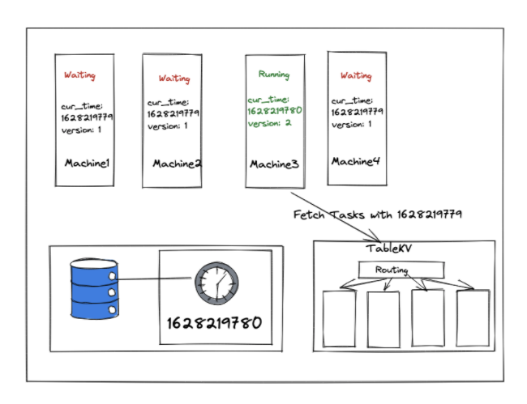

## Simple timing wheel

* Keep a large timing wheel
* A curser in the timing wheel moves one location every time unit (just like a seconds hand in the clock)
* If the timer interval is within a rotation from the current curser position then put the timer in the corresponding location
* Requires exponential amount of memory

## Hashed wheel
* Unsorted list
  * Unsorted list in each bucket
  * List can be kept unsorted to avoid worst case O(n) latency for START_TIMER
  * However worst case PER_TICK_BOOKKEEPING = O(n)
  * Again, if n < WheelSize then average O(1)
* Sorted list
  * Sorted Lists in each bucket
  * The list in each bucket can be insertion sorted
  * Hence START_TIMER takes O(n) time in the worst case
  * If  n < WheelSize then average O(1)

## Hierarchical wheels
* START_TIMER = O(m) where m is the number of wheels. The bucket value on each wheel needs to be calculated
* STOP_TIMER = O(1)
* PER_TICK_BOOKKEEPING = O(1)  on avg.

# Process
## Step1. Insert pending task
* We are going to implement Hashed Timing Wheel algorithm with TableKV, supposing there are 10m buckets, and current time is 2021:08:05 11:17:33 +08=(the UNIX timestamp is =1628176653), there is a timer task which is going to be triggered 10s later with start_time = 1628176653 + 10 (or 100000010s later, start_time = 1628176653 + 10 + 100000000), these tasks both will be stored into bucket start_time % 100000000 = 28176663

## Step2. Pull task out from slot
* As clock tick-tacking to 2021:08:05 11:17:43 +08(1628176663), we need to pull tasks out from slot by calculating the bucket number: current_timestamp(1628176663) % 100000000 = 28176663. After locating the bucket number, we find all tasks in bucket 28176663 with start_time < currenttimestamp=, then we get all expected expiry tasks.

## Step3. Have a central clock
* In order to get the correct time, it's necessary to maintain a monotonic global clock(Of course, it's not the only way to go, there are several ways to handle time and order). Since everything we care about clock is Unix timestamp, we could maintain a global system clock represented by Unix timestamp. All machines request the global clock every second to get the current time, fetching the expiry tasks later.

## Step4. Guarantee that each task is only executed once
* Steps:
  1. All machines fetch global timestamp(timestamp A) with version
  2. All machines increase timestamp(timestamp B) and update version(optimistic locking), only one machine will success because of optimistic locking.
  3. Then the machine acquired mutex is authorized to fetch expiry tasks with timestamp A, the other machines failed to acquire mutex is suspended to wait for 1 seconds.
  4. Loop back to step 1 with timestamp B.

## Step5. Scheduler component for global clock and only once execution
* We could encapsulate the role who keep acquiring lock and fetch expiry data as an individual component named scheduler.
* Expiry processing is responsible for invoked the user-supplied callback or other user requested action. In distributed computing, it's common to execute a procedure by RPC(Remote Procedure Call). In our case, A RPC request is executed when timer task is expiry, from timer service to callback service. Thus, the caller(user) needs to explicitly tell the timer, which service should I execute with what kind of parameters data while the timer task is triggered.
* We could pack and serialize this meta information and parameters data into binary data, and send it to the timer. When pulling data out from slot, the timer could reconstruct Request/Response/Client type and set it with user-defined data, the next step is a piece of cake, just executing it without saying.

## Step6. Thread pool
* Perhaps there are many expiry tasks needed to triggered, in order to handle as many tasks as possible, you could create a thread pool, process pool, coroutine pool to execute RPC concurrently.

## Step7. Decoupling with message queue
* Supposing the callback service needs tons of operation, it takes a hundred of millisecond. Even though you have created a thread/process/coroutine pool to handle the timer task, it will inevitably hang, resulting in the decrease of throughout.
* As for this heavyweight processing case, Message Queue is a great answer. Message queues can significantly simplify coding of decoupled services, while improving performance, reliability and scalability. It's common to combine message queues with Pub/Sub messaging design pattern, timer could publish task data as message, and timer subscribes the same topic of message, using message queue as a buffer. Then in subscriber, the RPC client executes to request for callback service.

# NonFunc
## Scan missed expiry tasks
* A missed expiry of tasks may occur because of the scheduler process being shutdown or being crashed, or because of other unknown problems. One important job is how to locate these missed tasks and re-execute them. Since we are using global `currenttimestamp` to fetch expiry data, we could have another scheduler to use `delay10mintimestamp` to fetch missed expiry data.

## Callback service error
* Since the distributed systems are shared-nothing systems, they communicate via message passing through a network(asynchronously or synchronously), but the network is unreliable. When invoking the user-supplied callback, the RPC request might fail if the network is cut off for a while or the callback service is temporarily down.
* Retries are a technique that helps us deal with transient errors, i.e. errors that are temporary and are likely to disappear soon. Retries help us achieve resiliency by allowing the system to send a request repeatedly until it gets an explicit response(success or fail). By leveraging message queue, you obtain the ability for retrying for free. In the meanwhile, the timer could handle the user-requested retries: It's not the proper time to execute callback service, retry it later.

