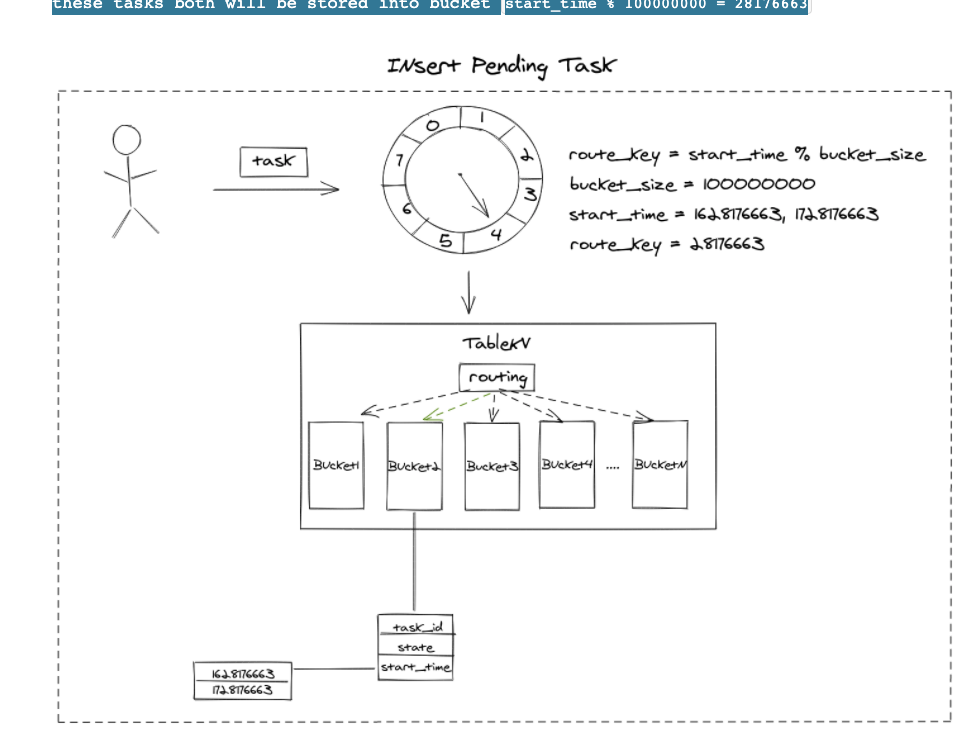
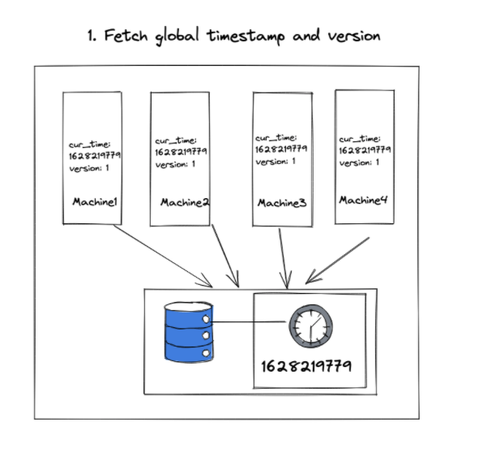

- [Category of timing wheels](#category-of-timing-wheels)
  - [Operation1: Per-tick bookkeeping](#operation1-per-tick-bookkeeping)
  - [Operation2: Expiry processing](#operation2-expiry-processing)
- [Components](#components)
  - [Planner](#planner)
    - [Insert pending task](#insert-pending-task)
  - [Scheduler](#scheduler)
    - [Pull task out from slot](#pull-task-out-from-slot)
    - [Expiry processing](#expiry-processing)
  - [Executor](#executor)
    - [Multiple consumer with thread pool](#multiple-consumer-with-thread-pool)
    - [Decoupling with message queue](#decoupling-with-message-queue)
  - [Storage](#storage)
    - [Write tasks in disk](#write-tasks-in-disk)
    - [Replace disk offset address with ID](#replace-disk-offset-address-with-id)
      - [Efficiently access singly linked list](#efficiently-access-singly-linked-list)
      - [Recover after restart](#recover-after-restart)
- [NonFunc](#nonfunc)
  - [Accuracy](#accuracy)
    - [Naive solution: Global clock](#naive-solution-global-clock)
  - [Reliability - Exact once execution](#reliability---exact-once-execution)
    - [Optimistic lock with version control](#optimistic-lock-with-version-control)
    - [Scan missed expiry tasks](#scan-missed-expiry-tasks)
  - [Resilience](#resilience)
    - [Callback service error](#callback-service-error)
    - [Restore a node after crash](#restore-a-node-after-crash)
  - [Perf](#perf)
    - [Storage](#storage-1)
      - [Partitioning of Linked List of Tasks](#partitioning-of-linked-list-of-tasks)
    - [Softloading in task execution](#softloading-in-task-execution)
- [References](#references)

# Category of timing wheels
* N: Size of wheel
* M: Max length of list in a slot

| `Operation complexity` | `Simple` | `Hashing` | `Hierarchical`  |
|---|---|---|---|
| `Space complexity`  | O(N) wheel_size * O(M) list_size | O(1) wheel_size * O(M) list_size | O(1) wheel_size * O(K) list_size, K << M (far smaller) |
| `Time complexity: Per tick bookkeeping`  | O(1) | O(logM)  | O(logK)  |
| `Time complexity: Expiry processing`  | O(1) | O(logM) | O(logK)  |
| `Comment`  | Not practical | Less space more time | Suitable for millions of tasks  |

## Operation1: Per-tick bookkeeping
* Per-tick bookkeeping: happens on every 'tick' of the timer clock. If the unit of granularity for setting timers is T units of time (e.g. 1 second), then per-tick bookkeeping will happen every T units of time. It checks whether any outstanding timers have expired, and if so it removes them and invokes expiry processing.

## Operation2: Expiry processing
* Expiry processing: is responsible for invoked the user-supplied callback (or other user requested action, depending on your model).

# Components
## Planner
### Insert pending task
* We are going to implement Hashed Timing Wheel algorithm with TableKV, supposing there are 10m buckets, and current time is 2021:08:05 11:17:33 +08=(the UNIX timestamp is =1628176653), there is a timer task which is going to be triggered 10s later with start_time = 1628176653 + 10 (or 100000010s later, start_time = 1628176653 + 10 + 100000000), these tasks both will be stored into bucket start_time % 100000000 = 28176663

## Scheduler
* We could encapsulate the role who keep acquiring lock and fetch expiry data as an individual component named scheduler.

### Pull task out from slot
* As clock tick-tacking to 2021:08:05 11:17:43 +08(1628176663), we need to pull tasks out from slot by calculating the bucket number: current_timestamp(1628176663) % 100000000 = 28176663. After locating the bucket number, we find all tasks in bucket 28176663 with start_time < currenttimestamp=, then we get all expected expiry tasks.

### Expiry processing
* Expiry processing is responsible for invoked the user-supplied callback or other user requested action. In distributed computing, it's common to execute a procedure by RPC(Remote Procedure Call). In our case, A RPC request is executed when timer task is expiry, from timer service to callback service. Thus, the caller(user) needs to explicitly tell the timer, which service should I execute with what kind of parameters data while the timer task is triggered.
* We could pack and serialize this meta information and parameters data into binary data, and send it to the timer. When pulling data out from slot, the timer could reconstruct Request/Response/Client type and set it with user-defined data, the next step is a piece of cake, just executing it without saying.

## Executor
### Multiple consumer with thread pool
* Perhaps there are many expiry tasks needed to triggered, in order to handle as many tasks as possible, you could create a thread pool, process pool, coroutine pool to execute RPC concurrently.

### Decoupling with message queue
* Supposing the callback service needs tons of operation, it takes a hundred of millisecond. Even though you have created a thread/process/coroutine pool to handle the timer task, it will inevitably hang, resulting in the decrease of throughout.
* As for this heavyweight processing case, Message Queue is a great answer. Message queues can significantly simplify coding of decoupled services, while improving performance, reliability and scalability. It's common to combine message queues with Pub/Sub messaging design pattern, timer could publish task data as message, and timer subscribes the same topic of message, using message queue as a buffer. Then in subscriber, the RPC client executes to request for callback service.

## Storage
### Write tasks in disk
* The idea is to write a list of tasks into the disk, where the list of tasks are linked together one by one in the way of a linked list. For this, each task should have a disk offset pointing to the next task, and the whole linked list of tasks can be obtained by simply getting the header of the linked list. Thus, for the solution, there is no need for an individual degree on the timing wheel to store the whole list of tasks, it can only store the header of the list so that the pressure of storage can be released.

* This solution will be acceptable for those systems where the middleware gets targeted in this way, but for systems targeting ordinary apps, the requirement for deployment seems too high, because you need a fixed disk. Under the current trend of containerization and dynamic capacity management, an ordinary app will have to depend on a fixed disk; this introduces extra complexity to the operation, maintenance and deployment of a system. As a result, this article mainly focuses on the lightweight timer task scheduling engine which gets built upon that basis.

### Replace disk offset address with ID
* The task is designed into a structured list, and the offset on the list gets replaced with a task ID (above figure 2 shows the offset of a file), through which the whole list of tasks are linked together one by one, and only the ID of the linked list header gets associated to the timing wheel.

#### Efficiently access singly linked list
* As a single linked list cannot get extracted concurrently, it will impact the extraction efficiency, which can lead to severe latency in timer task processing when there are a large number of timer tasks at a specific time.

#### Recover after restart
* As the tasks do not get stored in the native disk (meaning the timer tasks for the entire cluster gets stored in a centralized way, and each node in the cluster has its timing wheel), in what way will each node restore after being restarted? How to automate the management of cluster resizing and reduction?

# NonFunc
## Accuracy
### Naive solution: Global clock
* In order to get the correct time, it's necessary to maintain a monotonic global clock(Of course, it's not the only way to go, there are several ways to handle time and order). Since everything we care about clock is Unix timestamp, we could maintain a global system clock represented by Unix timestamp. All machines request the global clock every second to get the current time, fetching the expiry tasks later.

## Reliability - Exact once execution
### Optimistic lock with version control
* Steps:
  1. All machines fetch global timestamp(timestamp A) with version
  2. All machines increase timestamp(timestamp B) and update version(optimistic locking), only one machine will success because of optimistic locking.
  3. Then the machine acquired mutex is authorized to fetch expiry tasks with timestamp A, the other machines failed to acquire mutex is suspended to wait for 1 seconds.
  4. Loop back to step 1 with timestamp B.

### Scan missed expiry tasks
* A missed expiry of tasks may occur because of the scheduler process being shutdown or being crashed, or because of other unknown problems. One important job is how to locate these missed tasks and re-execute them. Since we are using global `currenttimestamp` to fetch expiry data, we could have another scheduler to use `delay10mintimestamp` to fetch missed expiry data.

## Resilience
### Callback service error
* Since the distributed systems are shared-nothing systems, they communicate via message passing through a network(asynchronously or synchronously), but the network is unreliable. When invoking the user-supplied callback, the RPC request might fail if the network is cut off for a while or the callback service is temporarily down.
* Retries are a technique that helps us deal with transient errors, i.e. errors that are temporary and are likely to disappear soon. Retries help us achieve resiliency by allowing the system to send a request repeatedly until it gets an explicit response(success or fail). By leveraging message queue, you obtain the ability for retrying for free. In the meanwhile, the timer could handle the user-requested retries: It's not the proper time to execute callback service, retry it later.

### Restore a node after crash
* Metadata: The degree the timing wheel is at before the restart, and the data of the linked list of tasks on the timing wheel scale during restart.
* how can a cluster node get its metadata? A Master node will get selected from the cluster, and all other nodes will register themselves into the Master node. After this, the Master node will assign an ID to each of these nodes, who can then get its timing wheel metadata from the storage service by its assigned ID and initialize its timing wheel. Figure 5 and Figure 6 illustrate for that process:

## Perf
### Storage
#### Partitioning of Linked List of Tasks
* The advantage of a linked list is that, instead of storing the entire list of tasks, you store a simple ID, which reduces the consumption of storage but also introduces a new issue. It is well-known that a linked list is writing-friendly, but the reading efficiency is not very high; as a result, when a long linked list of tasks is to be mounted at a specific time, the form of a linked list will not allow the improvement in reading efficiency through concurrency.
* How to improve the efficiency of extraction from task queue at a specific time? Here we use partitioning to split a single linked list for a specific time into multiple linked lists; in this way, the extraction of tasks for a specific time can get performed concurrently based on the size of linked list collection; this can accelerate the extraction of all tasks for that time. So the solution is adjusted as shown in Figure 4:

### Softloading in task execution
* Distribute the extracted linked list of tasks to other nodes within the same cluster through soft loading. As the data of tasks gets stored in a centralized way, any of other nodes can extract all tasks of that linked list by simply getting the ID of the header of that linked list; in this way, the pressure on a single node also gets distributed within the whole cluster. Figure below shows the interactions during this process:

# References
* [How To Design A Reliable Distributed Timer](https://0x709394.me/How-To%20Design%20A%20Reliable%20Distributed%20Timer)
* [Speeding Up Logistics with a Lightweight Timer Task Scheduling Engine](https://www.alibabacloud.com/blog/speeding-up-logistics-with-a-lightweight-timer-task-scheduling-engine_594197)
* A hashed timer implementation [https://github.com/ifesdjeen/hashed-wheel-timer](https://github.com/ifesdjeen/hashed-wheel-timer)
* [http://www.cloudwall.io/hashed-wheel-timers](http://www.cloudwall.io/hashed-wheel-timers)

* Implementation in Netty: [https://www.jianshu.com/p/f009666ef55c](https://www.jianshu.com/p/f009666ef55c)
