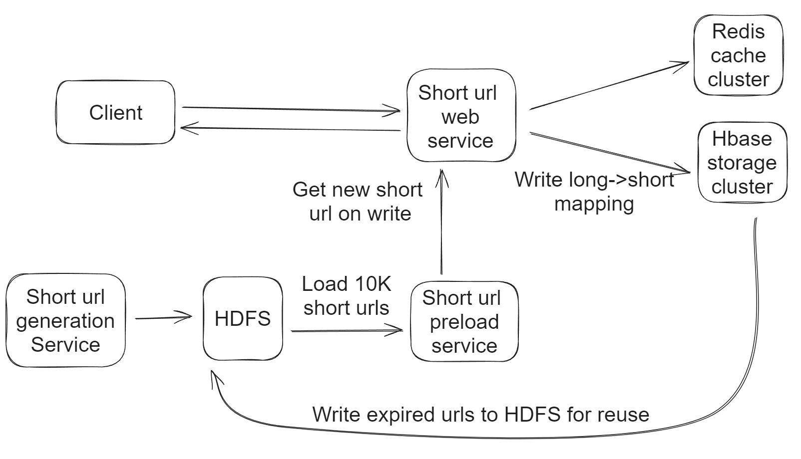

# Flowchart



# Deal with expired records

* Solution1: Check data in the service level, if expired, return null
  * Pros: Simple and keep historical recordds
  * Cons: Waste disks
* Solution2: Remove expired data in the database and cache using daemon job
  * Pros: Reduce storage and save cost, improve query performance
  * Cons: 
    * Lost historical records
    * Complicated structure
    * Easy to fail

```text
while(true)
{
    List<TinyUrlRecord> expiredRecords = getExpiredRecords();
    For (TinyUrlRecord r: expiredRecords)
    {
        deleteFromDb(r);
        removeFromCache(r);
    }
}
```

# Offline generators
## Naive short url generation service
* Offline job generates keys \(Daemon process\) and stores into database.
  * Offline job can tolerate longer query time. 

### Database schema
* create table keys\(Key text primary key, status integer\)
* status
  * 0: available
  * 1: occupied

### Query
* Keys database query 
  * 1. Select key from keys where status = 0 limit 1 
  * 2. Update keys set status = 1 where key = a\_key

### Cons
#### Race condition
* Multiple users can get same keys if qps is high
  * Select / Update is not atomic operation
* Database is not suitable for queuing
* Solution: 
  1. Database lock: Select key from keys where status = 0 limit 1 for update skip locked
  2. Distributed lock: bad performance. 
  3. Redis -&gt; LPush and LPop: Redis list data structure is actually queue and it is thread-safe and production ready
