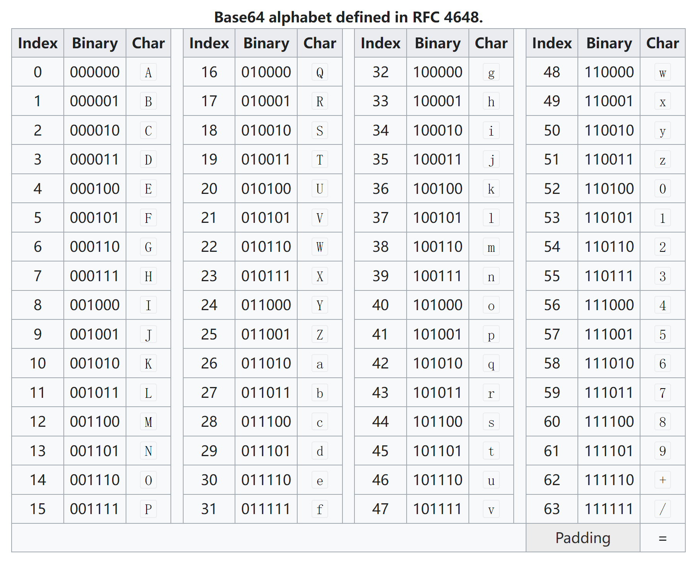
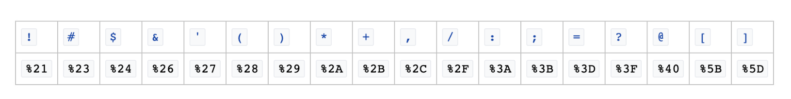

- [Short url length](#short-url-length)
- [Shortening algorithm](#shortening-algorithm)
  - [Hashing algorithm](#hashing-algorithm)
    - [SHA-256 / Murmur / Jenkins](#sha-256--murmur--jenkins)
      - [Comparison](#comparison)
      - [Cons](#cons)
      - [Pros](#pros)
    - [Base62 / Base64 encoding](#base62--base64-encoding)
      - [Pros](#pros-1)
      - [Cons](#cons-1)
      - [Modified base64 encoding](#modified-base64-encoding)
- [Hashing seed](#hashing-seed)
  - [Truncate self-incrementing id hashing value](#truncate-self-incrementing-id-hashing-value)
  - [Truncate url hashing value](#truncate-url-hashing-value)
- [Pre-generate or on-the-fly](#pre-generate-or-on-the-fly)

# Short url length
* Retention period varies with base radix. For example, assume 500M new records per month
  * If length == 8, 62^8 ~ 200 trillion ~ 33333 years
  * If length == 7, 62^7 ~ 3 trillion ~ 600 years
  * If length == 6, 62^6 ~ 57 B ~ 10 years

| Encoding | Base10 | Base62 | Base64 |
| :--- | :--- | :--- | :--- |
| Year | 36,500,000 | 36,500,000 |  |
| Usable characters | \[0-9\] | \[0-9a-zA-Z\] | \[0-9a-zA-Z+/=\] |
| Encoding length | 8 | 5 |  |

* 6 bits will be enough for purely storage purpose. However, to avoid too many hash collision, we could use 7 bits. 

# Shortening algorithm

## Hashing algorithm
### SHA-256 / Murmur / Jenkins
#### Comparison
* Crypto hash function: MD5 and SHA-1
  * Secure but slow
* Fast hash function: Murmur and Jenkins
  * Performance
  * Have 32-, 64-, and 128-bit variants available

#### Cons
* Key duplication if only use 6 prefix characters. 
  * Possible solution: Use long_url + timestamp as hash argument, if conflict happens, try again
* Hashing algorithm could be slow.

#### Pros
* No need to write additional hash function, easy to implement
* Are randomly distributed
* Not guessable and reverserable

### Base62 / Base64 encoding 

#### Pros
* Faster than SHA-256/Murmur algorithms

#### Cons
* Key duplication if only use 6 prefix characters. 
  * Possible solution: Use long_url + timestamp as hash argument, if conflict happens, try again
* Easy to predict and guessable

#### Modified base64 encoding
* The 62nd and 63rd character is '+' and '/'. 

* Inside URL, '+' and '/' be encoded as '%2B' and '%2F'. 

* So the revised base64 encoding will use '-' instead of '+' and use '_' instead of '/'.

# Hashing seed
## Truncate self-incrementing id hashing value
* For example, the self-incrementing id could be implemented by GLOBAL_ID inside database. 
* Cons: Predictable

## Truncate url hashing value

# Pre-generate or on-the-fly
* When generate on the fly, there will be performance bottlenecks if there are collisions after truncating characters. 
* If the hashing values could be calculated ahead of time, the generated URLs could be stored in the file system.  