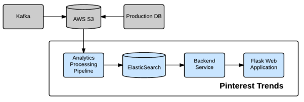

- [Heavy hitters / Find top k in a data stream](#heavy-hitters--find-top-k-in-a-data-stream)
  - [Single treeMap](#single-treemap)
  - [HashMap + PriorityQueue](#hashmap--priorityqueue)
  - [LFU cache](#lfu-cache)
  - [Count-min sketch](#count-min-sketch)
  - [Lossy counting](#lossy-counting)
- [Counter service design](#counter-service-design)
  - [Nonfunctional requirements](#nonfunctional-requirements)
  - [High level design](#high-level-design)
    - [Counting service](#counting-service)
    - [Query service](#query-service)
- [Trend detection service](#trend-detection-service)
  - [Imp with elasticsearch at Pinterest](#imp-with-elasticsearch-at-pinterest)
  - [Statistical view](#statistical-view)
- [Real world](#real-world)
- [TODO](#todo)

## Heavy hitters / Find top k in a data stream

### Single treeMap

* TC: O(nlgm)
* SC: O(m)

### HashMap + PriorityQueue

* Parameters
  * n: number of records
  * m: number of distinct entries
  * K: target k
* TC: O(n + mlgk) = O(n)
  * Count frequency: O(n)
  * Calculate top K: O(mlgk)
* SC: O(n + k)
  * HashMap: O(n)
  * PriorityQueue: O(k)

### LFU cache

* DLL + HashMap based LFU cache (approximate answer)
  * TC: O(n + k)
  * SC: O(n)
  * Cons:
    * All low frequency will be hashed to same value, which will result in incorrect result (low possibility)
    * Some low frequency words will come later, which will have a great count, then replace other high frequency words (bloom filter)
      * HashMap will have 3 different hash functions
      * Choose the lowest count from hashmap

### Count-min sketch

* [https://florian.github.io/count-min-sketch/](https://florian.github.io/count-min-sketch/)
* [https://towardsdatascience.com/big-data-with-sketchy-structures-part-1-the-count-min-sketch-b73fb3a33e2a](https://towardsdatascience.com/big-data-with-sketchy-structures-part-1-the-count-min-sketch-b73fb3a33e2a)

### Lossy counting

* [https://micvog.com/2015/07/18/frequency-counting-algorithms-over-data-streams/](https://micvog.com/2015/07/18/frequency-counting-algorithms-over-data-streams/)

## Counter service design

```
┌───────────────┐           ┌───────────────┐            ┌───────────────┐
│   Counting    │           │               │            │               │
│    Service    │──────────▶│    Storage    │◀───────────│ Query Service │
│               │           │               │            │               │
└───────────────┘           └───────────────┘            └───────────────┘
```

### Nonfunctional requirements

* Low latency: 
* Write latency
* Read latency
* High availability

### High level design
#### Counting service

* API gateway
* Counting service: User could not directly write into MQ, need to write through counting service
* MQ
* Counting consumer


#### Query service


## Trend detection service


### Imp with elasticsearch at Pinterest

* [Pinterest trends](https://medium.com/pinterest-engineering/pinterest-trends-insights-into-unstructured-data-b4dbb2c8fb63)



### Statistical view

* [Microsoft](https://devblogs.microsoft.com/cse/2019/01/02/real-time-time-series-analysis-at-scale-for-trending-topics-detection/#:\~:text=Detecting%20trending%20topics%20requires%20the,the%20entire%20set%20of%20topics.)
* [Trend at instagram](https://instagram-engineering.com/trending-on-instagram-b749450e6d93)
* [Trend at Twitter](https://blog.twitter.com/engineering/en_us/a/2015/building-a-new-trends-experience.html)
  * Whitepaper: [https://blog.twitter.com/en_us/a/2015/trend-detection-social-data.html](https://blog.twitter.com/en_us/a/2015/trend-detection-social-data.html)

## Real world

* [Strom near real time](https://www.michael-noll.com/blog/2013/01/18/implementing-real-time-trending-topics-in-storm/)

## TODO
* Stream processing: https://highlyscalable.wordpress.com/2013/08/20/in-stream-big-data-processing/