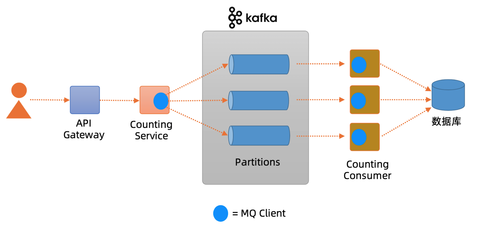
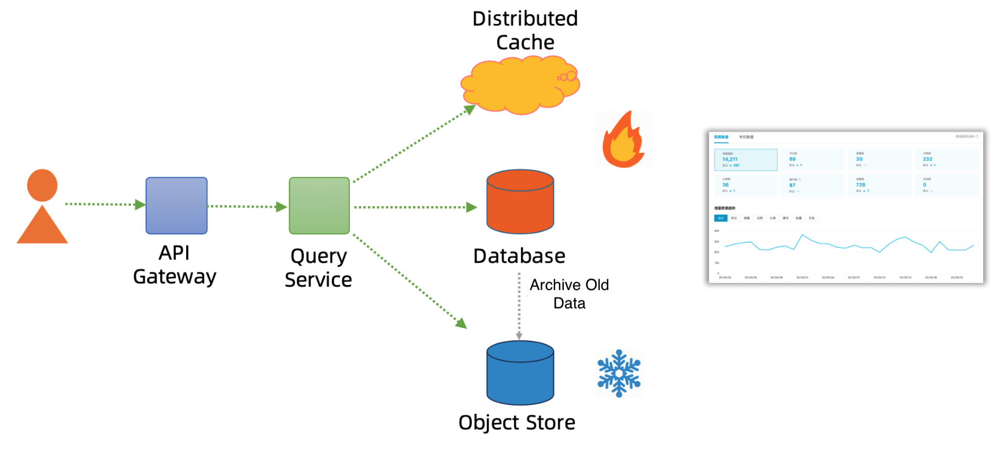
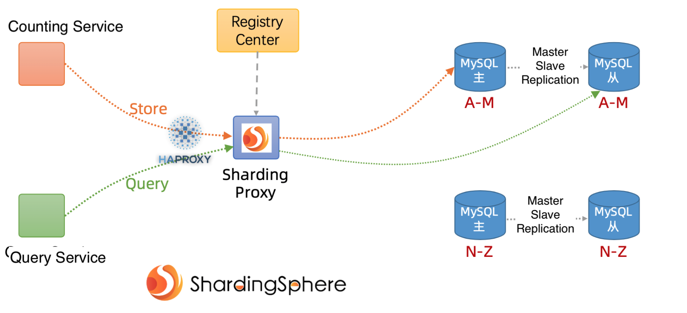
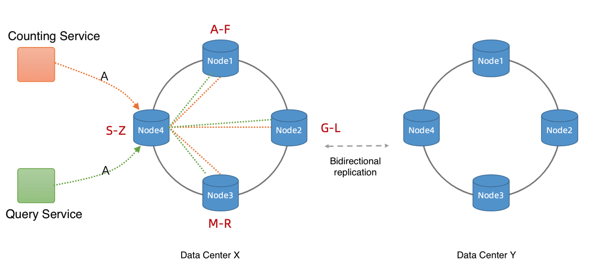

# Scenario\_Trends

* [Heavy hitters / Find top k in a data stream](scenario_trends.md#heavy-hitters--find-top-k-in-a-data-stream)
  * [Single treeMap](scenario_trends.md#single-treemap)
  * [HashMap + PriorityQueue](scenario_trends.md#hashmap--priorityqueue)
  * [LFU cache](scenario_trends.md#lfu-cache)
  * [Count-min sketch](scenario_trends.md#count-min-sketch)
  * [Lossy counting](scenario_trends.md#lossy-counting)
* [Counter service design](scenario_trends.md#counter-service-design)
  * [Nonfunctional requirements](scenario_trends.md#nonfunctional-requirements)
  * [High level design](scenario_trends.md#high-level-design)
    * [Counting service](scenario_trends.md#counting-service)
    * [Query service](scenario_trends.md#query-service)
  * [Detailed component design / Specific counter scenarios](scenario_trends.md#detailed-component-design--specific-counter-scenarios)
    * [Count of comments, likes, views, retweets on a tweet](scenario_trends.md#count-of-comments-likes-views-retweets-on-a-tweet)
      * [Impl with MySQL](scenario_trends.md#impl-with-mysql)
      * [Impl with NoSQL](scenario_trends.md#impl-with-nosql)
      * [Impl with Redis](scenario_trends.md#impl-with-redis)
        * [Improve redis native storage \(not so sure -\_-\)](scenario_trends.md#improve-redis-native-storage-not-so-sure--_-)
        * [Persistence](scenario_trends.md#persistence)
        * [Synchronization between DB and cache](scenario_trends.md#synchronization-between-db-and-cache)
    * [Count of unread system notifications](scenario_trends.md#count-of-unread-system-notifications)
      * [V1: An unread counter of sys notification for every user](scenario_trends.md#v1-an-unread-counter-of-sys-notification-for-every-user)
      * [V2: A last read id of sys notifications for every user](scenario_trends.md#v2-a-last-read-id-of-sys-notifications-for-every-user)
      * [V3: Small optimization on top of V2](scenario_trends.md#v3-small-optimization-on-top-of-v2)
    * [Count of unread message in newsfeed](scenario_trends.md#count-of-unread-message-in-newsfeed)
      * [How is the scenario different?](scenario_trends.md#how-is-the-scenario-different)
      * [Idea](scenario_trends.md#idea)
  * [Follow-up questions](scenario_trends.md#follow-up-questions)
* [Trend detection service](scenario_trends.md#trend-detection-service)
  * [Imp with elasticsearch at Pinterest](scenario_trends.md#imp-with-elasticsearch-at-pinterest)
  * [Statistical view](scenario_trends.md#statistical-view)
* [Real world](scenario_trends.md#real-world)

## Heavy hitters / Find top k in a data stream

### Single treeMap

* TC: O\(nlgm\)
* SC: O\(m\)

### HashMap + PriorityQueue

* Parameters
  * n: number of records
  * m: number of distinct entries
  * K: target k
* TC: O\(n + mlgk\) = O\(n\)
  * Count frequency: O\(n\)
  * Calculate top K: O\(mlgk\)
* SC: O\(n + k\)
  * HashMap: O\(n\)
  * PriorityQueue: O\(k\)

### LFU cache

* DLL + HashMap based LFU cache \(approximate answer\)
  * TC: O\(n + k\)
  * SC: O\(n\)
  * Cons:
    * All low frequency will be hashed to same value, which will result in incorrect result \(low possibility\)
    * Some low frequency words will come later, which will have a great count, then replace other high frequency words \(bloom filter\)
      * HashMap will have 3 different hash functions
      * Choose the lowest count from hashmap

### Count-min sketch

* [https://florian.github.io/count-min-sketch/](https://florian.github.io/count-min-sketch/)
* [https://towardsdatascience.com/big-data-with-sketchy-structures-part-1-the-count-min-sketch-b73fb3a33e2a](https://towardsdatascience.com/big-data-with-sketchy-structures-part-1-the-count-min-sketch-b73fb3a33e2a)

### Lossy counting

* [https://micvog.com/2015/07/18/frequency-counting-algorithms-over-data-streams/](https://micvog.com/2015/07/18/frequency-counting-algorithms-over-data-streams/)

## Counter service design

```text
┌───────────────┐           ┌───────────────┐            ┌───────────────┐
│   Counting    │           │               │            │               │
│    Service    │──────────▶│    Storage    │◀───────────│ Query Service │
│               │           │               │            │               │
└───────────────┘           └───────────────┘            └───────────────┘
```

### Nonfunctional requirements

* Low latency: 
* Write latency
* Read latency
* High availability

### High level design

#### Counting service

* API gateway
* Counting service: User could not directly write into MQ, need to write through counting service
* MQ
* Counting consumer



#### Query service



### Detailed component design / Specific counter scenarios

* [Weibo](https://www.cnblogs.com/wt645631686/p/13878284.html)

#### Count of comments, likes, views, retweets on a tweet

**Impl with MySQL**

* All attributes inside a table and using tweet id as the primary key

```text
select repost_count, comment_count, praise_count, view_count 
from t_weibo_count where tweet_id = ?
```

* Scale with partition on tweet\_id
  * Hash based sharding on tweet\_id
  * Range based sharding on tweet\_date



* Typical performance metrics:
  * 

**Impl with NoSQL**

* Schema: using tweet\_id as primary key



* Typical performance metrics:
  * 

**Impl with Redis**

* TweetId =&gt; Count

**Improve redis native storage \(not so sure -\_-\)**

* Storage cost for Redis native way: 
  * Key stored as string: 8 bit LONG type will be stored as 8 bit \(sdshdr length\)+ 19 bit \(8 byte Long represent as string）+ 1\(’\0’\)=28
  * Remove the unnecessary 

**Persistence**

* Redis + SSD
  * Popularity of tweets usually calms down over time. For old data, persist them into SSD disk.

**Synchronization between DB and cache**

* If using DB as backend, then synchronization between DB and cache will be conducted. 
* The benefits of using a DB don't outweigh the downsides of it. \(TODO: Details to be added\)

#### Count of unread system notifications

* System notifications will happen for every user. 

**V1: An unread counter of sys notification for every user**

* Idea: Keep a unread system notification counter for everyone. When a new notification comes out, loop through all users and increment the counter. 
* It has the folllowing downsides:
  * Full table scan will take a long time. For example, suppose 1 billion user and each user takes 1ms, thenn it will take 10^6 s in total. 
  * Furthermore, it wastes lots of storage space because most registered users are not active. 

```text
List<Long> userIds = getAllUserIds();
for(Long id : userIds) {
  incrUnreadCount(id);
}
```

**V2: A last read id of sys notifications for every user**

* Idea: Keep a last read message id for system notifications. The lastest sys notification message id will be same for everyone \(system notification definition\). When need to check for how many unread system notifications a user have, substrate the last read with lastest sys notification message. This is similar to how the "red dot" is implemented in notification systems. 

**V3: Small optimization on top of V2**

* For users who are not active for certain periods, recycle their counter space. 

#### Count of unread message in newsfeed

**How is the scenario different?**

* Counts of tweets repost, comments... will be based on user activity \(follow, edit, etc.\), counts of newsfeed need to happen for everyone without any user intervention. The former is triggered by user activity, the later always happen automatically. 
* Counts of system notifications. Unread message number in newsfeed will vary among every user. 

**Idea**

* Record how many posts each user has made. Also record a snapshot of all posts. 
* When need to check for how many unread messages there are in newsfeed, calculate the different between snapshots. 


### Follow-up questions

* How to solve hot partition
* How to monitor system health
* How to solve slow consumer
* How to identify performance bottleneck 

## Trend detection service


### Imp with elasticsearch at Pinterest

* [Pinterest trends](https://medium.com/pinterest-engineering/pinterest-trends-insights-into-unstructured-data-b4dbb2c8fb63)


### Statistical view

* [Microsoft](https://devblogs.microsoft.com/cse/2019/01/02/real-time-time-series-analysis-at-scale-for-trending-topics-detection/#:~:text=Detecting%20trending%20topics%20requires%20the,the%20entire%20set%20of%20topics.)
* [Trend at instagram](https://instagram-engineering.com/trending-on-instagram-b749450e6d93)
* [Trend at Twitter](https://blog.twitter.com/engineering/en_us/a/2015/building-a-new-trends-experience.html)
  * Whitepaper: [https://blog.twitter.com/en\_us/a/2015/trend-detection-social-data.html](https://blog.twitter.com/en_us/a/2015/trend-detection-social-data.html)

## Real world

* [Strom near real time](https://www.michael-noll.com/blog/2013/01/18/implementing-real-time-trending-topics-in-storm/)

