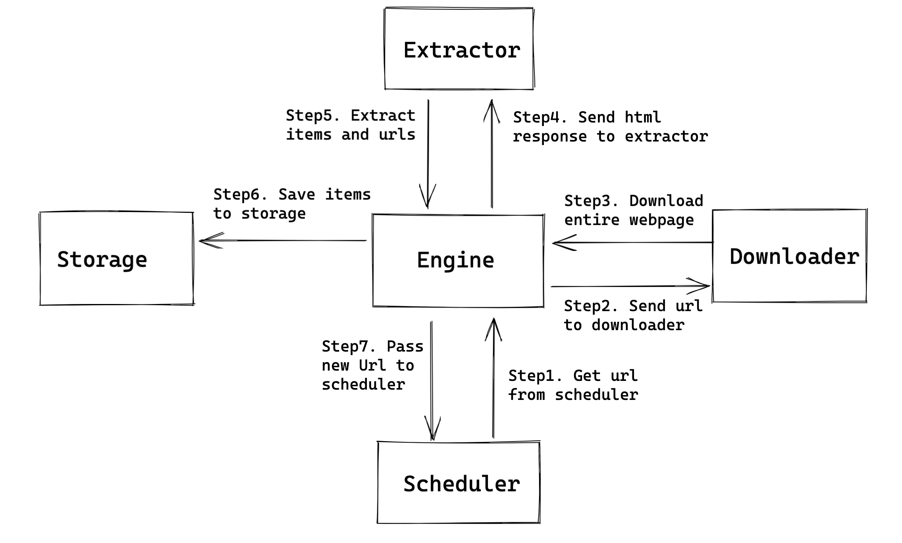

- [Benefits](#benefits)
- [Flowchart](#flowchart)
  - [Downloader](#downloader)
    - [Components](#components)
    - [DNS resolver](#dns-resolver)
    - [Ajax handler](#ajax-handler)
    - [Auth manager](#auth-manager)
    - [Verification code](#verification-code)
  - [Storage](#storage)
    - [Component](#component)
    - [DB selection](#db-selection)

# Benefits

* Utilize multiple machines' bandwidth to speed up crawling
* Utilize multiple machines' ip address to speed up crawling

# Flowchart

* The scheduler in the standalone impl needs to be make distributed because
  * For centralize all urls
  * For dedupe purpose



## Downloader

### Components

```
┌ ─ ─ ─ ─ ─ ─ ─ ─ ─ ─ ─ ─ ─ ─ ─ ─ ─ ─ ─ ─ ─ ─ ─ ─ ─ ─ ─ ─ ─ ─ ─ ─ ─ ─ ─ ─ ─ ─ ─ ─ ─ ─ ─ ─ ─ ─ ─ ─ ─ ┐
                                             Downloader                                              
│                                                                                                   │
                                                   ┌────────────────┐     ┌────────────────┐         
│    ┌────────────────┐     ┌────────────────┐     │  Verification  │     │  Ajax handler  │        │
     │  DNS Resolver  │     │  Auth manager  │     │  code handler  │     │                │         
│    └────────────────┘     └────────────────┘     └────────────────┘     └────────────────┘        │

│                                                                                                   │
 ─ ─ ─ ─ ─ ─ ─ ─ ─ ─ ─ ─ ─ ─ ─ ─ ─ ─ ─ ─ ─ ─ ─ ─ ─ ─ ─ ─ ─ ─ ─ ─ ─ ─ ─ ─ ─ ─ ─ ─ ─ ─ ─ ─ ─ ─ ─ ─ ─ ─
```

### DNS resolver

* DNS resolution is a well-known bottleneck in web crawling. Due to the distributed nature of the Domain Name Service, DNS resolution may entail multiple requests and round-trips across the internet, requiring seconds and sometimes even longer. Right away, this puts in jeopardy our goal of fetching several hundred documents a second. 
  * A standard remedy is to introduce caching: URLs for which we have recently performed DNS lookups are likely to be found in the DNS cache, avoiding the need to go to the DNS servers on the internet. However, obeying politeness constraints limits the of cache hit rate.
  * [https://nlp.stanford.edu/IR-book/pdf/20crawl.pdf](https://nlp.stanford.edu/IR-book/pdf/20crawl.pdf) for more details.

### Ajax handler

* For content loaded by Ajax, you will not be able to see it when viewing the source page, but you will be able to see it by browser element inspector. As a result, crawler will need to have customized way to access these contents. 
  1. Manually mimic a request by copying relevant fields (cookie, user-agent, origin, etc.).
     * Error prone and requires lots of expertise
  2. Use selenium to click the load button and crawl pages

### Auth manager

* If the target website requires logging in, then customized accounts are needed for crawling. When there is a large number of content to be crawled, hundreds or thousands of accounts need to be managed because there will be rate limiting on a single account. 
* Design a cookie pool, typical problems include:
  * When to detect that the pool size is not big enough?
  * How to manage different types of cookie for different websites
  * How to know cookie gets expired？
  * Unified way for configuration

### Verification code

* Optical character recognition mechanism
* How to handle sliding verification code


## Storage

### Component

```
┌ ─ ─ ─ ─ ─ ─ ─ ─ ─ ─ ─ ─ ─ ─ ─ ─ ─ ─ ─ ─ ─ ─ ─ ─ ─ ─ ─ ─ ─ ─ ─ ─ ─ ─ ─ ─ ─ ─ ─ ─ ─ ─ ─ ─ ─ ─ ─ ─ ─ ┐
                                               Storage                                               
│  ┌───────────────────────────────┐                                                                │
   │Webpage crawl history          │                                                                 
│  │                               │                                                                │
   │Url: string                    │                                                                 
│  │Domain: string (sharding key)  │                                                                │
   │Expected frequency: date       │                                                                 
│  │Last crawl timestamp: date     │                                                                │
   │Content signature: string      │                                                                 
│  │(calculate similarity)         │                                                                │
   │                               │                                                                 
│  │                               │                                                                │
   └───────────────────────────────┘                                                                 
│                                                                                                   │
 ─ ─ ─ ─ ─ ─ ─ ─ ─ ─ ─ ─ ─ ─ ─ ─ ─ ─ ─ ─ ─ ─ ─ ─ ─ ─ ─ ─ ─ ─ ─ ─ ─ ─ ─ ─ ─ ─ ─ ─ ─ ─ ─ ─ ─ ─ ─ ─ ─ ─
```

### DB selection

* Wide-column preferred because snapshot of the same page could be stored - support 3-dimensional query

```
(row, column family, timestamp)
```
