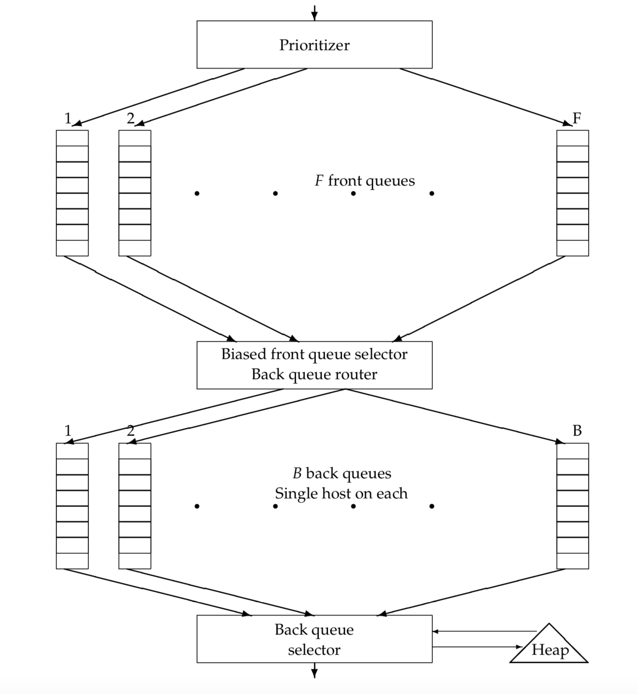

- [Benefits](#benefits)
- [Naive impl](#naive-impl)
  - [Downloader](#downloader)
    - [Components](#components)
    - [DNS resolver](#dns-resolver)
    - [Ajax handler](#ajax-handler)
    - [Auth manager](#auth-manager)
    - [Verification code](#verification-code)
  - [Scheduler](#scheduler)
    - [Components](#components-1)
    - [Size of queue](#size-of-queue)
    - [Url filter](#url-filter)
    - [Duplication remover](#duplication-remover)
    - [Prioritization strategies](#prioritization-strategies)
  - [Scheduler and downloader combined](#scheduler-and-downloader-combined)
  - [Storage](#storage)
    - [Component](#component)
    - [DB selection](#db-selection)
- [Distributed crawler](#distributed-crawler)
  - [Multi-region](#multi-region)
  - [Scale by functional partitioning](#scale-by-functional-partitioning)

# Benefits

* Utilize multiple machines' bandwidth to speed up crawling
* Utilize multiple machines' ip address to speed up crawling

# Naive impl

* The scheduler in the standalone impl needs to be make distributed because
  * For centralize all urls
  * For dedupe purpose

```
                                                    ┌──────────────────────┐                                                                         
                                                    │                      │                                                                         
                                                    │                      │                                                                         
                                                    │                      │                                                                         
                                                    │      Extractor       │                                                                         
                                                    │                      │                                                                         
                                                    │                      │                                                                         
                                                    │                      │                                                                         
                                                    │                      │                                                                         
                                                    └────┬────────────▲────┘                                                                         
                                                         │            │                                                                              
                                                         │            │                                                                              
                                               Step5. Extract       Step4. Send html response to                                                     
                                                  1) items            │       extractor                                                              
                                                 2) new Urls          │                                                                              
                                                         │            │                                                                              
                                                         │            │                                                                              
                                                         │            │                                                                              
                                                 ┌ ─ ─ ─ ┴ ─ ─ ─ ─ ─ ─│─ ─ ─ ─                                                                       
                                                      Extractor Middleware    │                                                                      
                                                 │  (aka spider middleware)                                                                          
                                                                              │                                                                      
                                                 └ ─ ─ ─ ┬ ─ ─ ─ ─ ─ ─│─ ─ ─ ─                                                                       
                                                         │            │                                                                              
                                                         │            │                                                                              
                                                         │            │                                                                              
┌──────────────────────┐                             ┌───▼────────────┴─────┐  ┌ ─ ─ ─ ─ ─                                   ┌──────────────────────┐
│                      │                             │                      │             │                                  │                      │
│                      │        Step6. Save items to │                      │  │             Step3. Download the entire      │                      │
│                      ◀───────────────storage───────┤                      ◀───          ├──────html page response──────────┤                      │
│       Storage        │                             │        Engine        │  │Downloader                                   │      Downloader      │
│                      │                             │                      │   Middleware│                                  │                      │
│                      │                             │                      │  │                                             │                      │
│                      │                             │                      ├───          ├─────Step2. Send Url to ──────────▶                      │
│                      │                             │                      │  │                    downloader               │                      │
└──────────────────────┘                             └────┬──────────▲──────┘             │                                  └──────────────────────┘
                                                          │          │         └ ─ ─ ─ ─ ─                                                           
                                                          │          │                                                                               
                                                          │          │                                                                               
                                                          │          │                                                                               
                                               Step7. Pass new       │                                                                               
                                              Urls to scheduler     Step1. Get url from scheduler                                                    
                                                          │          │                                                                               
                                                          │          │                                                                               
                                                          │          │                                                                               
                                                          │          │                                                                               
                                                          │          │                                                                               
                                                      ┌───▼──────────┴──────┐                                                                        
                                                      │                     │                                                                        
                                                      │  Replace Scheduler  │                                                                        
                                                      │     with Redis      │                                                                        
                                                      │                     │                                                                        
                                                      └─────────────────────┘
```


## Downloader

### Components

```
┌ ─ ─ ─ ─ ─ ─ ─ ─ ─ ─ ─ ─ ─ ─ ─ ─ ─ ─ ─ ─ ─ ─ ─ ─ ─ ─ ─ ─ ─ ─ ─ ─ ─ ─ ─ ─ ─ ─ ─ ─ ─ ─ ─ ─ ─ ─ ─ ─ ─ ┐
                                             Downloader                                              
│                                                                                                   │
                                                   ┌────────────────┐     ┌────────────────┐         
│    ┌────────────────┐     ┌────────────────┐     │  Verification  │     │  Ajax handler  │        │
     │  DNS Resolver  │     │  Auth manager  │     │  code handler  │     │                │         
│    └────────────────┘     └────────────────┘     └────────────────┘     └────────────────┘        │

│                                                                                                   │
 ─ ─ ─ ─ ─ ─ ─ ─ ─ ─ ─ ─ ─ ─ ─ ─ ─ ─ ─ ─ ─ ─ ─ ─ ─ ─ ─ ─ ─ ─ ─ ─ ─ ─ ─ ─ ─ ─ ─ ─ ─ ─ ─ ─ ─ ─ ─ ─ ─ ─
```

### DNS resolver

* DNS resolution is a well-known bottleneck in web crawling. Due to the distributed nature of the Domain Name Service, DNS resolution may entail multiple requests and round-trips across the internet, requiring seconds and sometimes even longer. Right away, this puts in jeopardy our goal of fetching several hundred documents a second. 
  * A standard remedy is to introduce caching: URLs for which we have recently performed DNS lookups are likely to be found in the DNS cache, avoiding the need to go to the DNS servers on the internet. However, obeying politeness constraints limits the of cache hit rate.
  * [https://nlp.stanford.edu/IR-book/pdf/20crawl.pdf](https://nlp.stanford.edu/IR-book/pdf/20crawl.pdf) for more details.

### Ajax handler

* For content loaded by Ajax, you will not be able to see it when viewing the source page, but you will be able to see it by browser element inspector. As a result, crawler will need to have customized way to access these contents. 
  1. Manually mimic a request by copying relevant fields (cookie, user-agent, origin, etc.).
     * Error prone and requires lots of expertise
  2. Use selenium to click the load button and crawl pages

### Auth manager

* If the target website requires logging in, then customized accounts are needed for crawling. When there is a large number of content to be crawled, hundreds or thousands of accounts need to be managed because there will be rate limiting on a single account. 
* Design a cookie pool, typical problems include:
  * When to detect that the pool size is not big enough?
  * How to manage different types of cookie for different websites
  * How to know cookie gets expired？
  * Unified way for configuration

### Verification code

* Optical character recognition mechanism
* How to handle sliding verification code

## Scheduler

### Components

```
┌ ─ ─ ─ ─ ─ ─ ─ ─ ─ ─ ─ ─ ─ ─ ─ ─ ─ ─ ─ ─ ─ ─ ─ ─ ─ ─ ─ ─ ─ ─ ─ ─ ─ ─ ─ ─ ─ ─ ─ ─ ─ ─ ─ ─ ─ ─ ─ ─ ─ ─ ─ ─ ─ ─ ─ ─ ─ ─ ─ ─ ┐
                                                         Scheduler                                                         
│                                                                                                                         │

│  ┌────────────────┐   ┌────────────────┐  ┌────────────────┐   ┌────────────────┐   ┌───────────────────────────────┐   │
   │                │   │  Url filter:   │  │  Duplication   │   │   Similarity   │   │         Prioritizer:          │    
│  │Url Normalizer: │   │                │  │    remover:    │   │  calculator:   │   │                               │   │
   │                │   │    Removed     │  │                │   │                │   │    e.g. Based on timestamp    │    
│  │ Relative Urls  │   │   disallowed   │  │ Some Urls have │   │  e.g. Minhash  │   │ A heap with (lastCrawlTime +  │   │
   │      ...       │   │  domains ...   │  │  been crawled  │   │   algorithm    │   │expectedIntervalBeforeTwoCrawl)│    
│  │                │   │                │  │     before     │   │                │   │                               │   │
   └────────────────┘   └────────────────┘  └────────────────┘   └────────────────┘   └───────────────────────────────┘    
└ ─ ─ ─ ─ ─ ─ ─ ─ ─ ─ ─ ─ ─ ─ ─ ─ ─ ─ ─ ─ ─ ─ ─ ─ ─ ─ ─ ─ ─ ─ ─ ─ ─ ─ ─ ─ ─ ─ ─ ─ ─ ─ ─ ─ ─ ─ ─ ─ ─ ─ ─ ─ ─ ─ ─ ─ ─ ─ ─ ─ ┘
```

### Size of queue

* In standalone case, scheduler is essentially a priority queue inside memory. 
* Could use a MySQL DB task table if scheduler queue grows too big
  * state (working/idle): Whether it is being crawling.
  * priority (1/0): 
  * available time: frequency. When to fetch the next time.

| id | url                                                       | state     | priority | available_time        |
| -- | --------------------------------------------------------- | --------- | -------- | --------------------- |
| 1  | “[http://www.sina.com/”](http://www.sina.com/%E2%80%9D)   | “idle”    | 1        | “2016-03-04 11:00 am” |
| 2  | “[http://www.sina1.com/”](http://www.sina1.com/%E2%80%9D) | “working” | 1        | “2016-03-04 12:00 am” |
| 3  | “[http://www.sina2.com/”](http://www.sina2.com/%E2%80%9D) | “idle”    | 0        | “2016-03-14 02:00 pm” |
| 4  | “[http://www.sina3.com/”](http://www.sina3.com/%E2%80%9D) | “idle”    | 2        | “2016-03-12 04:25 am” |

### Url filter

* A URL filter is used to determine whether the extracted URL should be excluded from the frontier based on one of several tests. For instance, the crawl may seek to exclude certain domains (say, all .com URLs) – in this case the test would simply filter out the URL if it were from the .com domain.
  * Many hosts on the Web place certain portions of their websites off-limits to crawling, under a standard known as the Robots Exclusion Protocol. This is done by placing a file with the name robots.txt at the root of the URL hierarchy at the site. Here is an example robots.txt file that specifies that no robot should visit any URL whose position in the file hierarchy starts with /yoursite/temp/, except for the robot called “searchengine”.

### Duplication remover

* The simplest implementation for this would use a simple fingerprint such as a checksum. 
* A more sophisticated test would use shingles instead of fingerprints. (What is Shingles ???)
* Bloom filter. A Bloom filter is a probabilistic data structure and is used for answering set-existential questions (eg: has this URL been crawled before?). Due its probabilistic nature, it can give erroneous results in the form of false positives. You can however tweak the error rate, allowing for only a small number of false positives. The great benefit is the large amount of memory you can save (much more memory efficient than Redis Hashes). If we start crawling pages in the hundreds of millions, we definitely would have to switch to this data structure. As for the false positives, well, there ain’t no harm in occasionally crawling the same page twice.        

### Prioritization strategies

* Use quota to balance different domains: Too many web pages in sina.com, the crawler keeps crawling sina.com and don't crawl other websites
* How to handle update for failure
  * Exponential back-off
    * Success: crawl after 1 week
    * no.1 failure: crawl after 2 weeks
    * no.2 failure: crawl after 4 weeks
    * no.3 failure: crawl after 8 weeks

## Scheduler and downloader combined



* A set of scheduler queues: Prioritization
  * A prioritizer first assigns to the URL an integer priority i between 1 and F based on its fetch history (taking into account the rate at which the web page at this URL has changed between previous crawls). 
    * Frequency of change: For instance, a document that has exhibited frequent change would be assigned a higher priority. 
    * Other heuristics (application-dependent and explicit) – for instance, URLs from news services may always be assigned the highest priority. 
  * Now that it has been assigned priority i, the URL is now appended to the ith of the front queues
  * Two important considerations govern the order in which URLs are returned by the frontier. 
    * First, high-quality pages that change frequently should be prioritized for frequent crawling. Thus, the priority of a page should be a function of both its change rate and its quality (using some reasonable quality estimate). The combination is necessary because a large number of spam pages change completely on every fetch.
    * We must avoid repeated fetch requests to a host within a short time span. The likelihood of this is exacerbated because of a form of locality of reference: many URLs link to other URLs at the same host. A common heuristic is to insert a gap between successive fetch requests to a host that is an order of magnitude larger than the time taken for the most recent fetch from that host.
  * An importance score will be assigned to each URL which we discover and then crawl them accordingly. We use Redis sorted sets to store the priority associated with each URL and hashes to store the visited status of the discovered URLs. This, of course, comes with a large memory footprint.
* A set of downloader queues: Politeness
  * Each of the downloader queue maintains the following invariants: 
    * (i) it is non- empty while the crawl is in progress 
    * (ii) it only contains URLs from a single host
  * An auxiliary table T is used to maintain the mapping from hosts to download queues. Whenever a downloader queue is empty and is being re-filled from a front-queue, table T must be updated accordingly.
  * Process
    1. A crawler thread requesting a URL from the frontier extracts the root of this heap and (if necessary) waits until the corresponding time entry te. 
    2. It then takes the URL u at the head of the downloader queue j corresponding to the extracted heap root, and proceeds to fetch the URL u. 
    3. After fetching u, the calling thread checks whether j is empty. 
    4. If so, it picks a front queue and extracts from its head a URL v. The choice of front queue is biased (usually by a random process) towards queues of higher priority, downloader that URLs of high priority flow more quickly into the back queues. We examine v to check whether there is already a back queue holding URLs from its host. 
    5. If so, v is added to that queue and we reach back to the front queues to find another candidate URL for insertion into the now-empty queue j. 
    6. This process continues until j is non-empty again. In any case, the thread inserts a heap entry for j with a new earliest time te based on the properties of the URL in j that was last fetched (such as when its host was last contacted as well as the time taken for the last fetch), then continues with its processing. For instance, the new entry te could be the current time plus ten times the last fetch time.


## Storage

### Component

```
┌ ─ ─ ─ ─ ─ ─ ─ ─ ─ ─ ─ ─ ─ ─ ─ ─ ─ ─ ─ ─ ─ ─ ─ ─ ─ ─ ─ ─ ─ ─ ─ ─ ─ ─ ─ ─ ─ ─ ─ ─ ─ ─ ─ ─ ─ ─ ─ ─ ─ ┐
                                               Storage                                               
│  ┌───────────────────────────────┐                                                                │
   │Webpage crawl history          │                                                                 
│  │                               │                                                                │
   │Url: string                    │                                                                 
│  │Domain: string (sharding key)  │                                                                │
   │Expected frequency: date       │                                                                 
│  │Last crawl timestamp: date     │                                                                │
   │Content signature: string      │                                                                 
│  │(calculate similarity)         │                                                                │
   │                               │                                                                 
│  │                               │                                                                │
   └───────────────────────────────┘                                                                 
│                                                                                                   │
 ─ ─ ─ ─ ─ ─ ─ ─ ─ ─ ─ ─ ─ ─ ─ ─ ─ ─ ─ ─ ─ ─ ─ ─ ─ ─ ─ ─ ─ ─ ─ ─ ─ ─ ─ ─ ─ ─ ─ ─ ─ ─ ─ ─ ─ ─ ─ ─ ─ ─
```

### DB selection

* Wide-column preferred because snapshot of the same page could be stored - support 3-dimensional query

```
(row, column family, timestamp)
```


# Distributed crawler

## Multi-region

* When Google's webpage crawls China's webpages, it will be really really slow. Deploy crawler servers in multiple regions.

## Scale by functional partitioning

* Crawler service
* Task service
* Storage service
