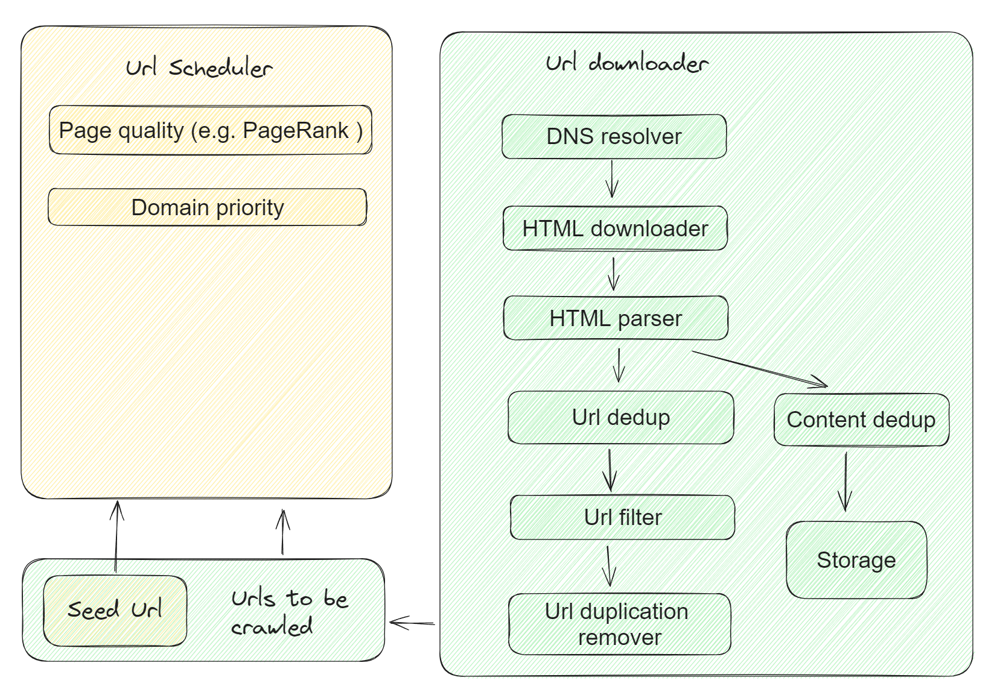
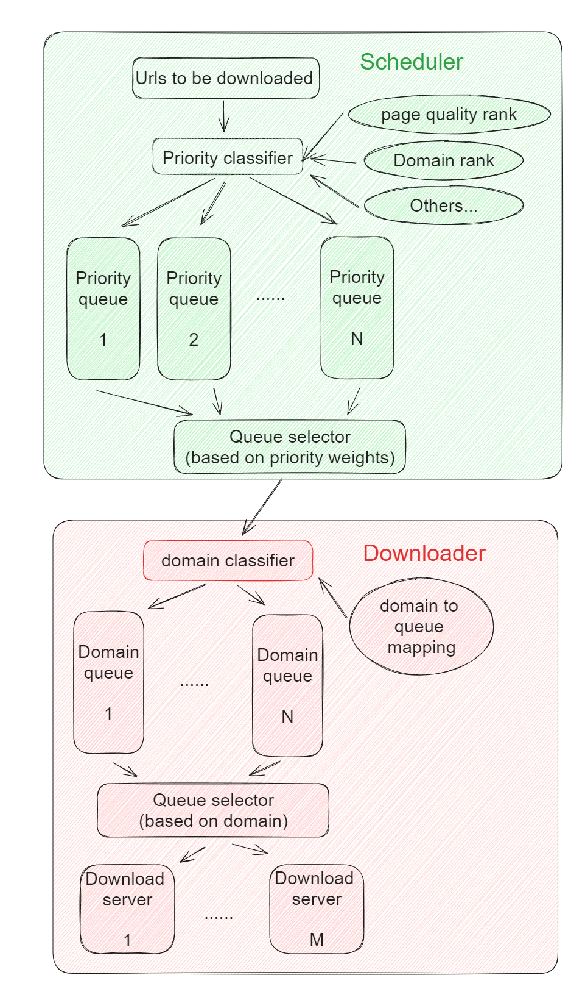
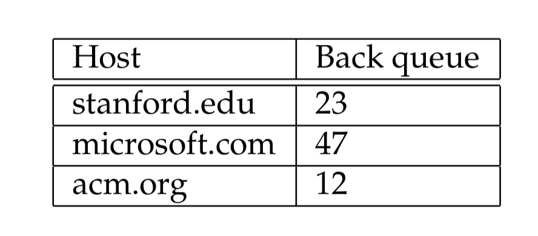

- [Challenges](#challenges)
- [Flowchart](#flowchart)
- [Components map](#components-map)
- [Scheduler](#scheduler)
  - [Url priority factors](#url-priority-factors)
    - [Page content quality](#page-content-quality)
    - [Frequency of change](#frequency-of-change)
    - [Politeness](#politeness)
    - [Other heuristics](#other-heuristics)
- [Downloader](#downloader)
  - [Url filter](#url-filter)
    - [Robots.txt](#robotstxt)
  - [Duplication remover](#duplication-remover)
    - [Content similarity](#content-similarity)
    - [Url similarity](#url-similarity)

# Challenges
* How to avoid the same page being crawled twice? e.g. Same url, very similar content
* What if a webpage gets updated? How long does it take to be crawled again? 

# Flowchart

# Components map

# Scheduler

## Url priority factors
### Page content quality
* High-quality pages according to algorithms such as PageRank.

### Frequency of change
* Frequency of change: For instance, a document that has exhibited frequent change would be assigned a higher priority. 

### Politeness
* We must avoid repeated fetch requests to a host within a short time span. The likelihood of this is exacerbated because of a form of locality of reference: many URLs link to other URLs at the same host. A common heuristic is to insert a gap between successive fetch requests to a host that is an order of magnitude larger than the time taken for the most recent fetch from that host.

### Other heuristics
* application-dependent and explicit – for instance, URLs from news services may always be assigned the highest priority. 

# Downloader
* A set of downloader queues: Politeness
  * Each of the downloader queue maintains the following invariants: 
    * (i) it is non- empty while the crawl is in progress 
    * (ii) it only contains URLs from a single host
  * An auxiliary table T is used to maintain the mapping from hosts to download queues. Whenever a downloader queue is empty and is being re-filled from a front-queue, table T must be updated accordingly.

## Url filter

* A URL filter is used to determine whether the extracted URL should be excluded from the frontier based on one of several tests. For instance, the crawl may seek to exclude certain domains (say, all .com URLs) – in this case the test would simply filter out the URL if it were from the .com domain.
* The most popular example is robots.txt file. Many hosts on the Web place certain portions of their websites off-limits to crawling, under a standard known as the Robots Exclusion Protocol. This is done by placing a file with the name robots.txt at the root of the URL hierarchy at the site. Here is an example robots.txt file that specifies that no robot should visit any URL whose position in the file hierarchy starts with /yoursite/temp/, except for the robot called “searchengine”.

### Robots.txt
* Def: The Robots Exclusion Standards specifies which areas of a website should be crawled and which should not.
* Example: Wikipedia's robots.txt - [https://en.wikipedia.org/robots.txt](https://en.wikipedia.org/robots.txt) 
* sitemap.xml: 
  * Def: A webmaster specifies how often to crawl, which url to prioritize, etc. 
  * Example: [https://www.sitemaps.org/protocol.html](https://www.sitemaps.org/protocol.html)

## Duplication remover
### Content similarity
* The simplest implementation for this would use a checksum such as MD5. 
* Use bloom filter to replace the hash table for storage. 

### Url similarity
* Bloom filter. A Bloom filter is a probabilistic data structure and is used for answering set-existential questions (eg: has this URL been crawled before?). Due its probabilistic nature, it can give erroneous results in the form of false positives. You can however tweak the error rate, allowing for only a small number of false positives. The great benefit is the large amount of memory you can save (much more memory efficient than Redis Hashes). If we start crawling pages in the hundreds of millions, we definitely would have to switch to this data structure. As for the false positives, well, there ain’t no harm in occasionally crawling the same page twice.        
