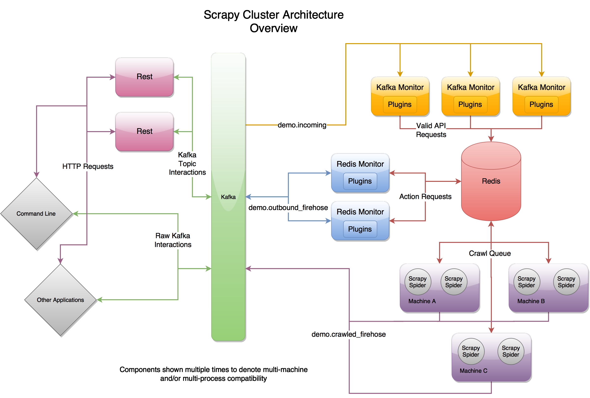

- [Functional requirements](#functional-requirements)
- [Non-functional requirements](#non-functional-requirements)
  - [Efficiency](#efficiency)
  - [Availability](#availability)
  - [Scalability](#scalability)
  - [Politeness](#politeness)
- [Real world applications](#real-world-applications)
  - [Python scrapy](#python-scrapy)
  - [TODO](#todo)

# Functional requirements

* Crawl a specific website? Or entire internet for usage of a search engine
* Want to crawl dynamic pages containing Ajax pages? Or static pages will be enough?
* Want to handle verification code?
* Store HTML pages only? Or need other types of media such as images and videos. Need to store historical webpages or only the latest webpages?
* What protocols we support: HTTP/HTTPS/FTP

# Non-functional requirements
## Efficiency
* Prioritization: Crawl high-importance webpages first. Given that a significant fraction of all web pages are of poor utility for serving user query needs, the crawler should be biased towards fetching “useful” pages first.
* Avoid duplication: Crawling webpages which have same or extremely similar web content.

## Availability
* Avoid deadlocks: The Web contains servers that create spider traps, which are generators of web pages that mislead crawlers into getting stuck fetching an infinite number of pages in a particular domain. Crawlers must be designed to be resilient to such traps. Not all such traps are malicious; some are the inadvertent side-effect of faulty website development.

## Scalability
* Scalability: Could crawl more content by simply adding machines

## Politeness
* Politeness: Web servers have both implicit and explicit policies regulating the rate at which a crawler can visit them. These politeness policies must be respected.
  * robots.txt: 
    * Def: The Robots Exclusion Standards specifies which areas of a website should be crawled and which should not.
    * Example: Wikipedia's robots.txt - [https://en.wikipedia.org/robots.txt](https://en.wikipedia.org/robots.txt) 
  * sitemap.xml: 
    * Def: A webmaster specifies how often to crawl, which url to prioritize, etc. 
    * Example: [https://www.sitemaps.org/protocol.html](https://www.sitemaps.org/protocol.html)

# Real world applications

## Python scrapy
* [How does Google store petabytes of data](https://www.8bitmen.com/google-database-how-do-google-services-store-petabyte-exabyte-scale-data/)
* Language comparison for crawler:
  * Java: Too heavy, not easy to refactor while crawler change might need to change regularly
  * PHP: Not good support for asynchronous, multi-threading, 
  * C/C++: High effort in development
  * Python: Winner. Rich in html parser and httprequest. Have modules such as Scrapy, Redis-Scrapy

* Scrapy cluster: [https://scrapy-cluster.readthedocs.io/en/latest/topics/introduction/overview.html](https://scrapy-cluster.readthedocs.io/en/latest/topics/introduction/overview.html)

* Scrapy: [https://docs.scrapy.org/en/latest/topics/architecture.html](https://docs.scrapy.org/en/latest/topics/architecture.html)
* Middleware:
  * Download middleware: [https://docs.scrapy.org/en/latest/topics/downloader-middleware.html#topics-downloader-middleware](https://docs.scrapy.org/en/latest/topics/downloader-middleware.html#topics-downloader-middleware)
  * Extractor middleware: [https://docs.scrapy.org/en/latest/topics/spider-middleware.html#topics-spider-middleware](https://docs.scrapy.org/en/latest/topics/spider-middleware.html#topics-spider-middleware)

## TODO
* https://leetcode.com/discuss/interview-question/124657/Design-a-distributed-web-crawler-that-will-crawl-all-the-pages-of-wikipedia/263401