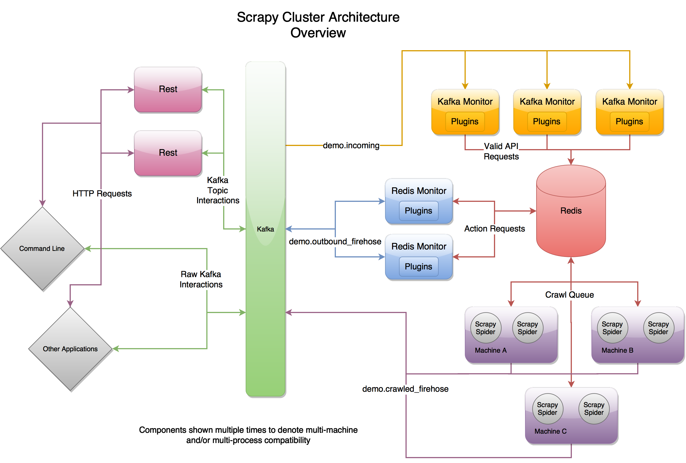

- [Python scrapy](#python-scrapy)
  - [TODO](#todo)

# Python scrapy
* [How does Google store petabytes of data](https://www.8bitmen.com/google-database-how-do-google-services-store-petabyte-exabyte-scale-data/)
* Language comparison for crawler:
  * Java: Too heavy, not easy to refactor while crawler change might need to change regularly
  * PHP: Not good support for asynchronous, multi-threading, 
  * C/C++: High effort in development
  * Python: Winner. Rich in html parser and httprequest. Have modules such as Scrapy, Redis-Scrapy

* Scrapy cluster: [https://scrapy-cluster.readthedocs.io/en/latest/topics/introduction/overview.html](https://scrapy-cluster.readthedocs.io/en/latest/topics/introduction/overview.html)

* Scrapy: [https://docs.scrapy.org/en/latest/topics/architecture.html](https://docs.scrapy.org/en/latest/topics/architecture.html)
* Middleware:
  * Download middleware: [https://docs.scrapy.org/en/latest/topics/downloader-middleware.html#topics-downloader-middleware](https://docs.scrapy.org/en/latest/topics/downloader-middleware.html#topics-downloader-middleware)
  * Extractor middleware: [https://docs.scrapy.org/en/latest/topics/spider-middleware.html#topics-spider-middleware](https://docs.scrapy.org/en/latest/topics/spider-middleware.html#topics-spider-middleware)

## TODO
1. https://leetcode.com/discuss/interview-question/124657/Design-a-distributed-web-crawler-that-will-crawl-all-the-pages-of-wikipedia/263401
2. 