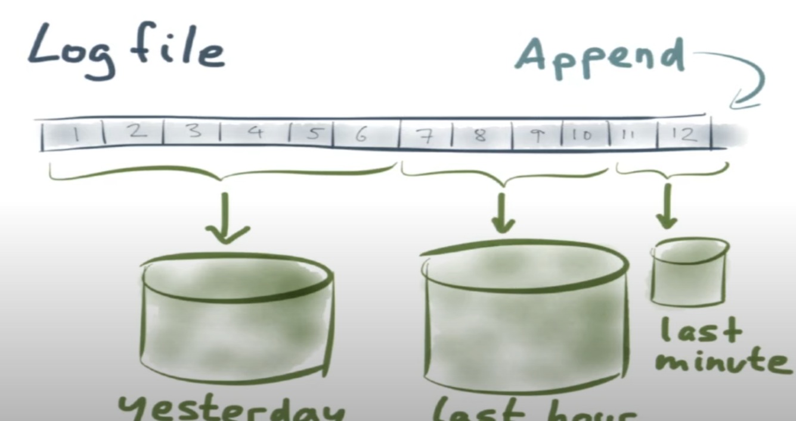

# Example - Streaming search

* Following the search result for some time

* Reverse patttern of traditional search

## Solution
* Mark each query with ID
  * Delete query:
  * Update query: 

# References
* https://www.confluent.io/blog/real-time-full-text-search-with-luwak-and-samza/