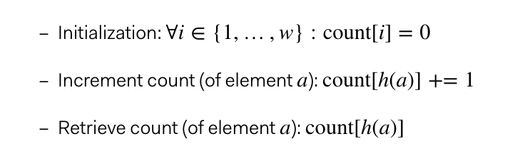
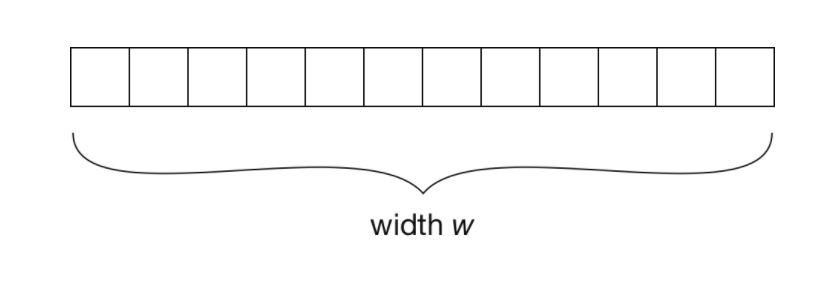
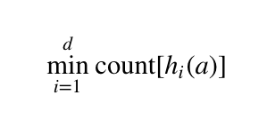
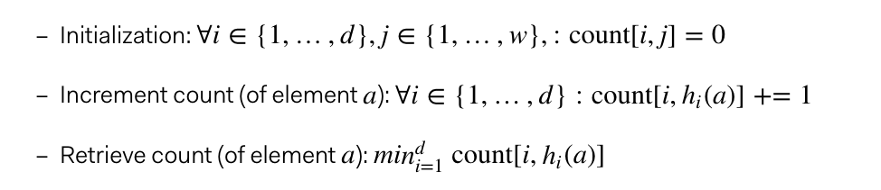
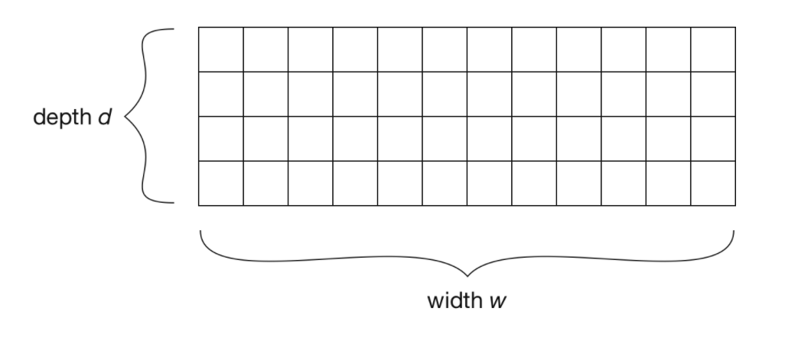

- [Count-min sketch](#count-min-sketch)
  - [Motivation](#motivation)
  - [Approximate algorithm](#approximate-algorithm)
    - [V1: 1-dimensional array with 1 hashing func](#v1-1-dimensional-array-with-1-hashing-func)
    - [V2: 1-dimensional array with d hashing funcs](#v2-1-dimensional-array-with-d-hashing-funcs)
    - [V3: n-dimensional hashing with d hashing funcs](#v3-n-dimensional-hashing-with-d-hashing-funcs)
  - [Applications](#applications)
    - [Database query planning](#database-query-planning)
    - [Heavy-hitters (topK)](#heavy-hitters-topk)
- [Refereces](#refereces)

# Count-min sketch

## Motivation
* Suppose that we plan to find the best sellers on Amazon. We could not use a single machine data structure such as HashTable + Heap because:
  * Not efficient in space: Amazon's products have a long tail distribution and a such a huge hashtable could not fit into a single machine's memory. 
    * Suppose we use:
      * Each item will require a key of 32-bit unique id, and a value of 32-bit integer. 
      * There are 350 million products on Amazon. 
    * It will take in total 350 * 10^6 * 64 bit = 23 GB disk space. 
  * High latency: Even if persisting sections of this huge hashtable into disk, it won't be performant due to disk write latency. 
    * Suppose we use: 
      * Average 10ms write once. 
      * There are 350 million products on Amazon. 
    * It will take in total 10ms * 350 * 10^6 / 3600 / 24 = 40 Days


## Approximate algorithm
### V1: 1-dimensional array with 1 hashing func
* Pros: 
  * Efficient in space. Elimiate the need for hashtable key. And value is limited to a fixed length. 
* Cons: Hash conflicts and an approximate upper bound 





### V2: 1-dimensional array with d hashing funcs
* Pros: Min of the hash count reduces the possible deviation from actual value. 
* Cons: Adding more hash functions in a 1-d array actually increases the chance of conflicts. 



### V3: n-dimensional hashing with d hashing funcs
* Pros: D-hash functions don't interfere with each other.
* Cons: 
  * An approximate algorithm for an upper bound estimation. 





## Applications
### Database query planning
* Database engines plan how they execute queries. How quickly a query is performed can heavily depend on the execution strategy, so it is a crucial area of optimization. For example, this is especially important when determining the order in which several joins are performed, a task known as join order optimization.
* Part of finding good execution strategies is estimating the table sizes yielded by certain subqueries. For example, given a join, such as the one below, we want to find out how many rows the result will have.
* This information can then be used to allocate a sufficient amount of space. More importantly, in a bigger query where the result is joined with a table c, it could be used to determine which tables to join first.
* To estimate the size of the join, we can create two CM sketches. One holds the frequencies of elements x in a, the other holds frequencies of elements x in b. We can then query these sketches to estimate how many rows the result will have.
* Building up full hash tables for this task would require a huge amount of space. Using a sketch data structure is much more feasible, especially since the SQL tables in the join could potentially be very big. Furthermore, an approximate result is generally good enough for planning.

```SQL
SELECT *
FROM a, b
WHERE a.x = b.x
```

### Heavy-hitters (topK)
* A common task in many analytics application is finding heavy hitters, elements that appear a lot of times. For example, given a huge log of website visits, we might want to determine the most popular pages and how often they were visited. Again, building up a full hash table could scale badly if there is a long tail of unpopular pages that have few visits.
* To solve the problem with CMS, we simply iterate through the log once and build up the sketch [2] . To query the sketch, we need to come up with candidate keys to check for. If we do not have an existing candidate set, we can simple go through the log again and look up each page in the CMS, remembering the most important ones.

# Refereces
* [Lossy counting and sticky sampling](https://micvog.com/2015/07/18/frequency-counting-algorithms-over-data-streams/)
* [https://florian.github.io/count-min-sketch/](https://florian.github.io/count-min-sketch/)
* [https://towardsdatascience.com/big-data-with-sketchy-structures-part-1-the-count-min-sketch-b73fb3a33e2a](https://towardsdatascience.com/big-data-with-sketchy-structures-part-1-the-count-min-sketch-b73fb3a33e2a)
